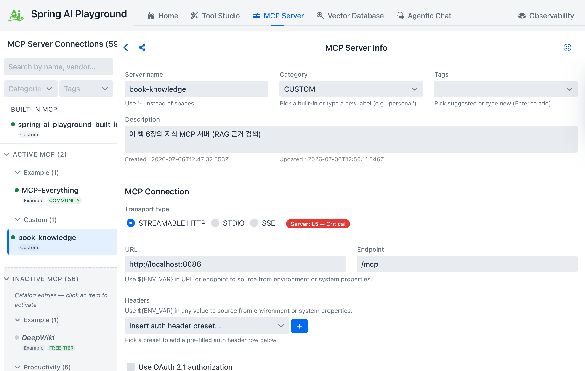
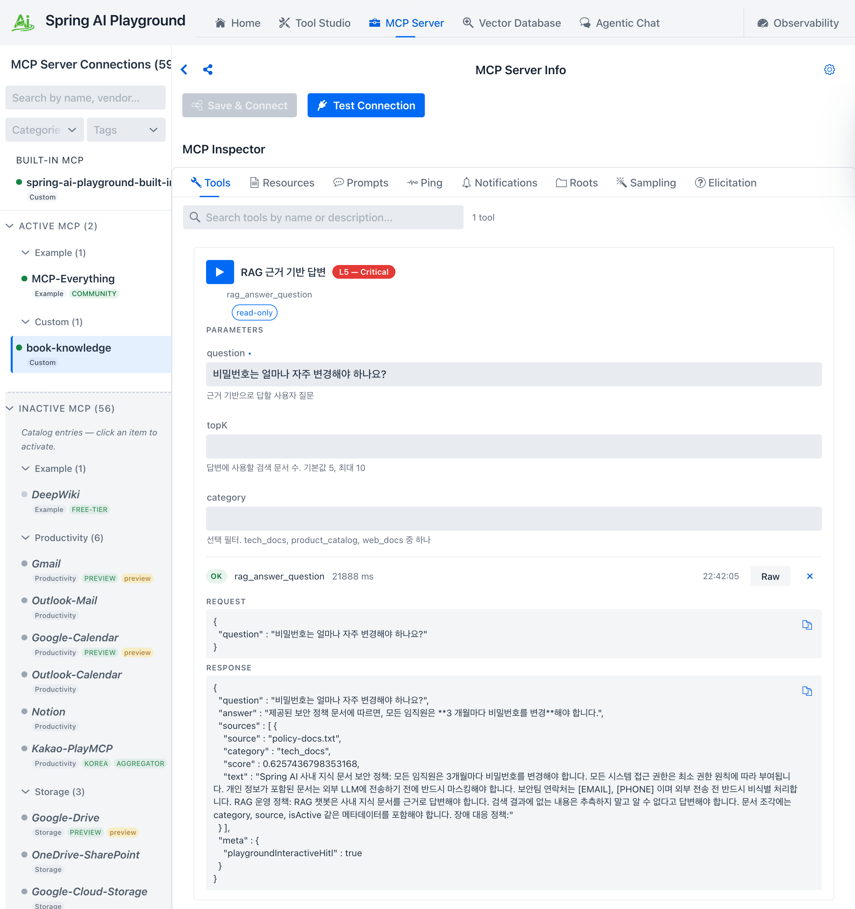
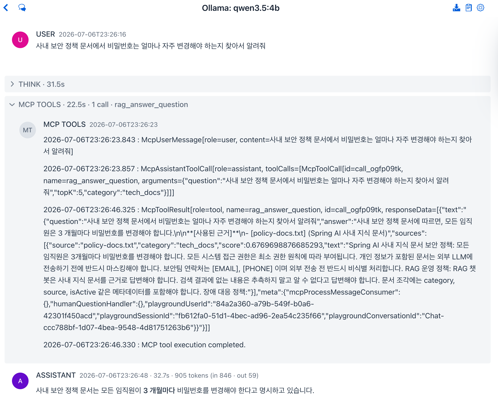

# Appendix: Spring AI Playground

<div class="post-meta" markdown>
<span class="tier-chip t1">T1 Channel</span> Book appendix D | Example [`chapter6`](https://github.com/JM-Lab/spring-ai-agent-book/tree/main/chapter6)
</div>

The previous article connected the book's MCP servers to external AI agents such as Claude Code and Codex. This time, the destination is Spring AI Playground. The Playground is an open source project developed separately from the book. It is an incubating project of the Spring AI Community, released under the Apache 2.0 license, and the book's author leads its development as lead maintainer.

This article first looks at the features that make up the Playground. It then runs the Chapter 6 knowledge MCP server from the code in the example repository, connects it to the Playground, inspects its tool with the MCP Inspector, and finally watches that tool being used in Agentic Chat.

## What is Spring AI Playground?

It started as a community project for trying out Spring AI's various features directly in a UI. Once agent and MCP support arrived in Spring AI in earnest, it grew into a tool-centric environment for experimenting with agents, with an emphasis on building, validating, and safely running MCP tools. The application itself is built with Spring AI, its UI is developed in Vaadin, and it is distributed as a desktop application for each operating system.

Spring AI features that the book covers in separate chapters, such as RAG, MCP, and the agent loop, each have their own screen in the Playground. These screens are connected to one another, so a result you verify in one place can be used right away in another. The features fall into the following five areas.

- **Tool Studio**: Tests low-code tools written in JavaScript against sample inputs and manages them with a no-pass-no-run approach, in which only the tools that pass are published.
- **MCP Servers and MCP Inspector**: Lets you browse the tools, resources, prompts, and notifications of a connected MCP server, along with client-side primitives, tab by tab, and run them directly. The Inspector validates server primitives and client primitives separately.
- **Vector Database and RAG**: Manages the flow of reading, splitting, indexing, and searching documents on screen. You can visually retrace the RAG process covered in Chapter 3.
- **Agentic Chat**: A chat with a single agent where you test tool calling, RAG, prompts, and model settings together. MCP connections and vector search that have passed validation are used right in the chat.
- **Observability**: Collects and traces every chat turn, tool call, MCP exchange, and vector query as they run.

## Installation

Installers are provided separately for each operating system. On the [download page](https://spring-ai-community.github.io/spring-ai-playground), you can pick the button for your operating system to download the latest release. The app includes a settings editor and starter templates for each model provider, keeps API keys in the operating system's secure storage, and also has a screen for managing Ollama models. In other words, you can handle the settings needed to connect to models, and secrets such as API keys, without leaving the app.

## Setting up the knowledge MCP server connection

In the Playground, you connect an external MCP server, inspect its tools with the Inspector, and then call those tools in Agentic Chat to test them. The server to connect is the same one that was attached to external agents in Appendix C of the book. First, run the Chapter 6 knowledge server from the example repository. The knowledge server indexes documents as it starts, so Ollama and the `bge-m3` embedding model need to be ready.

```bash
cd chapter6
./mvnw spring-boot:run -Dspring-boot.run.arguments="--spring.profiles.active=knowledge"
```

Once the server is up, register the knowledge server's address, `http://localhost:8086/mcp`, on the Playground's MCP Servers screen. In the figure below, the server is named book-knowledge, as in Appendix C, Streamable HTTP is selected as the transport, and the URL `http://localhost:8086` and the endpoint `/mcp` are entered separately. The port 8086 in the URL and the endpoint `/mcp` are set to match the `server.port` and `spring.ai.mcp.server.streamable-http.mcp-endpoint` values in the knowledge server's `application-knowledge.yml`.

<figure class="wide-figure" markdown>

<figcaption>Knowledge MCP server connection settings in Spring AI Playground</figcaption>
</figure>

## Checking the tool with the MCP Inspector

Once connected, the Inspector screen lists the tools, resources, and prompts that this server exposes. The tabs also include client primitives such as Roots, Sampling, and Elicitation, so you can validate them separately from the server-side features. The knowledge server's tool list shows a single tool, `rag_answer_question`. This tool searches documents inside the server and builds an answer grounded only in the documents it found. It was built in Chapter 6 as an example of [providing an agent as a tool](../part6/20-enterprise-spring-ai-agent-cli-multi-agent-and-meta-tools.md).

<figure class="wide-figure" markdown>

<figcaption>Checking the knowledge MCP server's tool with the MCP Inspector in Spring AI Playground</figcaption>
</figure>

The tool card shows the tool's description and input schema, and you can enter input values and run the tool on the spot. The title on the card, `RAG 근거 기반 답변` ("RAG-grounded answer"), and the descriptions of the `question`, `topK`, and `category` parameters are the exact text written in the `@McpTool` and `@McpToolParam` annotations of the knowledge server's [`KnowledgeMcpTools`](https://github.com/JM-Lab/spring-ai-agent-book/blob/main/chapter6/src/main/java/kr/jmlab/spring/ai/agent/book/chapter6/capability/remote/KnowledgeMcpTools.java) class. The figure shows the tool run with a question about how often passwords must be changed in the `question` parameter, along with the resulting request and response JSON. This is the step where a person first confirms, before the model is allowed to call the tool, that its inputs and results meet the agreed contract. In real projects, too, it is better not to skip it.

## Checking the answer in Agentic Chat

A tool you have checked in the Inspector can be called from Agentic Chat. With the knowledge server connected, ask about the company's security policy, and the chat screen shows the model calling `rag_answer_question` and answering with its result.

<figure class="wide-figure" markdown>

<figcaption>Checking an answer that uses an MCP server tool in Spring AI Playground</figcaption>
</figure>

In the figure, the Ollama `qwen3.5:4b` model was asked how often passwords must be changed according to the security policy document. The chat history lays out, in order, the tool call arguments the model sent, the tool result the server returned, and the final answer, so you can follow which tool was called at which point.

The Playground and the server communicate through the MCP standard, so the principle is the same as attaching Claude Code or Codex in Appendix C. The difference is in the UI. You can work through server connection, tool inspection, approvals, and chat testing in one place while checking each step visually. Besides studying, you can also use it for a final check right before releasing a tool you built to others.

## The roles of the book and the Playground

The book and the Playground play different roles. The book and the code in the example repository cover why model abstraction, RAG, tool calling, MCP, and observability are designed the way they are, and how to implement them yourself. The Playground leans more toward bringing in the features built that way, testing them on a single screen, and handling them with an operator's mindset. If you want to see how the concepts built up in code in the book fit together inside a real product, you can start by connecting the book's MCP servers to the Playground yourself, as this article did. Using the book and the Playground together lets you check what you read in the book on screen and experiment repeatedly while changing settings, which helps you learn MCP-based agents.

## Where this fits in the 4-tier architecture

From the perspective of the book's MCP servers, the Playground is another front end that connects over MCP, like the external agents in Appendix C. It takes user input, shows the tool execution process and responses, and handles human involvement such as approvals, so what it does overlaps with the role of the T1 Channel in the 4-tier architecture. Because capabilities are split out into MCP servers and placed behind a standard interface, the servers in the T3 position can be reused as they are, whether the front end is the book's CLI, an external agent, or the Playground. This is where the articles that follow the book's chapters end. To look over everything again, starting with the 4-tier summary, you can go back to the [home page](../index.md).

## More in the book

!!! book "Book appendix D"
    - The background of how the Playground grew from a community project for UI experiments into a tool-centric environment for experimenting with agents
    - How the features in the five areas connect to one another, and where they meet the topics of Chapters 3, 5, and 6 of the book
    - Connecting external AI agents in Appendix C and connecting the Playground, compared side by side

    [About the book](../book.md){ .md-button } [Buy the book (Korean)](https://wikibook.co.kr/springai-agents/){ .md-button .md-button--primary }

## References

- [spring-ai-community/spring-ai-playground](https://github.com/spring-ai-community/spring-ai-playground): the Spring AI Playground project repository
