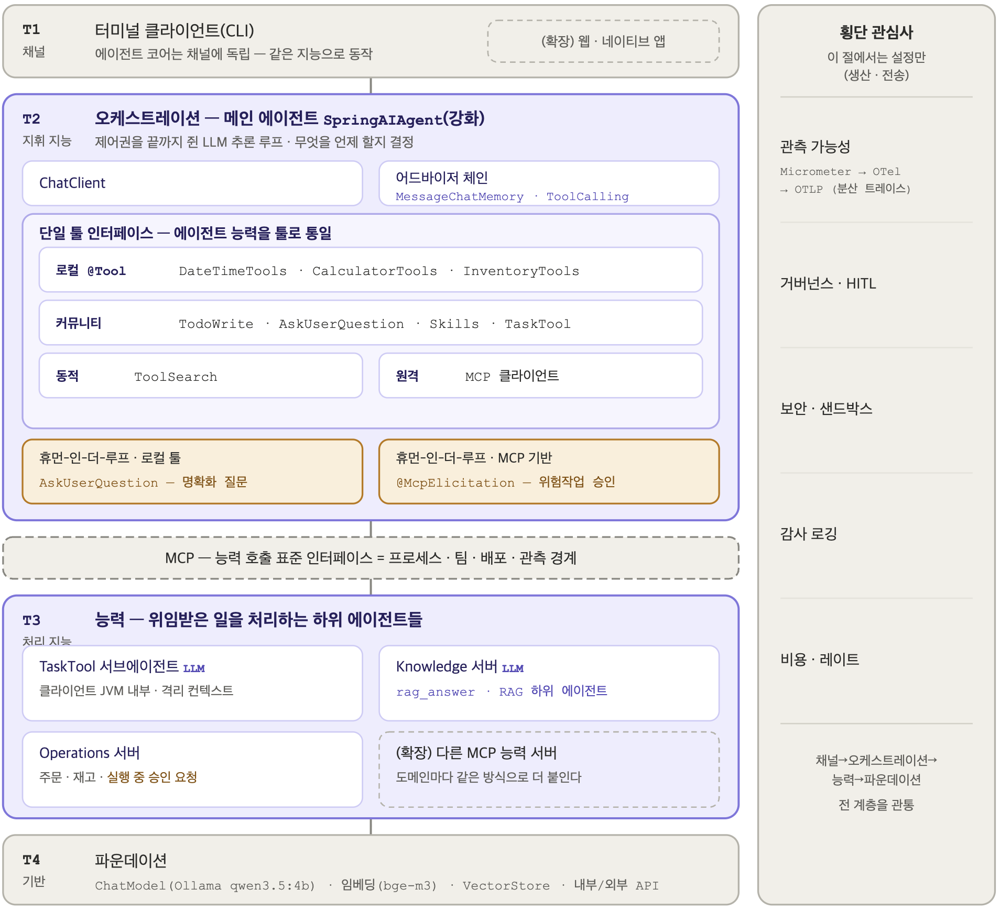
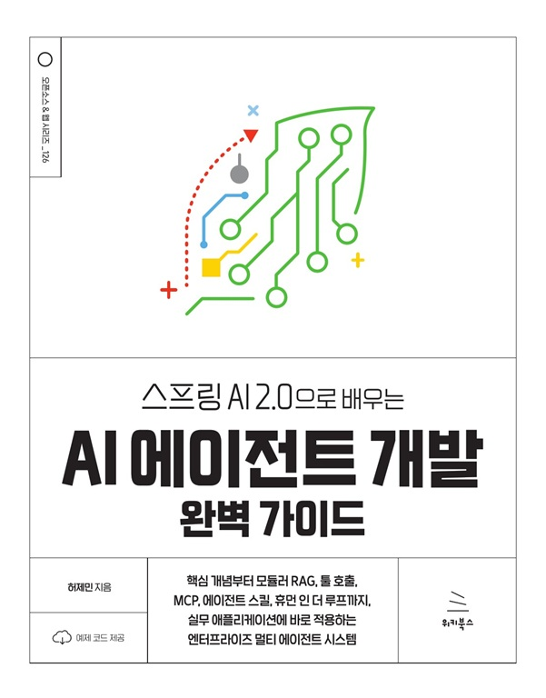

엔터프라이즈 AI 에이전트 시스템을 만드는 방법

# 설계는 4-티어 아키텍처로, 구현은 스프링 AI로

채널, 오케스트레이션, 능력, 파운데이션의 네 계층으로 역할을 나누고, 계층마다 필요한 기술을 스프링 AI 2.0으로 구현합니다. 도메인별 MCP 서버, 승인 게이트, 하위 에이전트, 관측 가능성까지 갖춘 에이전트 시스템을 책의 장 순서를 따라 완성해 갑니다.

[4-티어 아키텍처 살펴보기](part6/14-four-tier-architecture-for-ai-agent-systems.md){ .md-button .md-button--primary } [1장부터 읽기](part1/01-from-llm-calls-to-ai-agents-why-spring-ai.md){ .md-button }

<figure class="hero-figure" markdown>

<figcaption>AI 에이전트 서비스 4-티어 아키텍처</figcaption>
</figure>

## 한눈에 보는 요약: 티어마다 대응하는 스프링 AI 기술

-   T1 __채널 (Channel)__

    ---

    사용자와 만나는 접점입니다. 터미널 CLI, 웹, 네이티브 앱. 에이전트 코어와 분리돼 있어 채널만 바꿔 끼울 수 있습니다. 책의 예제는 모두 CLI 채널입니다.

    스프링 AI: `ChatClient` 스트리밍 응답, 사용자 개입(HITL) 표시

    [:octicons-arrow-right-24: ChatModel과 ChatClient](part2/03-chatmodel-chatclient-and-prompt-engineering.md), [2장 챗봇 CLI](part2/05-chat-memory-and-advisor-chain.md#이-장의-실습-프로젝트)

-   T2 __오케스트레이션 (Orchestration)__

    ---

    메인 에이전트입니다. 추론하고 계획하고 툴을 고르고 루프를 제어합니다. 경쟁력은 모델이 아니라 여기, 계획과 제어와 상태 관리에 있습니다.

    스프링 AI: `ChatClient`, 어드바이저 체인, `ToolCallingAdvisor`, `MessageChatMemoryAdvisor`, `ToolSearchToolCallingAdvisor`

    [:octicons-arrow-right-24: 재귀적 어드바이저와 툴 루프 제어](part6/16-recursive-advisor-and-tool-loop-control.md)

-   T3 __능력 (Capability)__

    ---

    에이전트가 쓰는 외부 능력입니다. 툴, MCP, 검색, 메모리. 로컬 메서드도, 같은 JVM의 하위 에이전트도, MCP로 연결된 원격 서버도 메인 에이전트에게는 모두 같은 툴입니다.

    스프링 AI: `@Tool`, MCP 클라이언트와 서버, `TaskTool` 하위 에이전트, 스킬, RAG

    [:octicons-arrow-right-24: 툴 호출 설계](part4/09-tool-calling-design-in-spring-ai.md), [MCP 기본](part5/11-mcp-basics-and-spring-ai-mcp-client.md)

-   T4 __파운데이션 (Foundation)__

    ---

    두 지능 계층이 사용하는 기반 자원입니다. 모델, 데이터, 인프라. 모델도 추론을 공급하는 기반 자원이므로 이 계층에 둡니다.

    스프링 AI: `ChatModel`, `EmbeddingModel`, `VectorStore`, ETL 파이프라인

    [:octicons-arrow-right-24: RAG 아키텍처와 ETL](part3/06-rag-architecture-and-etl-pipeline.md), [임베딩과 벡터 저장소](part3/07-embedding-models-and-vector-stores.md)

-   횡단 __횡단 관심사 (Cross-cutting)__

    ---

    특정 티어가 아니라 전 계층의 공통 관심사입니다. 관측 가능성(Observability), 거버넌스와 사용자 개입(HITL), 보안과 샌드박스, 감사 로깅, 비용과 레이트 제어.

    스프링 AI: Micrometer 관측과 OTLP, MCP Elicitation 승인 게이트, MCP 시큐리티(OAuth2, JWT)

    [:octicons-arrow-right-24: MCP 보안](part5/13-mcp-security-oauth2-and-jwt.md), [승인 게이트](part6/18-human-in-the-loop-approval-gate-with-mcp-elicitation.md)

-   :material-layers-triple:{ .lg .middle } __표준 인터페이스: MCP__

    ---

    오케스트레이션이 능력을 호출하는 경계입니다. 지금의 구현은 MCP 프로토콜입니다. 이 경계를 어디에 두느냐에 따라 클라이언트와 서버, 프로세스와 팀과 배포 단위가 나뉩니다.

    [:octicons-arrow-right-24: 4-티어를 클라이언트와 서버로 배치하기](part6/14-four-tier-architecture-for-ai-agent-systems.md)

## 클라이언트와 서버로 나누어 배치하기

네 계층은 논리적인 구분이라 실제로 어떻게 배치할지는 시스템마다 다를 수 있습니다. 책에서는 사용자가 터미널에서 실행하는 CLI를 메인 에이전트로 두고, 업무 능력은 도메인별 MCP 서버로 나누어 배치합니다.

<figure class="wide-figure" markdown>

<figcaption>4-티어 아키텍처를 클라이언트와 서버로 배치한 설계</figcaption>
</figure>

클라이언트인 CLI 프로세스에는 채널(T1)과 오케스트레이션(T2), 그리고 바로 실행하는 로컬 능력(T3)이 함께 들어갑니다. 재고 조회나 사내 문서 검색처럼 따로 운영하는 능력은 MCP 서버로 분리하고, 두 쪽은 Streamable HTTP 기반의 MCP로 연결합니다. 새로운 업무 능력이 필요해지면 메인 에이전트 코드는 그대로 두고 MCP 서버를 추가한 뒤 연결 정보만 등록하면 됩니다.

<figure class="wide-figure tall" markdown>

<figcaption>스프링 AI 컴포넌트로 옮긴 에이전트 CLI 시스템의 구성</figcaption>
</figure>

이 설계를 스프링 AI 컴포넌트로 옮기면 위와 같은 구성이 됩니다. `ChatClient`와 어드바이저 체인이 오케스트레이션을 맡고, 로컬 `@Tool`과 커뮤니티 툴, 원격 MCP 서버의 툴이 모두 하나의 툴 인터페이스로 정리됩니다. 6장의 [엔터프라이즈 에이전트 CLI 글](part6/20-enterprise-spring-ai-agent-cli-multi-agent-and-meta-tools.md)에서 이 구성을 코드로 완성하고, [관측 가능성 글](part6/21-observability-for-ai-agents-micrometer-otel-otlp.md)에서 전 계층의 추적을 켭니다. 그 앞의 글들은 이 그림에 들어가는 부품을 하나씩 다룹니다.

## 책의 장을 따라 읽기

책 「스프링 AI 2.0으로 배우는 AI 에이전트 개발 완벽 가이드」를 장 순서대로 따라가는 글입니다. 각 글은 그 장의 핵심 개념과 설명, 그리고 [예제 저장소](https://github.com/JM-Lab/spring-ai-agent-book)의 코드를 담습니다. 설계한 이유와 내부 구현, 실측 결과까지 깊이 보고 싶은 독자를 위해 글 끝에 책의 해당 절을 적어 두었습니다. 잘못된 곳을 발견하면 [오류 제보](book.md#오류-제보) 안내를 따라 알려 주세요.

<!-- chapters:start -->

-   1장 __AI 에이전트, 새로운 패러다임의 시작__

    ---

    1. [LLM 호출에서 AI 에이전트로, 그리고 왜 자바 개발자는 스프링 AI인가](part1/01-from-llm-calls-to-ai-agents-why-spring-ai.md)
    2. [스프링 AI 1.0에서 2.0으로, 무엇이 달라졌나](part1/02-whats-new-in-spring-ai-2-0.md)

-   2장 __스프링 AI 프레임워크__

    ---

    1. [ChatModel과 ChatClient, 그리고 프롬프트 엔지니어링](part2/03-chatmodel-chatclient-and-prompt-engineering.md)
    2. [토큰과 구조화한 출력: 모델의 답을 자바 객체로 받기](part2/04-tokens-and-structured-output.md)
    3. [대화 메모리와 어드바이저 체인: 스프링 AI의 코어](part2/05-chat-memory-and-advisor-chain.md)

-   3장 __스프링 AI와 RAG__

    ---

    1. [RAG 아키텍처와 ETL 파이프라인: 문서를 AI의 지식으로](part3/06-rag-architecture-and-etl-pipeline.md)
    2. [임베딩 모델과 벡터 데이터베이스](part3/07-embedding-models-and-vector-stores.md)
    3. [Naive RAG에서 모듈러 RAG로: 스프링 AI RAG 프레임워크](part3/08-from-naive-rag-to-modular-rag.md)

-   4장 __툴 호출__

    ---

    1. [툴 호출 설계: LLM이 현실 세계와 연결되는 방법](part4/09-tool-calling-design-in-spring-ai.md)
    2. [툴 구현과 실행 제어: @Tool에서 ToolCallingManager까지](part4/10-tool-implementation-and-execution-control.md)

-   5장 __스프링 AI MCP__

    ---

    1. [MCP 기본과 스프링 AI MCP 클라이언트](part5/11-mcp-basics-and-spring-ai-mcp-client.md)
    2. [스프링 AI로 MCP 서버 만들기: 부트 스타터부터 애너테이션까지](part5/12-building-an-mcp-server-with-spring-ai.md)
    3. [MCP 보안: OAuth2와 JWT로 지키는 MCP 클라이언트와 서버](part5/13-mcp-security-oauth2-and-jwt.md)

-   6장 __AI 에이전트__

    ---

    1. [AI 에이전트 서비스 4-티어 아키텍처](part6/14-four-tier-architecture-for-ai-agent-systems.md)
    2. [에이전트 실행 루프와 컨텍스트 엔지니어링](part6/15-agent-loop-and-context-engineering.md)
    3. [재귀적 어드바이저와 툴 루프 제어](part6/16-recursive-advisor-and-tool-loop-control.md)
    4. [스프링 AI 에이전트 아키텍처와 구현, 그리고 동적 툴 탐색](part6/17-spring-ai-agent-architecture-and-dynamic-tool-discovery.md)
    5. [사용자 개입(HITL): MCP Elicitation으로 만드는 승인 게이트](part6/18-human-in-the-loop-approval-gate-with-mcp-elicitation.md)
    6. [에이전트 스킬: 범용 스킬로 에이전트의 능력을 확장하기](part6/19-agent-skills-extending-capabilities.md)
    7. [엔터프라이즈 스프링 AI 에이전트 CLI: 멀티 에이전트와 메타 툴 오케스트레이션](part6/20-enterprise-spring-ai-agent-cli-multi-agent-and-meta-tools.md)
    8. [AI 에이전트 관측 가능성: Micrometer, OTel GenAI 규약, OTLP](part6/21-observability-for-ai-agents-micrometer-otel-otlp.md)

-   부록 __실습을 한 단계 넓히기__

    ---

    1. [오픈AI 전환, AI 평가, 외부 AI 에이전트 연결](appendix/22-openai-evaluation-and-external-agents.md)
    2. [스프링 AI 플레이그라운드](appendix/23-spring-ai-playground.md)

<!-- chapters:end -->

## 책, 예제 저장소, 플레이그라운드

**스프링 AI 2.0으로 배우는 AI 에이전트 개발 완벽 가이드**
 허제민 지음, 위키북스, 2026년 9월 17일 출간, 692쪽

이 사이트의 원전입니다. ChatClient부터 RAG, 툴 호출, MCP, 그리고 4-티어 아키텍처로 완성하는 엔터프라이즈 AI 에이전트까지, 스프링 AI 2.0 GA 기준으로 로컬 모델만으로 전부 실습합니다. 이 사이트가 핵심만 담는다면 책은 각 절의 설계 이유와 내부 구현과 실측까지 담습니다.

[온라인 구매](https://wikibook.co.kr/springai-agents/){ .md-button .md-button--primary } [책 소개](book.md){ .md-button }

-   :material-github:{ .lg .middle } __예제 저장소__

    ---

    장별 독립 Maven 프로젝트입니다. Java 21, Spring Boot 4, Spring AI 2.0.0 GA, 올라마 `qwen3.5:4b`와 `bge-m3`. 이 사이트의 코드 블록은 저장소 파일에서 그대로 가져옵니다.

    [:octicons-arrow-right-24: JM-Lab/spring-ai-agent-book](https://github.com/JM-Lab/spring-ai-agent-book)

-   :material-flask:{ .lg .middle } __스프링 AI 플레이그라운드__

    ---

    이 책의 저자가 리드 메인테이너로 이끄는 별도의 오픈소스 프로젝트입니다. 스프링 AI 커뮤니티의 인큐베이팅 프로젝트이며, 스프링 AI로 만들고 바딘(Vaadin)으로 UI를 개발한 데스크톱 애플리케이션입니다. 툴 스튜디오, MCP 서버 연결과 인스펙터, 벡터 데이터베이스와 RAG, 에이전트 채팅, 관측 가능성 다섯 축을 한 화면에서 시험합니다. 이 책의 MCP 서버를 그대로 연결해 볼 수 있습니다(부록 D).

    [:octicons-arrow-right-24: 플레이그라운드 소개](appendix/23-spring-ai-playground.md), [다운로드](https://spring-ai-community.github.io/spring-ai-playground), [GitHub](https://github.com/spring-ai-community/spring-ai-playground)

