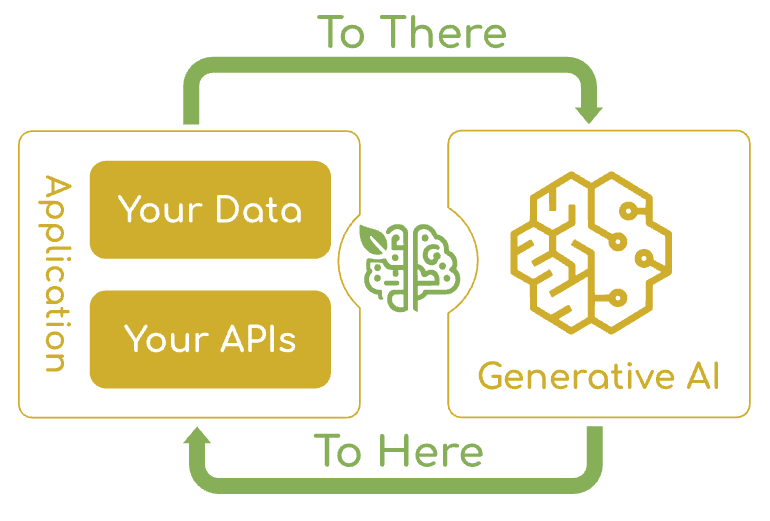

# From LLM Calls to AI Agents: Why Spring AI for Java Developers

<div class="post-meta" markdown>
<span class="tier-chip all">All 4 tiers</span> Book sections 1.1-1.3.2, 1.4 | Example [`basic-chat`](https://github.com/JM-Lab/spring-ai-agent-book/tree/main/basic-chat)
</div>

Code that sends a question to an LLM and gets an answer back now takes only a few lines. But what companies expect from AI does not end with a single answer. They need AI agents that take a goal, break the work down, query internal systems, and look at the results to choose the next action.

Yet most core enterprise systems are built in Java, and AI libraries appeared in Python first. This first article on the site covers how an agent differs from an LLM call, the difficulties Java developers faced, and the answer Spring AI came up with. At the end, it outlines how the book is organized and the blueprint this site uses to follow that organization.

## The difference between an LLM call and an AI agent

The age of agents arrived as several trends matured at once. Since ChatGPT, LLMs such as GPT-5, Claude, and Llama have advanced quickly, and AWS, Google Cloud, and Azure have expanded their generative AI services. As the number of users of new AI services grew sharply and companies also pushed for adoption, the groundwork took shape for building agents that go beyond generating text and handle work on their own.

The LLM in a chatbot stops at answering questions. Give the same LLM a goal along with tools, and that changes. It makes a plan to reach the goal, picks the right tools and runs them, and decides the next action based on the results. An intelligent actor that moves toward a goal on its own in this way, within a given environment, is called an AI agent.

The book shows this flow with the request "Plan a five-day, four-night trip to Hawaii for next week."

1. Splits the request into flight lookup, hotel search, and activity recommendations.
2. Uses a flight lookup tool to find flights available next week.
3. Searches a hotel booking API for accommodations that match the chosen flight dates.
4. Organizes the collected information into an itinerary in natural language and proposes it to the user.

Even a single agent handles this much well. The trouble starts when the requirements get more complex. A single agent takes on every role, such as travel guide, budget calculation, and API calls, inside one long prompt. When responsibilities are concentrated in one place, the LLM misses instructions in the middle (lost in the middle) or picks the wrong tool out of many. In other words, the limits of the context window and conflicts between roles show up together. If flight prices change in real time and the budget is exceeded as well, the agent's judgment can easily waver between calculating and booking.

That is why multi-agent systems with separate roles emerged. For example, an orchestrator that talks with the user and distributes the work, a booking agent that only finds and books flights and available rooms, a local expert that plans routes around the weather and local events, and a reviewer that does a final check of the routes and total cost all work together. In software development, too, agent development tools such as Claude Code and OpenClaw have appeared, and an agent that writes code, an agent that catches errors, and an agent that looks up API documentation work hand in hand like a team.

## Enterprise systems run on Java, the AI ecosystem on Python

After ChatGPT showed the business potential of AI, companies set out to adopt AI agents, hoping for work automation, better customer experiences, and new services. The obstacle was that most large enterprise systems run in the Java ecosystem. Everything from database integration to REST APIs and complex business rules is an asset built up in Java code over decades.

AI technology centered on Python. Major libraries such as TensorFlow, PyTorch, LangChain, and Hugging Face Transformers supported Python first, and its concise syntax and scientific computing libraries made experimentation and prototyping fast. Faced with this mismatch, Java developers ran into three difficulties.

- **Libraries:** Most libraries used for AI development centered on Python, which made them hard to use from Java.
- **Paradigm:** Unlike deterministic code, where the same input yields the same result, an LLM communicates through natural language prompts instead of function calls and gives different answers to the same question depending on the context.
- **Standards:** There were few best practices for connecting AI models to enterprise systems the Java way.

This has been changing recently. Eclipse Deeplearning4j, a Java-native deep learning library, and LangChain4j, which reimplements ideas from Python libraries in Java, opened up the possibilities first. With the release of Spring AI 1.0 GA on May 20, 2025, an ecosystem for building AI services in pure Java took hold, and with the Spring AI 2.0 GA release on June 12, 2026, the framework moved fully into the agent stage.

Spring AI starts not from porting outside tools but from the Spring way of developing. It applies dependency injection, auto-configuration, and modularity to AI features in the same way. Add a model starter as a dependency and write the connection details in the configuration file, and Spring Boot creates a `ChatClient.Builder` bean for you. Developers inject this builder and just call `build()`. `basic-chat` in the example repository is this minimal setup.

```java title="SpringAiAgentBookApplication.java"
--8<-- "basic-chat/src/main/java/kr/jmlab/spring/ai/agent/book/SpringAiAgentBookApplication.java:28:45"
```
<span class="code-link">[View full code](https://github.com/JM-Lab/spring-ai-agent-book/blob/main/basic-chat/src/main/java/kr/jmlab/spring/ai/agent/book/SpringAiAgentBookApplication.java)</span>

`basic-chat` uses the Ollama starter and specifies the local Ollama address and the `qwen3.5:4b` model in `application.yml`. The code builds a client with the auto-registered `ChatClient.Builder`, sends a single question with `prompt().user(...).call().content()`, and receives the answer as a string. Add tool calling and the advisor chain on top of this, and external system integration and RAG workflows follow in the same way. The [ChatModel and ChatClient article](../part2/03-chatmodel-chatclient-and-prompt-engineering.md) covers how `ChatClient` is structured.

## Spring AI's goals and its place in the Spring ecosystem

Spring AI is aimed at Java developers who work with Spring. It is built on Spring Boot and Spring Data, and you add generative AI features with familiar tools such as dependency injection, annotations, and abstractions.

<figure class="wide-figure" markdown>

<figcaption>Spring AI addresses the fundamental challenge of AI integration by connecting enterprise data and APIs with AI models (Source: <a href="https://docs.spring.io/spring-ai/reference/index.html">Spring AI Introduction</a>)</figcaption>
</figure>

As the figure shows, the problem Spring AI sets out to solve is connection. The goal is to solve the integration problems that come up when bringing generative AI into enterprise applications, so that AI sits alongside existing business logic. You keep using the beans, services, and repositories you already have, and the framework handles the complex parts of data embedding, similarity search, and real-time API calls. As a result, you can add AI features without major changes to your codebase.

Being part of the Spring ecosystem leads to four advantages that enterprise AI applications need.

- **Enterprise integration:** Spring applications are already connected to databases, message brokers, caches, search engines, and monitoring tools, and AI features use those same connections. For example, if you use PostgreSQL's pgvector extension as the vector store for RAG, the vectors sit in the same PostgreSQL database as the relational data your Spring Data JPA code already manages.
- **Security and compliance:** Prompts can contain sensitive information, and model responses also need filtering. Spring Security method security, such as `@PreAuthorize` and `@PostAuthorize`, restricts who can call which AI APIs, and audit logs track what was exchanged with the AI.
- **Scaling and high availability:** Spring Cloud and Kubernetes scale AI services horizontally, and Spring Cloud Circuit Breaker guards against failures in external AI APIs. If an external model goes down, you can return a fallback response or fail over to a local model.
- **Observability:** Spring Boot Actuator and Micrometer collect response times, token usage, and error rates, and Micrometer Tracing follows the path a single request takes through multiple services to reach the model.

## How the book is organized and the path this site follows

Companies want to build AI agents with the proven Java assets and development teams they already have. With 2.0, Spring AI gained a foundation for agent development and can now meet that need. So the book is organized to build up AI services one step at a time in a familiar Spring environment and, at the end, integrate the results into a single enterprise AI agent system. Each chapter has one hands-on CLI project.

| Chapter | Technologies covered | Hands-on project at the end of the chapter |
| --- | --- | --- |
| Chapter 2. The Spring AI Framework | Local Ollama environment, prompt engineering, tokens, structured output, chat memory, the advisor chain | AI Chatbot CLI |
| Chapter 3. Spring AI and RAG | ETL pipeline, embedding models, vector databases, Modular RAG | RAG AI Chatbot CLI |
| Chapter 4. Tool Calling | How tool calling works and how to design it, method and function tools, controlling tool execution | Tool-Enabled AI Chatbot CLI |
| Chapter 5. Spring AI MCP | MCP architecture, MCP clients and servers, MCP security | MCP-Based AI Chatbot CLI |
| Chapter 6. AI Agents | Workflow patterns, the agent loop, context engineering, recursive advisors, Agent Skills, subagents, multi-agent systems, meta-tools, observability | Enterprise Spring AI Agent CLI |
| Appendix | OpenAI environment, AI evaluation, connecting external agent tools, Spring AI Playground | |

The result of Chapter 6 does more than demonstrate a single feature. The main agent takes the user's request, makes a plan, searches for and selects the tools it needs, and gets human approval before operations that are hard to undo. It delegates parts of the work to a RAG knowledge server and subagents, and traces the whole process with standard observability data. This site follows the order of the book's chapters, and each article points out where its technology is used in this final system.

## Where this fits in the 4-tier architecture

To design the final system, Chapter 6 of the book divides an AI agent system into four tiers: T1 Channel, where users meet the agent; T2 Orchestration, which makes plans, picks tools, and controls the loop; T3 Capability, where tools, MCP servers, and subagents do the actual work; and T4 Foundation, which provides models, data, and infrastructure. Observability, approval gates, security, auditing, and cost control are treated as cross-cutting concerns that span all four tiers. `ChatClient` and the advisor chain from Chapter 2 go into T2, the embedding models and vector databases from Chapter 3 into T4, the tools from Chapter 4 into T3, and MCP from Chapter 5 into the boundary that connects T2 and T3. This article is the entrance to the whole map rather than a look at a single tier, and the [4-tier architecture article](../part6/14-four-tier-architecture-for-ai-agent-systems.md) covers the definition and deployment of each tier in detail. The next article, [From Spring AI 1.0 to 2.0: What Changed](../part1/02-whats-new-in-spring-ai-2-0.md), summarizes the major changes in Spring AI 2.0, the framework you build these parts with.

## More in the book

!!! book "Book sections 1.1-1.3.2, 1.4"
    - **1.1 The age of agents:** How a single agent runs into role conflicts and context limits, and an example of how a multi-agent system divides roles
    - **1.2.1 The Python-centered AI development ecosystem:** An explanation, told through developer experience, of the gap between deterministic Java development and probabilistic LLMs
    - **1.2.2 The shift in the Java AI development ecosystem:** How auto-configuration, tool calling, and advisors change the way Java developers build AI
    - **1.3.2 Spring AI's role and advantages in the Spring ecosystem:** Enterprise use cases such as asynchronous processing with Kafka, caching with Redis, circuit breaker fallbacks, and distributed tracing
    - **1.4.1 A practical guide to AI agent development:** The learning goals of each chapter and how the hands-on projects lead up to the final system

    [About the book](../book.md){ .md-button } [Buy the book (Korean)](https://wikibook.co.kr/springai-agents/){ .md-button .md-button--primary }

## References

- [Spring AI 1.0 GA Released](https://spring.io/blog/2025/05/20/spring-ai-1-0-GA-released): the announcement of the Spring AI 1.0 GA release
- [Spring AI 2.0.0 GA Available Now](https://spring.io/blog/2026/06/12/spring-ai-2-0-0-GA-available-now): the announcement of the Spring AI 2.0 GA release
- [Spring AI Introduction](https://docs.spring.io/spring-ai/reference/index.html): the introduction page of the official Spring AI reference documentation, and the source of Figure 1.1
