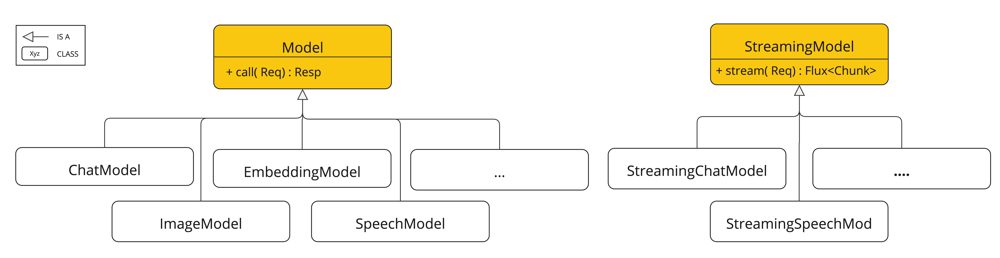
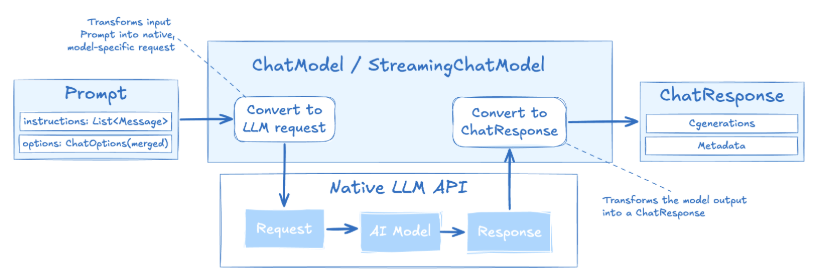

# ChatModel과 ChatClient, 그리고 프롬프트 엔지니어링

<div class="post-meta" markdown>
<span class="tier-chip t2">T2 오케스트레이션</span><span class="tier-chip t4">T4 파운데이션</span> 책 2.1~2.4절 | 예제 [`basic-chat`](https://github.com/JM-Lab/spring-ai-agent-book/tree/main/basic-chat), [`chapter2`](https://github.com/JM-Lab/spring-ai-agent-book/tree/main/chapter2)
</div>

스프링 AI로 LLM을 호출하는 코드를 쓰면 가장 먼저 ChatModel과 ChatClient를 만납니다. 둘 다 모델에 질문을 보내고 답을 받지만 맡은 일이 다릅니다. 이 차이를 알아 두면 모델 제공자가 바뀌어도 코드를 고칠 일이 줄고, 뒤에서 메모리나 툴 같은 기능을 어디에 붙일지도 분명해집니다.

이 글은 책 2장의 앞부분을 따라갑니다. 스프링 AI가 여러 AI 모델을 공통 인터페이스로 묶는 방식을 먼저 보고, 올라마로 로컬 개발 환경을 준비해 첫 호출을 합니다. 이어서 ChatClient로 동기 호출과 스트리밍을 비교하고, 프롬프트를 이루는 메시지 역할과 PromptTemplate, ChatOptions를 정리합니다. [앞 글](../part1/02-whats-new-in-spring-ai-2-0.md)이 2.0의 변화를 훑었다면, 이 글부터는 예제를 직접 실행하며 따라갑니다.

## AI Model API의 설계 방향

JDBC를 떠올리면 이해가 빠릅니다. 애플리케이션은 JDBC 인터페이스에만 의존하고, 데이터베이스마다 다른 통신은 드라이버가 처리합니다. 스프링 AI도 같은 방식으로 올라마, 오픈AI, 앤트로픽, 구글 제미나이처럼 API가 서로 다른 제공자를 공통 자바 인터페이스 뒤로 감춥니다.

계층의 꼭대기에는 인터페이스가 두 개 있습니다. 요청을 보내고 완성된 응답을 기다리는 `Model`, 그리고 결과가 만들어지는 대로 조각(chunk)을 `Flux`로 흘려보내는 `StreamingModel`입니다. ChatModel, ImageModel, EmbeddingModel 같은 모델 유형은 이 둘을 확장한 인터페이스입니다.

<figure class="wide-figure" markdown>

<figcaption>AI Model API 최상위 인터페이스 계층도 (출처: <a href="https://docs.spring.io/spring-ai/reference/api/index.html#_ai_model_api">Spring AI API</a>)</figcaption>
</figure>

모든 유형이 스트리밍을 지원하지는 않습니다. 이미지 생성과 임베딩은 결과를 한 번에 받는 작업이라 동기 인터페이스만 있습니다. 반면 대화형 모델 구현체는 대부분 두 인터페이스를 함께 구현하므로 같은 객체에서 `call()`과 `stream()`을 골라 씁니다. 비즈니스 코드가 구현 클래스가 아닌 ChatModel 인터페이스에만 기대면, 제공자를 바꿀 때 자바 코드는 그대로 두고 의존성과 설정만 고치면 됩니다.

## 로컬 우선 개발 환경

책은 로컬 우선(local-first) 전략을 권합니다. 개발하는 동안에는 내 PC에서 도는 무료 모델로 비용 걱정 없이 실험하고, 운영 배포를 앞두고 성능과 환경을 따져 오픈AI 같은 클라우드 API로 옮기는 방식입니다. 모델 서버는 올라마, 기준 모델은 알리바바의 Qwen3.5-4B(`qwen3.5:4b`)입니다. 가벼우면서도 한국어를 잘 다루고 툴 호출과 이미지 입력을 지원합니다. 올라마는 도커 대신 호스트 OS에 직접 설치합니다. 그래야 별도 드라이버 설정 없이 GPU 가속(CUDA, Metal)이 바로 켜집니다. PC 사양이 부족하다면 [부록 글](../appendix/22-openai-evaluation-and-external-agents.md)을 참고해 오픈AI API로 실습합니다.

스프링 AI 프로젝트는 스프링 부트 프로젝트에 AI 의존성을 더한 것입니다. 평소처럼 부트 프로젝트를 만들고 `spring-ai-bom`으로 버전을 맞춘 뒤 올라마 스타터를 추가하면 됩니다. 예제의 pom.xml은 자바 21, 스프링 부트 4.0.7, 스프링 AI 2.0.0 기준입니다. 설정은 한글 주석을 달기 편한 application.yml로 씁니다.

```yaml title="application.yml (chapter2)"
--8<-- "chapter2/src/main/resources/application.yml"
```
<span class="code-link">[전체 코드 보기](https://github.com/JM-Lab/spring-ai-agent-book/blob/main/chapter2/src/main/resources/application.yml)</span>

`spring.ai.model.chat`은 사용할 채팅 모델 제공자를 고르고, `spring.ai.ollama` 아래에는 올라마 서버 주소와 모델 이름을 적습니다. `think: false`는 추론을 끄는 값입니다. Qwen3.5-4B는 추론 기능이 있어서 이 값을 비워 두면 환경에 따라 추론이 켜지고 응답이 늦어질 수 있습니다. `spring.ai.cli.step`은 예제 프로젝트가 정의한 값으로, 단계별 러너 중 실행할 하나를 고릅니다. 맨 위의 `logging.level` 설정은 Step 5와 최종 단계에서 로깅 어드바이저가 남기는 요청과 응답을 보려고 켠 DEBUG 레벨입니다.

## 첫 호출: 한 번 묻고 한 번 받기

basic-chat은 같은 올라마 설정을 쓰는 저장소의 가장 작은 예제입니다. 컨트롤러 없이 `CommandLineRunner` 빈 하나가 애플리케이션 구동 직후 질문을 보내고 콘솔에 답을 출력합니다.

```java title="SpringAiAgentBookApplication.java (basic-chat)"
--8<-- "basic-chat/src/main/java/kr/jmlab/spring/ai/agent/book/SpringAiAgentBookApplication.java:17:46"
```
<span class="code-link">[전체 코드 보기](https://github.com/JM-Lab/spring-ai-agent-book/blob/main/basic-chat/src/main/java/kr/jmlab/spring/ai/agent/book/SpringAiAgentBookApplication.java)</span>

스타터를 추가하면 자동 구성이 설정에 맞는 ChatModel을 연결한 `ChatClient.Builder`를 빈으로 등록합니다. 코드는 이 빌더로 클라이언트를 만들고 `prompt()`로 요청을 시작해 `user()`에 질문을 담습니다. `call()`은 모델이 답변을 끝까지 만든 다음 한꺼번에 받아 오는 동기 호출이고, `content()`는 그 응답에서 텍스트만 꺼냅니다. 답변이 길면 그만큼 오래 기다린 뒤에야 첫 글자를 보게 됩니다.

## ChatModel과 ChatClient: 드라이버와 클라이언트

스프링 AI는 모델과 대화하는 API를 두 단계로 나눕니다. 아래층의 저수준 API인 ChatModel은 RestTemplate이나 JDBC 드라이버와 비슷한 역할을 합니다. 요청을 제공자 API 형식으로 바꿔 보내고 돌아온 응답을 해석합니다. 한마디로 '어떻게 통신할지'를 책임집니다. `call(Prompt)`는 `ChatResponse`를, `stream(Prompt)`는 `Flux<ChatResponse>`를 돌려줍니다. ChatResponse에는 생성된 답변(Generation) 목록과 토큰 사용량 같은 메타데이터가 들어 있습니다.

반면 ChatClient는 ChatModel 위에 얹힌 고수준 API입니다. 관심사는 '무엇을 대화할지'이고, 빌더와 플루언트 API로 요청을 조립하며 프롬프트 템플릿과 대화 흐름을 다룹니다. 프레임워크를 확장하거나 모델 구현체를 직접 만드는 경우가 아니라면 애플리케이션 코드는 ChatClient로 작성하는 편이 좋습니다.

ChatClient에서 요청 조립(`prompt()`, `system()`, `user()`)과 실행(`call()`, `stream()`)은 서로 다른 단계입니다. 그래서 마지막 실행 메서드만 바꾸면 동기 호출이 스트리밍으로 바뀝니다. chapter2 Step1은 basic-chat의 호출을 스트리밍으로 바꾸고, 여러 번 묻고 답하도록 반복문으로 감쌌습니다.

```java title="Ch2Step1_BasicStreamChat.java"
--8<-- "chapter2/src/main/java/kr/jmlab/spring/ai/agent/book/chapter2/Ch2Step1_BasicStreamChat.java:21:58"
```
<span class="code-link">[전체 코드 보기](https://github.com/JM-Lab/spring-ai-agent-book/blob/main/chapter2/src/main/java/kr/jmlab/spring/ai/agent/book/chapter2/Ch2Step1_BasicStreamChat.java)</span>

`stream().content()`는 `Flux<String>`을 돌려주고, `doOnNext`가 토큰이 도착하는 대로 출력합니다. `blockLast()`는 응답이 끝난 뒤 다음 입력을 받도록 기다리는 콘솔용 처리입니다. 사용자는 첫 토큰부터 답을 읽기 시작하므로 체감 대기 시간이 줄어듭니다. 대신 프런트엔드와 백엔드 모두 스트림을 다루는 코드가 필요합니다. 이 러너는 실행 인자 `--spring.ai.cli.step=ch2-step1`로 켭니다.

생성자에서 클라이언트를 한 번만 만드는 데도 이유가 있습니다. ChatClient는 만든 뒤 설정을 바꿀 수 없는 불변 객체라서 여러 스레드가 함께 써도 안전합니다. 설정은 가변 객체인 Builder에서 더합니다. 책은 전역 클라이언트 하나를 돌려쓰기보다 컴포넌트마다 Builder를 주입받아 용도에 맞게 설정하고, `build()`로 전용 클라이언트를 만드는 방식을 권합니다. ChatClient는 이전 대화도 기억하지 않습니다. 대화 문맥을 이어 가는 방법은 [대화 메모리와 어드바이저 체인](../part2/05-chat-memory-and-advisor-chain.md)에서 다룹니다.

## Prompt와 메시지 역할

ChatModel이 받는 `Prompt`는 문자열이 아니라 요청 하나를 통째로 담는 객체입니다. 대화를 이루는 메시지 목록(`List<Message>`)과 실행 옵션(`ChatOptions`)이 함께 들어갑니다. 그래서 여러 턴의 대화를 한 요청으로 보낼 수 있고, 같은 프롬프트를 설정만 바꿔 시험하기도 쉽습니다.

<figure class="wide-figure" markdown>

<figcaption>ChatOptions 구성 및 실행 흐름도 (출처: <a href="https://docs.spring.io/spring-ai/reference/api/chatmodel.html#_api_overview">Chat Model API</a>)</figcaption>
</figure>

그림에서 보듯 ChatModel 안에서 Prompt는 제공자 고유의 요청으로 바뀌고, 모델의 응답은 표준 ChatResponse로 변환되어 돌아옵니다.

메시지에 역할이 붙는 이유는 LLM이 각 입력을 누가 말했는지 알아야 하기 때문입니다. 스프링 AI는 텍스트와 메타데이터를 담는 `Content` 인터페이스에 역할(`MessageType`)을 더해 `Message`를 정의하고, 역할마다 구현체를 둡니다.

- `SystemMessage`: 모델의 페르소나와 대화 규칙을 정합니다. 텍스트만 담습니다.
- `UserMessage`: 사용자 입력입니다. 텍스트와 함께 이미지나 오디오 같은 미디어를 실을 수 있습니다.
- `AssistantMessage`: 모델의 답변입니다. 모델이 툴을 쓰겠다고 요청할 때의 툴 호출 정보도 여기에 담깁니다.
- `ToolResponseMessage`: 툴을 실행한 결과를 모델에 돌려줄 때 씁니다.

클라이언트의 모든 호출에 시스템 메시지를 걸어 두려면 Builder의 `defaultSystem()`을 씁니다. Step2는 이 메서드로 시니어 자바 멘토라는 페르소나를 고정합니다.

```java title="Ch2Step2_PromptTemplate.java"
--8<-- "chapter2/src/main/java/kr/jmlab/spring/ai/agent/book/chapter2/Ch2Step2_PromptTemplate.java:23:36"
```
<span class="code-link">[전체 코드 보기](https://github.com/JM-Lab/spring-ai-agent-book/blob/main/chapter2/src/main/java/kr/jmlab/spring/ai/agent/book/chapter2/Ch2Step2_PromptTemplate.java)</span>

텍스트 블록에 페르소나와 답변 규칙을 적고 생성자에서 등록했습니다. 요청을 보내는 코드는 Step1과 똑같지만, 이제 답은 멘토의 관점과 말투로 돌아옵니다. 특정 요청에만 다른 지시를 넣으려면 `prompt().system(...)`을 씁니다.

## PromptTemplate: 틀과 데이터 나누기

서비스에서 쓰는 프롬프트에는 사용자 입력, 조회 결과, 현재 시각처럼 매번 달라지는 값이 들어갑니다. 이런 값을 `+`로 이어 붙이면 읽기 어렵고 프롬프트 인젝션에도 취약해집니다. `PromptTemplate`은 프롬프트의 틀과 데이터를 분리합니다. 틀과 데이터를 나누면 관리가 쉬워지지만 치환 자체가 인젝션을 막아 주지는 않으므로, 입력 검증은 따로 필요합니다. 템플릿에 `{topic}` 같은 자리 표시자를 두고, 실행할 때 `Map`으로 값을 넘깁니다.

치환은 `TemplateRenderer` 인터페이스가 맡으며, 기본 구현체는 StringTemplate 엔진을 쓰는 `StTemplateRenderer`입니다. 렌더링 결과는 쓰임새에 따라 세 가지 형태로 받습니다.

- `render()`: 문자열을 돌려줍니다. 모델을 호출하기 전에 완성된 프롬프트를 로그로 확인할 때 씁니다.
- `createMessage()`: Message를 돌려줍니다. 기본은 사용자 메시지이고, `SystemPromptTemplate`을 쓰면 시스템 메시지가 됩니다. 시스템 템플릿과 사용자 템플릿을 따로 관리하다가 하나의 Prompt로 합칠 때 알맞습니다.
- `create()`: 바로 호출할 수 있는 Prompt를 돌려줍니다. ChatOptions를 함께 넘길 수도 있습니다.

ChatClient에서는 `user(u -> u.text(...).param(...))` 형태로 요청 안에서 같은 바인딩을 합니다.

## ChatOptions: 모델 실행 옵션

같은 프롬프트라도 모델을 어떤 옵션으로 실행하느냐에 따라 답이 달라집니다. `ChatOptions`는 특정 제공자에 묶이지 않는 공통 옵션 인터페이스로, model, temperature, maxTokens, topP, topK 같은 값을 담습니다. 제공자에만 있는 옵션은 `OpenAiChatOptions`, `OllamaChatOptions` 같은 전용 클래스가 더합니다.

대표적인 옵션은 `temperature`와 `maxTokens`입니다. `temperature`는 답변의 무작위성을 정합니다. 사실 확인이나 분류처럼 일관성이 중요하면 0.0~0.3 정도로 낮추고, 브레인스토밍처럼 다양한 답이 필요하면 0.8~1.0으로 올립니다. `maxTokens`는 생성할 토큰 수의 상한이라 장황한 답을 줄이고 비용을 아끼는 데 씁니다.

옵션은 두 시점에 정해집니다. 애플리케이션이 시작될 때 application.yml에 적은 값이 모델의 기본 옵션이 되고, 요청할 때 Prompt나 ChatClient의 `.options()`로 넘긴 값이 그 기본값을 덮어씁니다. 앞 그림에서 Prompt의 옵션이 병합된(merged) 상태로 표시된 이유입니다. 전용 옵션 클래스는 코드를 특정 제공자에 묶으므로, 공통 옵션으로 해결되지 않을 때만 쓰는 편이 좋습니다.

## 4-티어 아키텍처에서의 위치

이 글에서 다룬 두 API는 4-티어 아키텍처에서 서로 다른 층에 놓입니다. ChatModel과 그 뒤에서 도는 올라마 모델은 추론을 공급하는 T4 파운데이션입니다. ChatClient는 프롬프트와 옵션을 조립해 모델을 부르는 T2 오케스트레이션의 출발점입니다. 앤트로픽은 LLM에 검색, 툴, 메모리를 덧붙인 증강된 LLM을 효과적인 AI 시스템의 기본 구성 단위로 제시합니다. ChatClient는 이 요소들을 붙일 수 있게 설계되어 있어, `.entity()`로 구조화한 출력을, `.advisors()`로 메모리와 RAG를, `.tools()`로 툴 호출과 MCP를 더합니다. 다음 글 [토큰과 구조화한 출력: 모델의 답을 자바 객체로 받기](../part2/04-tokens-and-structured-output.md)에서는 비용과 컨텍스트를 가늠하는 단위인 토큰을 살펴보고, 이어서 구조화한 출력을 붙여 봅니다.

## 책에서 더 다루는 내용

!!! book "책 2.1~2.4절"
    - 개발 환경 세부: 하드웨어 권장 사양과 대안 모델, IntelliJ IDEA 프로젝트 생성
    - ChatResponse 메타데이터: 종료 이유, 오픈AI의 다중 답변 후보, 토큰 사용량 확인 시 주의점
    - ChatClient 구성: 자동 구성과 수동 주입, 여러 모델을 함께 쓰는 멀티 모델 구성
    - 고급 템플릿 기법: JSON 중괄호와 충돌하지 않도록 구분자를 바꾸는 렌더러, 외부 파일로 템플릿 관리
    - 효과적인 프롬프트 작성: 지시, 외부 맥락, 사용자 입력, 출력 지시자의 네 요소와 퓨샷 예시
    - 모델 전용 옵션과 프롬프트 기법: 추론 모델의 파라미터 제약, 제로샷부터 생각의 나무까지 아홉 가지 기법

    [책 소개](../book.md){ .md-button } [온라인 구매](https://wikibook.co.kr/springai-agents/){ .md-button .md-button--primary }

## 참고 자료

- [Spring AI API: AI Model API](https://docs.spring.io/spring-ai/reference/api/index.html#_ai_model_api): Model과 StreamingModel 중심의 모델 추상화
- [Chat Model API](https://docs.spring.io/spring-ai/reference/api/chatmodel.html#_api_overview): ChatModel, Prompt, Message, ChatOptions의 구조
- [Prompt Engineering Techniques](https://docs.spring.io/spring-ai/reference/api/chat/prompt-engineering-patterns.html#_2_prompt_engineering_techniques): 스프링 AI 문서의 프롬프트 기법 모음
- [Building effective agents](https://www.anthropic.com/engineering/building-effective-agents): 증강된 LLM과 에이전트 구성 패턴
- [Ollama 다운로드](https://ollama.com/download): 올라마 설치 파일
- [StringTemplate](https://www.stringtemplate.org/): PromptTemplate의 기본 렌더러가 쓰는 템플릿 엔진
