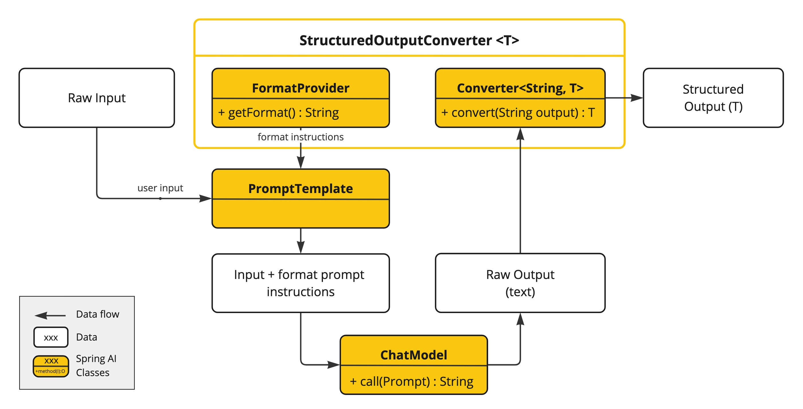
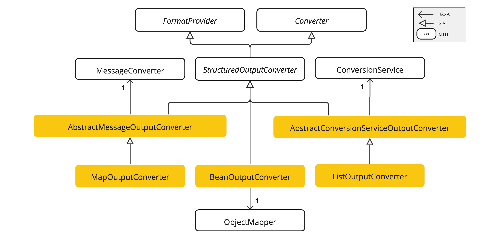

# Tokens and Structured Output: Getting Model Answers as Java Objects

<div class="post-meta" markdown>
<span class="tier-chip t2">T2 Orchestration</span> Book sections 2.5-2.6 | Example [`chapter2`](https://github.com/JM-Lab/spring-ai-agent-book/tree/main/chapter2)
</div>

The [previous article](../part2/03-chatmodel-chatclient-and-prompt-engineering.md) called a model with `ChatClient` and used prompts to steer its answers. This article looks at the two ends of that call. On the way in, text is turned into tokens and passed to the model. On the way out, the model returns sentences written for people to read.

Both ends have a direct effect on design. The number of tokens determines how much information you can send at once and how much it costs. The free-form sentences a model returns do not fit well with Java code, which works with fields and types. Parsing code that pulls the number out of an answer like "The population of Seoul is about 9.7 million" breaks as soon as the model changes its wording even slightly.

So the first part of this article looks at tokens from a developer's point of view. The second part uses example code to walk through structured output, which returns a model's answer as a Java record, and provider-native structured output.

## Tokens from a developer's point of view

A token is the smallest unit a model uses to handle text. An LLM converts input text into a sequence of integer tokens and then processes them. If you enter a sentence into the [OpenAI tokenizer](https://platform.openai.com/tokenizer), each token is shown in a different color, and you can also see the integer value for each token.

If you think of tokens as roughly a character count, you will overlook some things in your design. There are three points developers should keep in mind.

- **Context window**: There is an upper limit on the number of tokens a model accepts at once. Early GPT-3 accepted about 2,000 tokens, while GPT-5 and the o1 family accept 200K or more. That does not mean more is always better. A model can miss content in the middle of a long input, a problem known as lost in the middle, so you need to choose what to put in.
- **Cost**: Cloud LLMs charge for the tokens you use. Output tokens are often priced higher than input tokens, so using the prompt to keep answers from running longer than necessary is the basic way to manage cost.
- **Language understanding**: The better a tokenizer splits text into meaningful units, the better the model grasps context. A major reason older models performed poorly in Korean was that Korean text was chopped into small fragments with no meaning of their own.

## Korean token efficiency and the hybrid prompt strategy

The advice that "Korean uses a lot of tokens, so you should translate it into English first" was true for early models. With the latest tokenizers, the situation is different. The following table shows token counts by tokenizer generation for the same greeting written in Korean and in English.

| Generation | Models | Tokenizer | <span lang="ko">안녕하세요. 만나서 반갑습니다.</span> | Hello. Nice to meet you. |
| --- | --- | --- | --- | --- |
| Latest | GPT-5, o1/o3 | `o200k_base` | 9 tokens | 7 tokens |
| Transitional | GPT-4, GPT-3.5 | `cl100k_base` | 14 tokens | 7 tokens |
| Legacy | GPT-3 | `r50k_base` | 38 tokens | 7 tokens |

In the GPT-3 generation, the Korean sentence used more than five times as many tokens as the English one, but in the latest generation there is almost no difference. There is less reason to insist on English because of cost. If anything, translation tends to lose the difference between Korean particles such as eun/neun and i/ga, as well as the nuance of honorific speech. When you give instructions directly in Korean, that intent comes through intact, and with no translation step, the setup is simpler and response latency goes down.

That does not mean you should write the entire prompt in Korean. The book recommends a hybrid prompt that mixes an English structure with Korean content. The paper it cites as evidence, ["Do Multilingual LLMs Think in English?"](https://arxiv.org/abs/2502.15603), reports that even multilingual models tend to make fairly stable use of an English-centric representation space when they process non-English input. So you build the skeleton, such as Role, Task, Output Format, and Constraints, in English, and write the specific instructions and context in Korean. Which combination works well can differ from model to model, so it helps to check with the model you use. English headers are also useful for dividing up the structure, because in a long prompt written only in Korean, the model can get confused about where the instructions end and the data to process begins.

```text title="Hybrid prompt (excerpt from the book)"
# Role
You are an expert Java Developer and Code Reviewer.
# Task
Analyze the provided Java code and suggest improvements.
다음의 구체적인 기준에 맞춰 코드를 정밀하게 리뷰해 주세요:
1. "가독성 (Readability):" 변수명이 직관적인지, 불필요한 주석은 없는지 확인해 주세요.
[Criteria 2 and 3 omitted]
# Output Format
Please provide the response in the following format:
- "문제점 요약 (Summary):" (이슈를 3줄 이내로 요약)
[Remaining fields omitted]
# Constraints
- Explain specifically in Korean.
- Do not change the business logic.
```

This excerpt keeps only the skeleton of the code review agent prompt from the book. The review criteria, where nuance matters, are written in Korean.

## Format instructions the framework writes for you

An LLM is a generator that picks the next token by probability, so the format of its answer can vary slightly even for the same question. Structured output in Spring AI turns such answers directly into Java objects.

To use it, you only need to pass the type you want back, as in `.call().entity(ActorsFilms.class)`. It works even though the prompt never asks for a JSON answer, because Spring AI analyzes the target class, builds format instructions, and appends them after the user message. The instructions that `getFormat()` in `BeanOutputConverter` builds are written in English. They tell the model to answer only with RFC8259-compliant JSON, to leave out explanations and Markdown code blocks, and to follow the JSON schema attached at the end.

The schema is also generated automatically from the target class. Spring AI reads the fields, their types, and annotations such as `@JsonProperty` through reflection, uses jsonschema-generator and the Jackson module to build a schema that follows Draft 2020-12, and inserts it into the instruction template. Developers do not have to write either the prompt wording or the schema generation logic.

## Structured output architecture

Structured output is a pipeline that links request pre-processing and response post-processing.

<figure class="wide-figure" markdown>

<figcaption>Structured output data flow (Source: <a href="https://docs.spring.io/spring-ai/reference/api/structured-output-converter.html#_structured_output_api">Structured Output API</a>)</figcaption>
</figure>

1. **Request pre-processing**: The converter builds a JSON schema from the target type and appends the instructions returned by `getFormat()` to the user prompt.
2. **Model call**: Following the appended instructions, the model returns a JSON string instead of conversational sentences.
3. **Response post-processing**: Spring AI first receives the model's raw text and uses Jackson to deserialize it into a `List`, a `Map`, or a user-defined object. This step also checks that the types match.

At the center of this flow is the `StructuredOutputConverter<T>` interface. It extends both `Converter<String, T>` and `FormatProvider`, so its work splits into two roles. `getFormat()` from `FormatProvider` builds the format instructions to send to the model, and `convert()` from `Converter` turns the string the model returns into `T`.

## Choosing a StructuredOutputConverter implementation

<figure class="wide-figure" markdown>

<figcaption>StructuredOutputConverter hierarchy (Source: <a href="https://docs.spring.io/spring-ai/reference/api/structured-output-converter.html#_structured_output_api">Structured Output API</a>)</figcaption>
</figure>

Spring AI's converters are divided by the shape of the data you want back, and as the figure shows, each one relies on a different Spring technology.

- **`BeanOutputConverter<T>`**: Builds a JSON schema from a Java class and maps the answer to a POJO or record. It is the default choice for most business logic and lets you handle values in a type-safe way.
- **`MapOutputConverter`**: Moves JSON whose keys change from call to call into a `Map<String, Object>` without schema validation. You pass an instance, as in `.entity(new MapOutputConverter())`, and it uses a `MessageConverter` internally.
- **`ListOutputConverter`**: Receives a comma-separated list instead of JSON and splits it into a `List<String>`. It is lightweight because it only needs to cut the text apart, with no schema to analyze, and the `DefaultConversionService` passed to its constructor handles type conversion of the pieces.

There are two things to know when you use `BeanOutputConverter`. The first is field order. A model writes from beginning to end, so for an object that requires judgment, accuracy goes up when the model writes its reasoning before its conclusion. The book explains this as a chain of thought effect and gives the example of a movie analysis record that uses `@JsonPropertyOrder` to place the `reasoning` field ahead of the genre and recommendation score. The second is generic types. Because of type erasure in Java, you cannot pass a type such as `List<MovieAnalysis>` as a class literal, so you use `new ParameterizedTypeReference<List<MovieAnalysis>>() {}` to carry the type information through to runtime.

If the built-in converters are not enough, you can write your own. For a structured format such as XML or YAML, implement `StructuredOutputConverter`, put instructions to answer in that format in `getFormat()`, and call a parser such as `XmlMapper` in `convert()`. If you only want to change a text rule, such as a list separated by pipes (|) instead of commas, extend `AbstractConversionServiceOutputConverter`, shown on the right of the figure, and define only the new instructions and splitting rule.

## Provider-native structured output

Sending format instructions as prompt text has a weakness. If the model ignores the instructions or mixes Markdown symbols into its answer, parsing fails. To reduce this problem, features on the model provider side have evolved in two stages.

The first to appear was the built-in JSON mode. It is an option that forces the model to output only syntactically valid JSON, and in Spring AI you turn it on through each model's options class rather than a common interface. For OpenAI, you set the `responseFormat` type in `OpenAiChatOptions` to `JSON_OBJECT`, and for Ollama, you set `format` in `OllamaChatOptions` to `json`. Errors such as missing commas or unclosed brackets go away, but there is no guarantee that the model also keeps the key structure you want. Even when you ask for `name`, the model can return `userName`, and object mapping then fails.

Provider-native structured output goes one step further and sends the JSON schema itself to the model as an API parameter. Because the structure is enforced by a schema instead of being described in sentences, format errors drop sharply. In Spring AI, you turn it on by passing `AdvisorParams.ENABLE_NATIVE_STRUCTURED_OUTPUT` to `.advisors()` and leave the `entity()` call as it is. The framework then builds a schema from the target class, checks whether the model in use supports native output, and if it does, sends the schema in the parameter that the provider's API defines. In that case, the format instructions are left out of the prompt text.

To apply it to every request by default, register it with `defaultAdvisors()`. Model support varies, though. The Javadoc of `AdvisorParams` notes that Ollama models with a thinking mode may answer in plain text instead of JSON, and that OpenAI's structured outputs API rejects a top-level array schema, so a `List<T>` target fails. So the book recommends registering two separate beans, a `chatClient` for general conversation and a `structuredChatClient` with native mode fixed, and choosing the one that fits each use.

The parameter that carries the schema differs by provider (`response_format` for OpenAI, `format` for Ollama), but Spring AI handles the difference, so your application code stays the same. According to the book, native structured output is supported by local models running on Ollama 0.5 or later, OpenAI GPT-4o and later models, Gemini 1.5 Pro and later models, and Anthropic Claude Sonnet 4.6 and later models. If you do not turn on native mode, `ChatClient` uses the prompt-based approach described earlier. For an older model without a native mode, the next best option is to turn on at least the built-in JSON mode, which prevents syntax errors if nothing else.

## Structured output in the example code

Step 3 of Chapter 2 in the example repository takes a dish name as input, receives the model's answer as a `Recipe` record, and prints it as a table. First, it prepares the type to receive and the client.

```java title="Ch2Step3_StructuredOutput.java"
--8<-- "chapter2/src/main/java/kr/jmlab/spring/ai/agent/book/chapter2/Ch2Step3_StructuredOutput.java:23:37"
```
<span class="code-link">[View full code](https://github.com/JM-Lab/spring-ai-agent-book/blob/main/chapter2/src/main/java/kr/jmlab/spring/ai/agent/book/chapter2/Ch2Step3_StructuredOutput.java)</span>

`Recipe` is a simple record made up of the dish name, the cooking time in minutes, and the main ingredient. `@ConditionalOnProperty` registers this runner as a bean only when `spring.ai.cli.step` is `ch2-step3`.

```java title="Ch2Step3_StructuredOutput.java"
--8<-- "chapter2/src/main/java/kr/jmlab/spring/ai/agent/book/chapter2/Ch2Step3_StructuredOutput.java:39:59"
```
<span class="code-link">[View full code](https://github.com/JM-Lab/spring-ai-agent-book/blob/main/chapter2/src/main/java/kr/jmlab/spring/ai/agent/book/chapter2/Ch2Step3_StructuredOutput.java)</span>

The key is the single `entity()` line. `useProviderStructuredOutput()` turns on provider-native structured output for this call. Instead of passing `AdvisorParams.ENABLE_NATIVE_STRUCTURED_OUTPUT` from the previous section as an advisor parameter, it specifies the same thing as an `entity()` option. Spring AI sends the JSON schema built from `Recipe` in the `format` parameter of the Ollama request, deserializes the returned JSON with Jackson, and returns a `Recipe` object. The `validateSchema()` call chained after it makes Spring AI retry automatically when the response does not match the format.

In the Chapter 2 CLI chatbot, this is the only step that uses `.call()` instead of `.stream()`. This is because the JSON has to be complete before it can be converted into an object, and the `entity()` method is defined only on the `CallResponseSpec` that `call()` returns. In the sample run shown in the book, entering "kimchi jjigae" (kimchi stew) prints a `Recipe` as a table, with a cooking time of 35 minutes and kimchi as the main ingredient.

## Where this fits in the 4-tier architecture

Structured output is a component in the Orchestration (T2) tier that aligns the format between the model's answer and the application code. Business logic can use the model's results right away only when they arrive as objects with fields and types. Tokens and the context window are constraints in the same tier that govern what goes into the model and how much. The next article, [Chat Memory and the Advisor Chain: The Core of Spring AI](../part2/05-chat-memory-and-advisor-chain.md), covers chat memory, which remembers earlier conversation, and the advisor chain, which inserts add-on features such as memory into the request flow.

## More in the book

!!! book "Book sections 2.5-2.6"
    - An example of checking how text is split into tokens in the OpenAI tokenizer
    - The full hybrid prompt for the code review agent, and why a language was chosen for each part
    - The original `BeanOutputConverter` format instruction template and how the JSON schema is generated
    - A comparison table of each converter's return type, use, and behavior, with usage code
    - Full code for a custom XML converter and a pipe-separated list converter
    - A comparison table of built-in JSON mode and provider-native structured output settings by provider, and code for configuring `ChatClient` beans by purpose

    [About the book](../book.md){ .md-button } [Buy the book (Korean)](https://wikibook.co.kr/springai-agents/){ .md-button .md-button--primary }

## References

- [OpenAI Tokenizer](https://platform.openai.com/tokenizer): OpenAI's tool for checking how text is split into tokens
- [Do Multilingual LLMs Think in English?](https://arxiv.org/abs/2502.15603): Schut et al. (2025), a paper that analyzes whether multilingual LLMs rely on an English-centric representation space
- [Structured Output API](https://docs.spring.io/spring-ai/reference/api/structured-output-converter.html#_structured_output_api): the structured output documentation in the Spring AI reference
