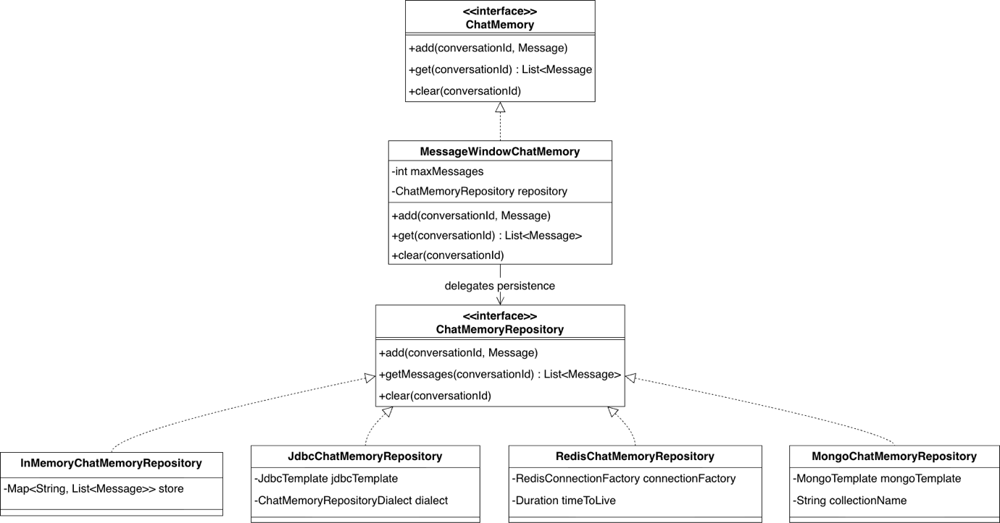
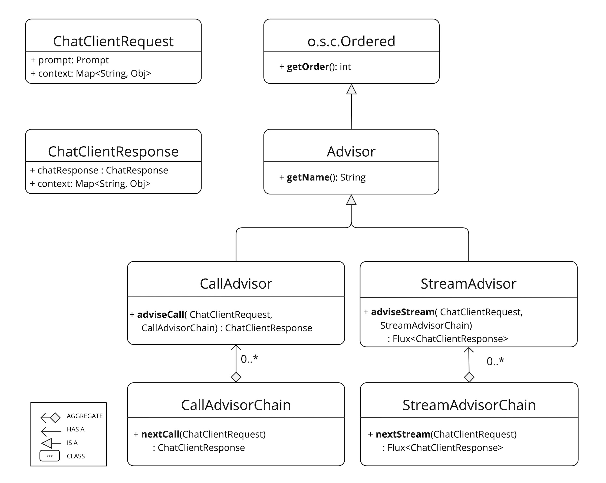
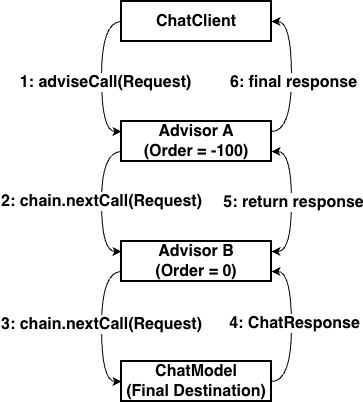
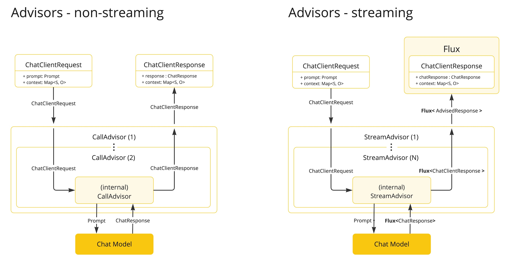

# 대화 메모리와 어드바이저 체인: 스프링 AI의 코어

<div class="post-meta" markdown>
<span class="tier-chip t2">T2 오케스트레이션</span> 책 2.7~2.8절 | 예제 [`chapter2`](https://github.com/JM-Lab/spring-ai-agent-book/tree/main/chapter2)
</div>

LLM은 상태를 기억하지 않습니다. 호출은 매번 독립적이라서, 방금 이름을 알려 줬어도 다음 요청에 그 대화를 다시 실어 보내지 않으면 모델은 알지 못합니다. 대화가 이어지는 챗봇을 만들려면 애플리케이션이 이전 메시지를 보관했다가 요청마다 알맞게 넣어 줘야 합니다.

스프링 AI는 이 일을 두 부품으로 나눕니다. `ChatMemory`는 무엇을 기억할지 정하고, 어드바이저는 요청이 모델로 가기 전에 그 기억을 프롬프트에 넣습니다. 어드바이저는 메모리 전용 장치가 아니라 요청과 응답을 가로채는 범용 확장 지점이어서 로깅, 보안, RAG도 같은 방식으로 붙습니다.

[앞 글](../part2/04-tokens-and-structured-output.md)에 이어 2장을 마무리하며, 대화 메모리와 어드바이저 체인의 실행 순서, 구현, 배치 전략을 예제 코드와 함께 정리합니다.

## 단기 기억과 장기 기억

대화 데이터는 쓰임과 수명에 따라 둘로 나눠 설계합니다. 이 구분이 분명해야 토큰을 아끼면서 필요한 맥락만 모델에 줄 수 있습니다.

- **단기 기억(chat memory)**: 진행 중인 대화의 맥락을 잇는 최근 메시지 몇 개입니다. 사용자가 "그것의 가격은 얼마야?"라고 물을 때 '그것'이 앞서 말한 상품임을 모델이 알게 해 줍니다. 보통 최근 N개만 남기는 슬라이딩 윈도우로 관리합니다.
- **장기 기억(chat history)**: 대화 시작부터 쌓인 전체 기록입니다. 과거 선호 분석, 감사와 법적 보관, 오래전 정보 회상에 쓰고 영구 보존합니다. 양이 많아 통째로 프롬프트에 넣을 수 없으므로 의미 기반 검색으로 필요한 부분만 꺼냅니다.

## ChatMemory와 저장소 유형

<figure class="wide-figure" markdown>

<figcaption>ChatMemory의 계층 구조 클래스 다이어그램</figcaption>
</figure>

그림처럼 스프링 AI의 대화 메모리는 정책과 저장소를 나눕니다.

- **`ChatMemory`**: 무엇을 기억할지 정하는 최상위 인터페이스입니다. 대화 ID별로 메시지를 추가하고, 기준에 맞는 메시지를 골라 돌려주고, 대화를 정리합니다.
- **`MessageWindowChatMemory`**: 기본 구현체입니다. `maxMessages`로 정한 개수만큼 최신 메시지를 남기고 넘치는 오래된 메시지는 지웁니다. 다만 시스템 메시지는 지우지 않아서 "너는 자바 전문가야" 같은 페르소나 설정이 긴 대화에서도 유지됩니다.
- **`ChatMemoryRepository`**: 저장을 위임받는 인터페이스입니다. 구현체를 바꾸면 비즈니스 코드를 고치지 않고 저장 위치를 옮길 수 있습니다.

| 유형 | 대표 구현체 | 특징 | 어울리는 상황 |
| --- | --- | --- | --- |
| 인메모리 | `InMemoryChatMemoryRepository` | 힙에 저장, 재시작하면 사라짐 | 로컬 개발, 테스트, PoC |
| RDBMS | `JdbcChatMemoryRepository` | 트랜잭션 보장, 다이얼렉트로 DB 차이 흡수 | 정합성이 중요한 기업 시스템 |
| NoSQL | `MongoChatMemoryRepository` 등 | 유연한 스키마, 수평 확장 | 대용량 대화 로그 |
| 분산 메모리 | `RedisChatMemoryRepository` | 서버 간 세션 공유, TTL 자동 만료 | 여러 인스턴스로 운영하는 서비스 |

저장소를 바꿀 때는 `ChatMemoryRepository` 빈만 교체하면 되고 "최근 20개 유지" 같은 정책 코드는 그대로입니다. 인메모리 구현체는 스프링 AI 코어에 들어 있고, 나머지는 저장소별 스타터 의존성이 필요합니다.

## 기억을 프롬프트에 넣는 어드바이저

`ChatMemory`와 저장소는 기록을 보관할 뿐이고, 실제 대화에 기억을 끼워 넣는 일은 어드바이저가 합니다. 스프링 AI는 두 기억에 맞춘 어드바이저를 따로 제공합니다.

- **`MessageChatMemoryAdvisor`**: 단기 기억의 표준 방식으로, 최근 대화를 `List<Message>` 형태 그대로 프롬프트에 넣습니다. 사용자와 어시스턴트의 발화 구분이 살아 있어 "그거"나 "아니" 같은 짧은 말도 문맥 속에서 해석됩니다.
- **`VectorStoreChatMemoryAdvisor`**: 윈도우 밖의 과거까지 맡습니다. 대화를 벡터로 저장해 두고, 새 질문과 의미가 가까운 과거 대화를 검색해 시스템 메시지에 넣습니다. 벡터 검색은 3장 RAG에서 자세히 다룹니다.

예제 저장소의 Step 4는 `MessageChatMemoryAdvisor`로 CLI 챗봇에 단기 기억을 붙입니다.

```java title="Ch2Step4_Memory.java"
--8<-- "chapter2/src/main/java/kr/jmlab/spring/ai/agent/book/chapter2/Ch2Step4_Memory.java:31:46"
```
<span class="code-link">[전체 코드 보기](https://github.com/JM-Lab/spring-ai-agent-book/blob/main/chapter2/src/main/java/kr/jmlab/spring/ai/agent/book/chapter2/Ch2Step4_Memory.java)</span>

인메모리 저장소에 최근 20개 메시지를 남기는 메모리를 만들고, `MessageChatMemoryAdvisor`로 감싸 `defaultAdvisors()`에 등록했습니다. 이제 이 클라이언트로 보내는 모든 요청에 대화 기록이 자동으로 들어갑니다.

```java title="Ch2Step4_Memory.java"
--8<-- "chapter2/src/main/java/kr/jmlab/spring/ai/agent/book/chapter2/Ch2Step4_Memory.java:48:71"
```
<span class="code-link">[전체 코드 보기](https://github.com/JM-Lab/spring-ai-agent-book/blob/main/chapter2/src/main/java/kr/jmlab/spring/ai/agent/book/chapter2/Ch2Step4_Memory.java)</span>

요청마다 `ChatMemory.CONVERSATION_ID` 파라미터로 대화 ID를 넘깁니다. 사용자마다 ID를 달리 넘기면 대화가 섞이지 않습니다.

어드바이저 없이 `ChatModel`을 직접 쓴다면 사용자 메시지 추가, 메모리 조회, 모델 호출, 응답 저장을 손으로 짜야 합니다. 번거롭지만 프레임워크에 없는 메모리 정책이 필요할 때 쓰는 방법입니다.

## 어드바이저 API 구조

스프링은 트랜잭션, 보안, 로깅 같은 공통 관심사를 AOP로 비즈니스 로직에서 떼어 냈습니다. 스프링 AI의 어드바이저 API는 이 발상을 `ChatClient`에 옮긴 것으로, 프롬프트 요청과 모델 응답을 가로채 수정하거나 보강합니다.

<figure class="wide-figure" markdown>

<figcaption>Advisors API 클래스 다이어그램 (출처: <a href="https://docs.spring.io/spring-ai/reference/api/advisors.html">Advisors API</a>)</figcaption>
</figure>

- **`Advisor`**: 모든 어드바이저의 최상위 인터페이스로 스프링의 `Ordered`를 확장합니다. `getName()`은 이름을, `getOrder()`는 실행 순서를 정하는 정수를 돌려줍니다.
- **`CallAdvisor`와 `StreamAdvisor`**: 실행 방식에 따라 나뉩니다. `call()`용 `adviseCall()`은 `ChatClientResponse` 하나를, `stream()`용 `adviseStream()`은 `Flux<ChatClientResponse>`를 돌려주며, 전달받은 체인의 `nextCall()`이나 `nextStream()`으로 다음 단계를 부릅니다.
- **`ChatClientRequest`와 `ChatClientResponse`**: 요청과 응답을 담습니다. 요청 객체는 불변이라 내용을 바꾸려면 `copy()`나 `mutate()`로 복제합니다. 두 객체에는 모두 `context` 맵이 있어 어드바이저끼리 상태를 주고받는 통로가 됩니다.

책에서는 어드바이저를 빌드 시점에 `defaultAdvisors()`로 등록해 클라이언트를 불변으로 두고, 실행 중에는 Step 4처럼 `.advisors(a -> a.param(...))`로 파라미터만 바꾸는 방식을 권합니다.

## 실행 흐름과 스택 구조

어드바이저 체인은 책임 연쇄 패턴과 데코레이터 패턴이 합쳐진 구조이고, 실행은 스택처럼 움직입니다. 요청과 응답의 처리 순서가 대칭이라는 점이 핵심입니다.

<figure class="wide-figure" markdown>

<figcaption>어드바이저 체인 실행 순서 상세도(요청/응답 흐름)</figcaption>
</figure>

그림은 order가 -100인 어드바이저 A와 0인 어드바이저 B를 연결한 경우입니다. 요청은 값이 낮은 A가 먼저 받아 `nextCall()`로 B에 넘기고, 체인 끝에서 `ChatModel`이 실제로 LLM을 호출합니다. 응답은 역순으로 올라와 B가 먼저 처리하고 A가 마지막으로 받아 클라이언트에 돌려줍니다.

스프링의 `Ordered`는 값이 낮을수록 우선순위가 높습니다. 어드바이저 체인에서 높은 우선순위는 요청은 먼저, 응답은 나중에 처리한다는 뜻이어서 `Ordered.HIGHEST_PRECEDENCE`는 요청을 가장 먼저 보고 응답을 가장 늦게 봅니다. order 값이 같은 어드바이저끼리는 순서가 보장되지 않으므로, 보안 검사 뒤에 로깅처럼 순서가 중요하면 값을 서로 다르게 줘야 합니다.

각 어드바이저는 요청을 고쳐서 넘길 수도 있고, 다음 단계를 부르지 않고 응답을 직접 만들어 흐름을 막을 수도 있습니다. 요청 때 만들어진 `context`는 응답에도 담겨 돌아오므로 응답 쪽 후처리에서도 쓸 수 있습니다.

## 동기식 처리와 스트리밍 처리

<figure class="wide-figure" markdown>

<figcaption>Non-Streaming vs Streaming 어드바이저 비교 (출처: <a href="https://docs.spring.io/spring-ai/reference/api/advisors.html">Advisors API</a>)</figcaption>
</figure>

어드바이저는 블로킹 방식의 `call()`과 리액티브 스트림 기반의 `stream()`에 맞춰 나뉩니다. 그림 왼쪽의 `CallAdvisor`는 완성된 응답 하나가 올 때까지 기다리므로 구현이 쉽고, 전체 텍스트 분석, JSON 구조 검증, 개인정보 일괄 검사에 맞습니다. 오른쪽의 `StreamAdvisor`는 토큰 단위 조각이 이어서 흘러오는 `Flux`를 다룹니다. 리액터를 알아야 해서 까다롭지만 실시간 토큰 사용량 집계, 스트리밍 중 필터링, 점진적인 응답 로깅처럼 흐름 도중에 개입하는 작업에 씁니다.

## 커스텀 어드바이저 구현

책에서 분석하는 내장 `SimpleLoggerAdvisor`는 커스텀 어드바이저의 권장 형태를 보여 줍니다. 로그만 남기는 관찰자로, 한 클래스가 `CallAdvisor`와 `StreamAdvisor`를 함께 구현합니다. 스트리밍에서는 `ChatClientMessageAggregator`로 조각난 응답을 모아 전체 내용을 기록하면서도 원래 `Flux` 흐름에는 끼어들지 않습니다. 예제 저장소의 `ElapsedTimeAdvisor`도 같은 모양입니다.

```java title="ElapsedTimeAdvisor.java"
--8<-- "chapter2/src/main/java/kr/jmlab/spring/ai/agent/book/chapter2/advisor/ElapsedTimeAdvisor.java:18:34"
```
<span class="code-link">[전체 코드 보기](https://github.com/JM-Lab/spring-ai-agent-book/blob/main/chapter2/src/main/java/kr/jmlab/spring/ai/agent/book/chapter2/advisor/ElapsedTimeAdvisor.java)</span>

`adviseCall()`은 `nextCall()` 앞뒤의 시각 차이를 출력합니다. `adviseStream()`은 `nextStream()`이 돌려준 `Flux`에 `doOnComplete`만 걸어 스트림이 끝나는 순간 걸린 시간을 찍습니다. 흐름을 막지 않으니 토큰은 그대로 사용자에게 전달됩니다. 발췌에서 뺀 나머지 메서드 중 `getName()`은 `"ElapsedTimeAdvisor"`를, `getOrder()`는 100을 돌려줍니다.

```java title="Ch2Step5_Advisor.java"
--8<-- "chapter2/src/main/java/kr/jmlab/spring/ai/agent/book/chapter2/Ch2Step5_Advisor.java:31:40"
```
<span class="code-link">[전체 코드 보기](https://github.com/JM-Lab/spring-ai-agent-book/blob/main/chapter2/src/main/java/kr/jmlab/spring/ai/agent/book/chapter2/Ch2Step5_Advisor.java)</span>

Step 5는 내장 `SimpleLoggerAdvisor`와 이 커스텀 어드바이저를 함께 등록합니다. 대화 루프 코드는 Step 1과 같고, 로깅과 시간 측정은 어드바이저 계층에서만 일어납니다. 실행 순서는 등록 순서가 아니라 order 값으로 정해집니다. `SimpleLoggerAdvisor`의 기본값은 0이고 `ElapsedTimeAdvisor`는 100이므로 로거가 바깥, 시간 측정이 안쪽에 놓입니다. 그래서 요청 로그가 먼저 찍히고, 스트림이 끝나면 응답 시간이 출력된 뒤 응답 로그가 남습니다.

## 차단과 대체

어드바이저는 체인을 끊거나 결과를 바꿔 끼울 수도 있습니다.

**요청 차단**은 금칙어가 들어 있거나 권한이 없는 요청을 만나면 `nextCall()`이나 `nextStream()`을 부르지 않고 준비한 응답을 바로 돌려주는 방식입니다. 뒤쪽 어드바이저와 모델이 실행되지 않으니 자원도 아낍니다. 책의 `ContentSafetyAdvisor`는 order를 -100으로 두고 요청과 응답을 모두 검사합니다. 스트리밍에서는 `Flux.defer`로 구독마다 `StringBuilder`를 따로 두고 누적 텍스트를 검사하다가, 금칙어가 보이면 내부 예외로 스트림을 멈추고 `onErrorResume`으로 차단 응답을 내보냅니다.

**응답 대체**는 모델이 빈 응답이나 기준에 못 미치는 답을 냈을 때 그대로 보여 주지 않고 어드바이저가 준비한 답으로 바꾸는 방식입니다. 책의 `FallbackAdvisor`는 동기 호출에서 응답 텍스트가 비어 있으면 사과 메시지로 바꾸고, 스트리밍에서는 `switchIfEmpty`로 아무것도 내보내지 않고 끝난 스트림을 대체 응답으로 바꿉니다.

## 어드바이저 배치 전략

책이 드는 구현 원칙은 단일 책임, `context` 맵을 이용한 상태 공유, `CallAdvisor`와 `StreamAdvisor` 이중 구현, `getOrder()`를 이용한 명확한 순서 지정의 네 가지입니다. 위치는 스택 구조를 떠올리며 고릅니다.

- **보안과 관측은 바깥쪽(낮은 order)**: 권한 검사나 개인정보 마스킹은 RAG 같은 다른 어드바이저가 돌기 전에 끝나야 합니다. 요청 시작부터 응답 완료까지 전체 시간을 재는 관측 어드바이저도 가장 바깥에서 감쌉니다.
- **재시도와 툴은 안쪽(높은 order)**: 응답 형식이 틀려 모델을 다시 불러야 할 때 재시도 로직이 바깥에 있으면 재시도마다 안쪽의 RAG 검색까지 다시 실행됩니다. 모델 바로 옆에 두면 모델 호출만 가볍게 반복합니다.
- **요청과 응답을 모두 먼저 처리하려면 분리**: 한 어드바이저로는 요청도 응답도 가장 먼저 받을 수 없습니다. `Ordered.HIGHEST_PRECEDENCE`를 준 입력 전용 어드바이저와 `Ordered.LOWEST_PRECEDENCE`를 준 출력 전용 어드바이저로 나누고 `context`로 상태를 공유합니다.

## 프레임워크의 코어, 어드바이저

책은 어드바이저를 스프링 AI 전체를 관통하는 아키텍처로 봅니다. 모델 추상화가 제공자를 바꿔 끼우는 이식성을 맡는다면, 어드바이저는 RAG, 대화 메모리, 보안, 관측 가능성을 모델과 무관한 미들웨어 계층으로 표준화합니다. 스프링 MVC의 `Filter`나 `HandlerInterceptor`와 닮은 구조라 스프링 개발자에게 익숙하고, 하부 모델이 오픈AI든 올라마든 같은 방식으로 기능을 붙일 수 있습니다. 비즈니스 코드에는 `prompt().user(question).call().content()`만 남기고 검색, 대화 저장, 로깅은 어드바이저에 맡길 수 있습니다. 모듈러 RAG의 `RetrievalAugmentationAdvisor`와 툴 루프를 도는 `ToolCallingAdvisor`도 같은 확장 지점 위에 있습니다.

## 4-티어 아키텍처에서의 위치

대화 메모리와 어드바이저 체인은 T2 오케스트레이션 계층의 뼈대입니다. `ChatClient`에 등록한 어드바이저가 요청마다 기억을 넣고, 흐름을 막거나 바꾸고, 실행 과정을 기록합니다. 3장에서는 같은 체인에 검색 어드바이저를 더해 모델에 문서 지식을 공급하고, 6장에서는 재귀적 어드바이저로 툴 루프를 제어합니다. 다음 글 [RAG 아키텍처와 ETL 파이프라인: 문서를 AI의 지식으로](../part3/06-rag-architecture-and-etl-pipeline.md)에서는 그 첫 단계로 문서를 읽고 가공해 저장하는 과정을 다룹니다.

## 이 장의 실습 프로젝트

!!! example "2.9 AI 챗봇 CLI 프로젝트"
    2장에서 익힌 개념을 하나씩 더해 터미널에서 대화하는 CLI 챗봇을 완성합니다. 스트리밍 기본 채팅(Step 1)에 시스템 프롬프트 페르소나(Step 2), 구조화한 출력(Step 3), 대화 메모리(Step 4), 어드바이저 체인(Step 5)을 차례로 붙이고, 마지막 `ch2-final`에서 페르소나, 기억, 어드바이저, 스트리밍을 한 `ChatClient`에 묶습니다. 모델은 올라마의 `qwen3.5:4b`를 쓰며, 전체 실행 과정은 예제 저장소 [`chapter2/`](https://github.com/JM-Lab/spring-ai-agent-book/tree/main/chapter2)의 README를 따릅니다.

    ```bash
    ollama pull qwen3.5:4b
    cd chapter2
    # 최종 통합 챗봇(기본값)
    ./mvnw spring-boot:run
    # 특정 단계만 실행
    ./mvnw spring-boot:run -Dspring-boot.run.arguments="--spring.ai.cli.step=ch2-step4"
    ```

## 책에서 더 다루는 내용

!!! book "책 2.7~2.8절"
    - 단기 기억과 장기 기억을 목적, 처리 방식, 생명 주기로 나눈 비교표
    - JDBC, 몽고DB, 카산드라, Neo4j, 레디스 저장소별 특징과 스타터 의존성, 저장소를 골라 끼우는 설정 클래스
    - 장기 기억 템플릿 작성법과 `ChatModel`로 단기 기억을 직접 관리하는 전체 코드
    - `SimpleLoggerAdvisor` 소스 분석과 내장 어드바이저 목록
    - `ContentSafetyAdvisor`와 `FallbackAdvisor`의 동기, 스트리밍 구현 전체 코드
    - 랭체인의 체인, 콜백 방식과 비교한 어드바이저 아키텍처와 스프링 시큐리티를 연동하는 `UserContextAdvisor` 예제

    [책 소개](../book.md){ .md-button } [온라인 구매](https://wikibook.co.kr/springai-agents/){ .md-button .md-button--primary }

## 참고 자료

- [Chat Memory](https://docs.spring.io/spring-ai/reference/api/chat-memory.html): 스프링 AI 레퍼런스의 대화 메모리 문서(chat memory와 chat history의 구분)
- [Advisors API](https://docs.spring.io/spring-ai/reference/api/advisors.html): 스프링 AI 레퍼런스의 어드바이저 API 문서
