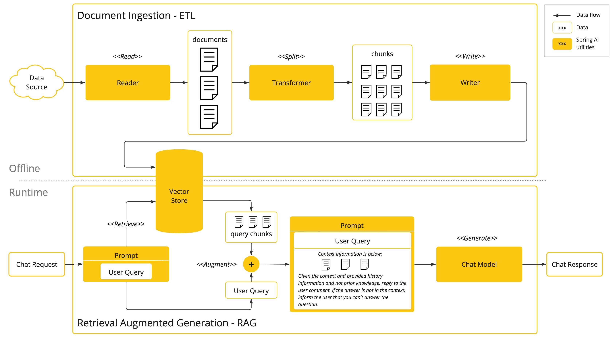
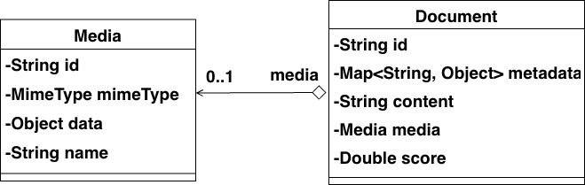
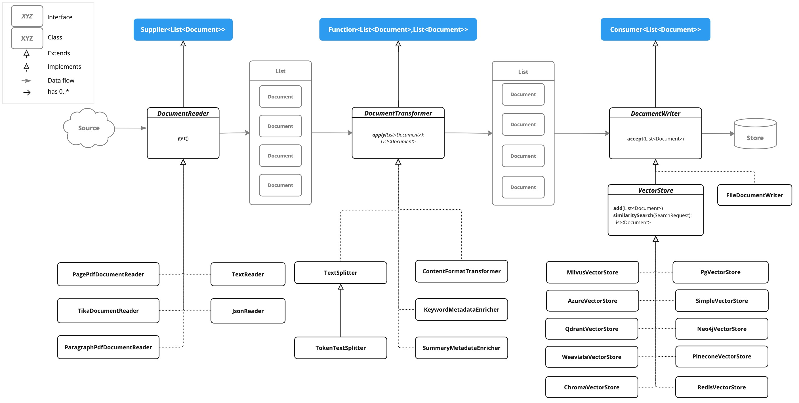

# RAG 아키텍처와 ETL 파이프라인: 문서를 AI의 지식으로

<div class="post-meta" markdown>
<span class="tier-chip t4">T4 파운데이션</span> 책 3.1~3.4절 | 예제 [`chapter3`](https://github.com/JM-Lab/spring-ai-agent-book/tree/main/chapter3)
</div>

[앞 글](../part2/05-chat-memory-and-advisor-chain.md)에서는 `MessageChatMemoryAdvisor`가 지난 대화를 프롬프트에 붙여 보내는 과정을 봤습니다. 모델이 모르는 정보를 질문과 함께 전달하는 기초적인 방식입니다. 하지만 기가바이트 단위로 쌓인 사내 문서는 프롬프트에 통째로 담을 수 없으니 질문과 관련된 부분만 골라야 합니다. 이렇게 필요한 부분을 검색해 붙이는 방식이 3장의 주제인 검색 증강 생성(RAG)입니다.

스프링 AI는 RAG를 검색 기능 하나로 보지 않고, 문서를 모으고 다듬어 저장해 두었다가 질문이 오면 꺼내 쓰는 데이터 파이프라인으로 설계합니다. 이 글에서는 LLM에 외부 데이터가 필요한 이유와 RAG 아키텍처를 보고, 그 앞단인 ETL 파이프라인을 `DocumentReader`, `DocumentTransformer`, `DocumentWriter` 순서로 예제 코드와 함께 살펴봅니다.

## LLM이 답하지 못하는 질문

LLM을 업무에 쓰려고 하면 세 가지 한계를 만납니다.

- **학습 이후의 일을 모릅니다.** 지식이 학습을 마친 시점(cut-off date)에 멈춰 있어 오늘 주가나 새로 개정된 법률을 알지 못합니다. 모델을 날마다 다시 학습시키기에는 비용이 너무 큽니다.
- **그럴듯한 거짓을 만듭니다.** LLM은 사실을 보관하는 데이터베이스가 아니라 앞 문맥에 이어질 단어를 확률로 고르는 생성 엔진입니다. 모르는 내용에도 사실처럼 들리는 답을 내놓는 환각은 의료, 법률, 금융 서비스에서 법적, 금전적 위험이 됩니다.
- **회사 안의 데이터를 본 적이 없습니다.** 사내 위키나 비공개 정책 문서는 공개 모델의 학습 데이터에 없으니, 어떤 모델도 "우리 회사 환불 규정"에는 답하지 못합니다.

세 한계를 넘으려면 모델이 학습하지 않은 정보를 안전하고 정확하게 건넬 방법이 필요합니다. 책에서는 모델이 모르는 이 영역을 데이터 공백이라고 부릅니다.

## 파인 튜닝이 아니라 주입을 택하는 이유

데이터 공백을 메우는 방법은 크게 두 가지입니다.

첫째, 파인 튜닝은 준비한 데이터셋으로 모델의 가중치를 조정해 전문 용어나 회사 고유의 말투를 익히게 합니다. 하지만 학습이 끝나면 지식이 다시 멈추므로 규정이 바뀔 때마다 재학습해야 합니다. GPU와 학습 시간 비용도 크고, 도메인 지식을 무리하게 넣다가 원래의 추론 능력을 잃는 지식의 왜곡(catastrophic forgetting)이 생길 수도 있습니다. 그래서 스프링 AI는 모델 학습을 지원하지 않고, 이미 훈련된 모델을 애플리케이션에 통합하는 데 집중합니다.

둘째, 프롬프트 합치기(prompt stuffing)는 질문하는 시점에 참고할 문서를 프롬프트에 주입해 함께 보냅니다. 외워서 푸는 시험이 아니라 자료를 펴 놓고 푸는 시험에 가깝습니다. 다만 방대한 문서를 모두 넣으면 토큰 한도를 넘고 비용이 커지므로, 질문과 의미가 가까운 청크(chunk) 몇 개만 벡터 데이터베이스에서 검색해 넣습니다. 이것이 RAG입니다. 매뉴얼이나 사내 위키처럼 미리 쌓아 둘 수 있는 텍스트에 잘 맞고, 문서가 바뀌면 벡터 데이터베이스만 갱신하면 됩니다.

툴 호출도 외부 정보를 프롬프트에 넣지만 판단 주체가 다릅니다. RAG는 개발자가 정한 규칙대로 시스템이 검색하고, 툴 호출은 모델이 필요하다고 판단할 때 외부 API 실행을 요청합니다. 실시간 조회나 시스템 제어에 맞는 툴 호출은 [툴 호출 설계](../part4/09-tool-calling-design-in-spring-ai.md) 글에서 다룹니다.

## 오프라인 단계와 런타임 단계

스프링 AI의 RAG 아키텍처는 데이터를 미리 준비하는 오프라인 단계와 질문에 실시간으로 답하는 런타임 단계로 나뉩니다.

<figure class="wide-figure" markdown>

<figcaption>스프링 AI의 RAG 아키텍처 및 데이터 흐름도 (출처: <a href="https://docs.spring.io/spring-ai/reference/concepts.html#concept-rag">Spring AI Reference: Retrieval Augmented Generation</a>)</figcaption>
</figure>

그림 위쪽의 오프라인 단계가 ETL 파이프라인입니다. 한 번 또는 주기적으로 도는 배치 작업으로, 시간과 비용이 들지만 런타임 검색의 정확도가 여기서 정해집니다.

- **추출(Extract)**: 파일이나 URL의 원본을 스프링 리소스 추상화로 읽어 파싱하고, 출처 같은 메타데이터를 보존합니다.
- **변환(Transform)**: 문서를 의미 단위와 토큰 한도에 맞춰 청크로 나누고 키워드나 요약 같은 메타데이터를 덧붙인 뒤, 임베딩 모델로 각 청크를 벡터로 바꿉니다.
- **적재(Load)**: 벡터와 원본 텍스트와 메타데이터를 한 레코드로 저장하고 검색용 인덱스를 만듭니다.

저장할 때 쓴 임베딩 모델과 차원은 나중에 질문을 벡터로 바꿀 때도 같아야 합니다. 모델이 다르면 벡터 공간이 달라져 엉뚱한 문서가 검색됩니다.

그림 아래쪽의 런타임 단계는 질문마다 실행됩니다. 질문을 같은 임베딩 모델로 벡터로 바꾸고, 벡터 데이터베이스에서 가장 가까운 청크 N개를 가져옵니다. 단어를 맞춰 보는 LIKE 검색이 아니라 코사인 유사도 같은 계산으로 의미의 거리를 재므로, 표현이 달라도 뜻이 같으면 찾아냅니다. 가져온 청크를 질문과 함께 프롬프트 템플릿에 조립하면(증강) 모델이 이 문맥을 근거로 답을 만듭니다(생성).

두 단계가 나뉘어 있으니 문제도 따로 고칠 수 있습니다. 엉뚱한 문서를 참고하면 오프라인의 분할과 메타데이터 전략을, 응답이 느리면 런타임의 검색 설정과 `ChatModel` 파라미터를 손봅니다. 각 단계가 인터페이스로 추상화돼 있어서 임베딩 모델이나 벡터 데이터베이스를 바꿔도 파이프라인 코드는 거의 그대로 둘 수 있습니다.

## Document와 세 가지 인터페이스

ETL 파이프라인의 각 단계가 주고받는 데이터 단위는 `Document`입니다.

<figure class="wide-figure" markdown>
{ style="width:auto" }
<figcaption>Document 클래스 다이어그램</figcaption>
</figure>

`Document`는 식별자 `id`, 본문 텍스트, 이미지나 오디오를 담는 `media`, 출처 같은 키-값 `metadata`, 검색 결과의 유사도가 들어가는 `score`로 이루어집니다. 텍스트와 미디어는 둘 중 하나만 주 콘텐츠로 씁니다. `metadata`는 RAG 검색에서 필터 조건이 됩니다. 벡터를 담는 필드는 없습니다. 임베딩은 `VectorStore`에 저장될 때 만들어지고 그 안에서 관리됩니다.

<figure class="wide-figure" markdown>

<figcaption>ETL 파이프라인 인터페이스 및 구현 클래스 다이어그램 (출처: <a href="https://docs.spring.io/spring-ai/reference/api/etl-pipeline.html#etl-class-diagram">Spring AI Reference: ETL Class Diagram</a>)</figcaption>
</figure>

세 인터페이스는 자바 함수형 인터페이스를 상속하고, ETL의 의미를 드러내는 디폴트 메서드도 함께 제공합니다.

| 단계 | 인터페이스 | 상속 | 메서드 | 구현 예 |
| --- | --- | --- | --- | --- |
| 추출 | `DocumentReader` | `Supplier<List<Document>>` | `get()`, `read()` | `TextReader`, `JsonReader`, `PagePdfDocumentReader`, `TikaDocumentReader` |
| 변환 | `DocumentTransformer` | `Function<List<Document>, List<Document>>` | `apply()`, `transform()` | `TokenTextSplitter`, `KeywordMetadataEnricher`, `ContentFormatTransformer` |
| 적재 | `DocumentWriter` | `Consumer<List<Document>>` | `accept()`, `write()` | `FileDocumentWriter`, `VectorStore` 구현체 |

적재 단계에서 눈여겨볼 점은 `VectorStore`가 `DocumentWriter`를 상속한다는 것입니다. 그래서 벡터 저장소를 어댑터 없이 파이프라인의 마지막 단계로 바로 쓸 수 있습니다.

## DocumentReader: 형식에 맞는 리더 고르기

스프링 AI는 형식별 리더를 제공하므로 파싱 코드를 직접 짜지 않고 알맞은 것을 고르면 됩니다. `TextReader`와 `JsonReader`는 모든 모델 스타터에 포함된 `spring-ai-commons`에 들어 있어 의존성을 따로 추가하지 않아도 됩니다. PDF, 마크다운, HTML, 티카 리더는 전용 모듈을 추가해서 씁니다. 3장 예제의 Step 1은 대표 리더 네 개를 차례로 실행합니다.

```java title="Ch3Step1_DocumentReaders.java"
--8<-- "chapter3/src/main/java/kr/jmlab/spring/ai/agent/book/chapter3/Ch3Step1_DocumentReaders.java:38:62"
```
<span class="code-link">[전체 코드 보기](https://github.com/JM-Lab/spring-ai-agent-book/blob/main/chapter3/src/main/java/kr/jmlab/spring/ai/agent/book/chapter3/Ch3Step1_DocumentReaders.java)</span>

코드에서 호출하는 네 컴포넌트는 스프링 AI 리더를 감싼 예제 클래스입니다. `SimpleTextReader`는 `TextReader`로 파일 전체를 `Document` 하나로 읽고 수집일, 카테고리, 버전을 메타데이터로 붙입니다. `JsonDocReader`는 `JsonReader`에 JSON 포인터 `/store/bikes`를 넘겨 자전거마다 `Document`를 만들고 브랜드, 모델, 가격을 메타데이터로 옮깁니다. `MarkdownDocsReader`는 가로선을 기준으로 문서를 나누고, `WebPageReader`는 CSS 선택자 `article p`로 본문 문단만 뽑습니다. 형식은 달라도 결과는 같은 `List<Document>`이므로 `printPreview()`는 `getText()`와 `getMetadata()`만으로 모두 확인합니다.

형식을 미리 알 수 없거나 여러 형식이 섞여 있다면 아파치 티카 기반의 `TikaDocumentReader`가 편합니다. 파일 헤더로 형식을 알아내 워드, 엑셀, HWP 같은 수십 가지 문서에서 텍스트를 뽑지만, 표나 페이지 같은 구조는 잃습니다. 답변에 쪽 번호를 출처로 달려면 페이지마다 `page_number`를 남기는 `PagePdfDocumentReader` 같은 전용 리더가 필요합니다. 책에서는 티카로 빠르게 시작하고, 품질과 출처 추적이 중요해지면 전용 리더로 바꾸는 단계적 도입을 권합니다.

데이터베이스나 REST API처럼 파일이 아닌 곳의 데이터는 `DocumentReader`의 `get()`을 직접 구현해 읽습니다. 이때 부서나 직급 같은 접근 권한 정보를 메타데이터에 넣어 두면, 사용자 권한에 맞는 문서만 답변에 쓰도록 거를 수 있습니다.

## DocumentTransformer: 자르고 다듬고 보강하기

리더가 읽은 문서는 컨텍스트 윈도우보다 크거나 불필요한 정보가 섞여 있어 그대로 쓰기 어렵습니다. 들어가는 데이터의 품질이 답변 품질을 좌우하므로 트랜스포머로 다듬습니다.

청킹의 기본 도구는 `TokenTextSplitter`입니다. `DocumentTransformer`를 구현한 추상 클래스 `TextSplitter`를 상속하고, 글자 수가 아니라 CL100K_BASE 인코딩으로 센 토큰 수로 자릅니다(기본 800토큰). 토큰 수로 자른 뒤 최소 글자 수를 넘긴 지점에서 가장 가까운 문장 부호로 경계를 옮겨, 문장이 잘리는 일을 줄입니다. 원본 메타데이터는 모든 청크에 복사됩니다. 이 토큰 수는 실제 모델의 토크나이저가 세는 값과 다를 수 있고 한국어는 토큰을 많이 쓰는 편이라, 청크 크기는 언어를 고려해 정하는 것이 좋습니다.

포맷 쪽에서는 `DefaultContentFormatter`가 메타데이터와 본문을 한 문자열로 합치는 형식과, 임베딩과 추론에 쓸 텍스트에서 각각 뺄 키를 정의합니다. `ContentFormatTransformer`는 이 포매터를 문서에 적용합니다. `KeywordMetadataEnricher`와 `SummaryMetadataEnricher`는 `ChatModel`을 호출해 키워드와 요약을 메타데이터에 붙입니다. 요약 보강기는 이전과 다음 청크의 요약까지 만들 수 있어, 앞뒤 텍스트를 겹쳐 저장하는 청크 오버랩보다 적은 공간으로 문맥을 잇습니다. 다만 청크 수만큼 LLM을 호출하니 비용을 따져야 합니다.

트랜스포머를 여러 개 연결하면 앞 단계의 출력이 다음 단계의 입력이 되므로 순서가 중요합니다. Step 2는 정제, 포맷 통일, 분할을 차례로 실행합니다.

```java title="Ch3Step2_DocumentTransformers.java"
--8<-- "chapter3/src/main/java/kr/jmlab/spring/ai/agent/book/chapter3/Ch3Step2_DocumentTransformers.java:39:51"
```
<span class="code-link">[전체 코드 보기](https://github.com/JM-Lab/spring-ai-agent-book/blob/main/chapter3/src/main/java/kr/jmlab/spring/ai/agent/book/chapter3/Ch3Step2_DocumentTransformers.java)</span>

`loadRawDocuments()`는 Step 1의 네 리더로 데이터 디렉터리의 문서 파일을 읽어 옵니다. `PiiMaskingTransformer`는 `DocumentTransformer`를 직접 구현해 이메일과 전화번호를 정규식으로 가립니다. 문서를 자르기 전에 해야 전화번호가 두 청크로 나뉘어 마스킹을 피하는 일이 없습니다. 이어서 `CustomContentFormatExample`이 뺄 키와 메타데이터 표시 템플릿을 정한 포매터를 각 문서에 지정합니다. 이 규칙도 분할 전에 정해 두어야 모든 청크가 같은 규칙을 물려받습니다. LLM을 쓰는 키워드와 요약 보강은 청크마다 만들어야 하므로 분할 뒤에 둡니다. 보강까지 이은 전체 흐름은 `DocumentProcessingPipeline` 예제에 있습니다.

## DocumentWriter와 ETL 파이프라인 완성

적재는 `DocumentWriter`가 맡습니다. RAG의 최종 목적지는 벡터 데이터베이스지만, 개발 중에는 `FileDocumentWriter`로 파일에 써 보면 청크가 의도대로 나뉘었는지, 메타데이터가 제대로 붙었는지 눈으로 확인할 수 있습니다. `FileEtlPipeline`은 추출, 변환, 적재를 메서드 하나에 담은 작은 ETL 파이프라인입니다.

```java title="FileEtlPipeline.java"
--8<-- "chapter3/src/main/java/kr/jmlab/spring/ai/agent/book/chapter3/examples/FileEtlPipeline.java:29:51"
```
<span class="code-link">[전체 코드 보기](https://github.com/JM-Lab/spring-ai-agent-book/blob/main/chapter3/src/main/java/kr/jmlab/spring/ai/agent/book/chapter3/examples/FileEtlPipeline.java)</span>

`TextReader`로 읽고 기본 설정의 `TokenTextSplitter`로 나눈 뒤 `FileDocumentWriter`로 씁니다. 생성자 인자는 차례로 출력 경로, 문서 구분 마커 사용, 기록할 메타데이터 범위, 이어 쓰기 여부입니다. 마커에는 페이지 범위가 찍히는데 텍스트 파일에는 페이지 정보가 없어서 `page_number`와 `end_page_number`를 직접 넣었습니다. 책의 실행 결과를 보면 `target/chapter3-etl-output.txt`에 `### Doc: 0, pages:[1,1]` 줄이 찍히고, 그 아래로 `source`, `chunk_index` 같은 메타데이터와 본문이 이어집니다.

다른 시스템에 적재하려면 `DocumentWriter`의 `accept()`를 직접 구현하면 됩니다. Step 3에서 실행하는 `LoggingDocumentWriter`는 문서 ID와 본문 길이를 로그로 남기는 커스텀 라이터입니다. RAG에서 쓰는 `VectorStore`도 같은 `Document` 목록을 받아, 내부에서 임베딩 모델로 텍스트를 벡터로 바꾼 뒤 저장합니다.

## 4-티어 아키텍처에서의 위치

`Document` 모델과 ETL 파이프라인은 T4 파운데이션에 속합니다. 오케스트레이션과 능력 계층이 사용하는 기반 자원 가운데 데이터를 맡아, 사내 문서를 검색할 수 있는 지식으로 바꿔 둡니다. 이 데이터를 질문 시점에 찾아 프롬프트에 넣는 RAG는 에이전트가 쓰는 능력(T3)에 해당하며, [Naive RAG에서 모듈러 RAG로](../part3/08-from-naive-rag-to-modular-rag.md) 글에서 구현합니다. 그 전에 다음 글에서는 적재가 향하는 [임베딩 모델과 벡터 데이터베이스](../part3/07-embedding-models-and-vector-stores.md)를 살펴봅니다.

## 책에서 더 다루는 내용

!!! book "책 3.1~3.4절"
    - RAG와 툴 호출 비교표, ETL 단계별 작업과 변환 단계의 세부 과정
    - `JsonReader`의 JSON 포인터와 메타데이터 생성기, 두 가지 PDF 리더의 차이
    - 마크다운과 HTML 리더의 옵션과 설정별 결과 비교
    - 범용 리더와 전용 리더의 장단점, 데이터베이스와 REST API용 커스텀 리더
    - `TokenTextSplitter`의 분할 과정과 파라미터 기본값, 포매터 템플릿과 `MetadataMode`
    - 키워드와 요약 보강기의 커스텀 템플릿, 커스텀 트랜스포머, `FileDocumentWriter` 옵션

    [책 소개](../book.md){ .md-button } [온라인 구매](https://wikibook.co.kr/springai-agents/){ .md-button .md-button--primary }

## 참고 자료

- [Prompt Stuffing](https://docs.spring.io/spring-ai/reference/concepts.html#_bringing_your_data_apis_to_the_ai_model): 스프링 AI 레퍼런스의 프롬프트 합치기 개념
- [Retrieval Augmented Generation](https://docs.spring.io/spring-ai/reference/concepts.html#concept-rag): 오프라인 ETL과 런타임 RAG로 나뉜 흐름도
- [ETL Class Diagram](https://docs.spring.io/spring-ai/reference/api/etl-pipeline.html#etl-class-diagram): ETL 인터페이스와 구현 클래스 다이어그램
- [Apache Tika](https://tika.apache.org/): `TikaDocumentReader`가 쓰는 문서 파싱 라이브러리
