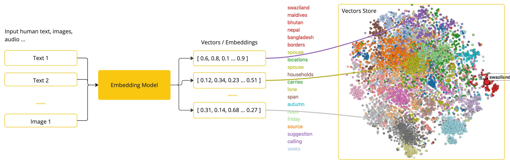
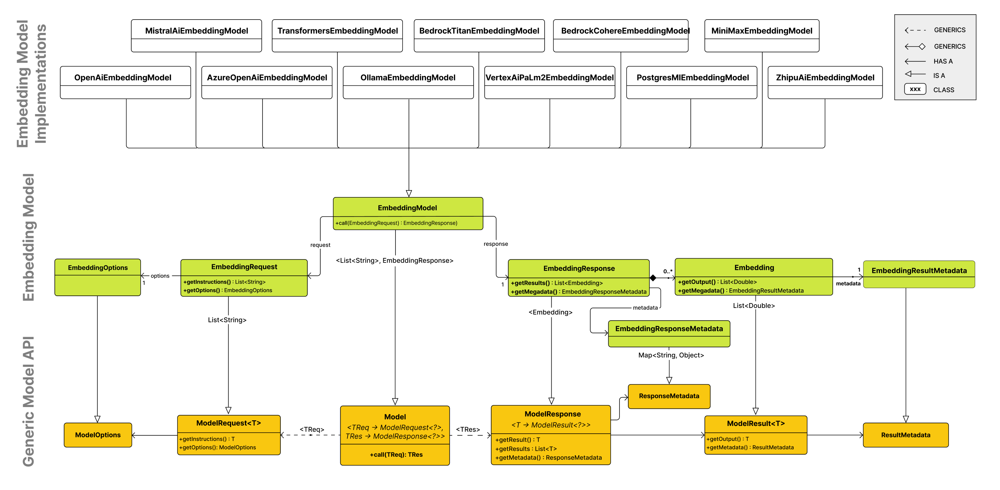

# 임베딩 모델과 벡터 데이터베이스

<div class="post-meta" markdown>
<span class="tier-chip t4">T4 파운데이션</span> 책 3.5~3.6절 | 예제 [`chapter3`](https://github.com/JM-Lab/spring-ai-agent-book/tree/main/chapter3)
</div>

[앞 글](../part3/06-rag-architecture-and-etl-pipeline.md)에서는 ETL 파이프라인으로 문서를 읽고 정제해 청크로 나눴습니다. 그런데 청크를 쌓아 두기만 해서는 질문에 맞는 조각을 고를 수 없습니다. "DI는 스프링의 기능"과 "스프링 프레임워크의 의존성 주입"처럼 표현이 다른 질문과 문서를 이으려면 글자가 아니라 의미를 비교해야 합니다.

의미를 비교하는 데는 부품 두 개가 필요합니다. 텍스트를 숫자 배열로 바꾸는 임베딩 모델, 그리고 그 배열을 저장했다가 가까운 것을 찾아 주는 벡터 데이터베이스입니다. 이 글에서는 스프링 AI의 `EmbeddingModel`과 `VectorStore`를 차례로 보고, 3장 예제 프로젝트가 올라마의 bge-m3와 `SimpleVectorStore`로 두 부품을 어떻게 연결하는지 따라갑니다.

## 텍스트를 벡터로 바꾸는 임베딩

임베딩은 텍스트, 이미지 같은 비정형 데이터를 길이가 정해진 실수 배열로 바꿔 데이터 사이의 관계를 숫자로 표현하는 기술입니다. 배열에 든 숫자의 개수를 차원이라고 합니다. 오픈AI의 text-embedding-3-small은 1536차원, 올라마의 nomic-embed-text는 768차원 벡터를 만듭니다. 차원이 높을수록 의미를 세밀하게 담을 여지가 커지지만 계산량과 저장 공간도 늘어납니다. 768차원 이하에서도 성능이 좋은 모델이 많으니, 차원 수보다 용도와 자원에 맞는 모델을 골라 시험해 보는 편이 좋습니다.

<figure class="wide-figure" markdown>

<figcaption>스프링 AI의 임베딩 변환 과정 (출처: <a href="https://docs.spring.io/spring-ai/reference/concepts.html#_embeddings">Spring AI Reference: Embeddings</a>)</figcaption>
</figure>

임베딩 모델은 뜻이 비슷한 문장이 벡터 공간에서 가까이 놓이도록 학습됩니다. 그래서 앞의 두 문장은 좌표가 가깝고, "오늘 점심 메뉴 추천" 같은 문장은 멀리 떨어집니다. 가까운 정도는 두 벡터의 각도를 보는 코사인 유사도, 두 점 사이의 직선거리를 보는 유클리드 거리, 크기와 방향을 함께 반영하는 내적으로 잽니다. 텍스트 검색에서는 문장 길이가 달라도 방향이 같으면 비슷하다고 보는 코사인 유사도를 가장 많이 씁니다.

스프링 AI에서는 `VectorStore`가 임베딩 모델을 불러 이 변환을 처리합니다. 문서는 적재하기 직전에 벡터로 바꾸고, 질문은 검색할 때 같은 모델로 바꿔 비교합니다.

## EmbeddingModel API

`EmbeddingModel`은 `ChatModel`이나 `ImageModel`처럼 범용 `Model` 인터페이스를 확장하고, 입력과 출력 타입을 `EmbeddingRequest`와 `EmbeddingResponse`로 정합니다. 설계 목표는 이식성과 단순성입니다. 오픈AI에서 애저 오픈AI나 올라마로 옮겨도 코드를 거의 고치지 않고, 토크나이징 같은 과정은 감춘 채 `embed()` 호출 하나로 벡터를 받습니다.

<figure class="wide-figure" markdown>

<figcaption>EmbeddingModel API 클래스 다이어그램 (출처: <a href="https://docs.spring.io/spring-ai/reference/api/embeddings.html">Spring AI Reference: Embedding Model API</a>)</figcaption>
</figure>

핵심 메서드는 `call(EmbeddingRequest)`입니다. 요청에는 변환할 텍스트 목록과 `EmbeddingOptions`가, 응답에는 `Embedding` 목록과 토큰 사용량 같은 메타데이터가 담깁니다. `embed(String)`, `embed(List<String>)`, `dimensions()` 같은 편의 메서드는 디폴트 메서드로 제공되고 내부에서 모두 `call()`을 부르므로, 구현체의 부담이 줄고 동작도 일관됩니다.

## 클라우드와 로컬, 그리고 한글 임베딩 모델

임베딩 모델을 구동하는 방식은 크게 둘입니다. 클라우드 API는 GPU 없이 최신 모델을 바로 쓸 수 있지만, 데이터가 외부 서버로 나가고 토큰 사용량만큼 비용이 듭니다. 로컬 설치형은 데이터가 밖으로 나가지 않고 호출 비용도 없습니다. 스프링 AI의 로컬 구동은 두 갈래입니다. 올라마는 별도 프로세스로 띄운 모델을 HTTP로 호출하고, `ollama pull` 한 줄로 모델을 내려받을 수 있어 여러 모델을 시험하기 편합니다. `spring-ai-transformers` 모듈은 자바 프로세스 안에서 모델을 돌려 네트워크 지연이 없지만, ONNX 모델 파일과 토크나이저를 따로 준비해야 합니다.

GPU가 없어도 로컬 임베딩은 CPU로 충분히 돌아갑니다. 텍스트를 생성하는 LLM은 다음 토큰을 예측하는 계산을 토큰 수만큼 되풀이하지만, 대개 BERT 계열 인코더를 쓰는 임베딩 모델은 입력 전체를 한 번 통과시키면 벡터가 나옵니다. 저자가 인텔 i7과 애플 실리콘 노트북에서 잰 bge-m3의 평균 응답 시간은 16~100ms였습니다. 수백만 건을 처음 적재하거나 초당 수천 건의 검색을 받는 서비스라면 GPU를 검토할 만합니다.

한국어는 조사와 어미가 다양하게 붙는 언어라, 영어 위주로 학습한 모델을 쓰면 검색이 기대만큼 정확하지 않을 수 있습니다. 책은 한글을 잘 다루는 후보로 클라우드의 text-embedding-3-small과 Cohere embed-multilingual-v3.0, 로컬의 bge-m3와 ko-sroberta-multitask를 비교하고, 예제 프로젝트에는 bge-m3를 씁니다. bge-m3는 크기가 약 1.1GB이고 최대 8,192토큰까지 입력받으며 한국어 성능이 좋습니다.

```yaml title="application.yml"
--8<-- "chapter3/src/main/resources/application.yml"
```
<span class="code-link">[전체 코드 보기](https://github.com/JM-Lab/spring-ai-agent-book/blob/main/chapter3/src/main/resources/application.yml)</span>

`spring.ai.model.embedding: ollama`로 임베딩 제공자를 고르고, `spring.ai.ollama.embedding.model`에 bge-m3를 지정합니다. 답변은 qwen3.5:4b가, 벡터 변환은 bge-m3가 맡습니다.

## VectorStore 인터페이스

벡터 데이터베이스는 고차원 벡터를 저장해 두고, 질의 벡터와 가까운 벡터를 찾아 줍니다. 관계형 데이터베이스가 값이 같은 행을 찾는다면, 벡터 데이터베이스는 뜻이 가까운 데이터를 찾습니다. 스프링 AI는 여러 제품을 `VectorStore`라는 공통 인터페이스로 추상화합니다.

`VectorStore`는 적재를 맡는 `DocumentWriter`와 검색을 맡는 `VectorStoreRetriever`를 함께 상속합니다. 그래서 ETL 파이프라인 끝에서 `add()`로 문서를 넣는 객체와, 질문 시점에 `similaritySearch()`로 문맥을 꺼내는 객체가 같습니다. 오프라인 준비와 런타임 검색이 이 인터페이스에서 만나는 셈입니다. 조회만 하는 서비스에는 읽기 전용인 `VectorStoreRetriever`만 넘겨 권한을 좁힐 수도 있습니다.

```java title="Chapter3RagConfig.java"
--8<-- "chapter3/src/main/java/kr/jmlab/spring/ai/agent/book/chapter3/Chapter3RagConfig.java:16:23"
```
<span class="code-link">[전체 코드 보기](https://github.com/JM-Lab/spring-ai-agent-book/blob/main/chapter3/src/main/java/kr/jmlab/spring/ai/agent/book/chapter3/Chapter3RagConfig.java)</span>

3장 프로젝트는 인프라 없이 돌아가도록 `SimpleVectorStore`를 빈으로 등록합니다. 빈 메서드가 받는 `EmbeddingModel`에는 올라마 스타터가 자동 구성한 bge-m3 모델이 주입되고, 이후 `add()`와 `similaritySearch()`는 모두 이 모델로 벡터를 만듭니다. pgvector나 Redis 같은 외부 저장소로 바꾸더라도 검색하는 쪽 코드는 `VectorStore` 인터페이스에만 의존하므로 고치지 않아도 됩니다.

## SearchRequest와 메타데이터 필터

`similaritySearch()`에 질문 문자열만 넘길 수도 있지만, 검색을 세밀하게 조절하려면 `SearchRequest`를 씁니다. 빌더로 만드는 불변 객체이고 질의, `topK`, `similarityThreshold`, 필터 표현식을 담습니다.

- `topK`: 돌려받을 문서의 최대 개수이며 기본값은 4입니다. RAG에서는 LLM에 건넬 참고 자료의 양이 됩니다. 너무 적으면 근거가 모자라 환각으로 이어질 수 있고, 너무 많으면 무관한 문서가 섞이고 토큰 비용과 응답 시간이 늘어납니다. 보통 3~10에서 시작해 조정합니다.
- `similarityThreshold`: 결과에 들어갈 최소 점수(0.0~1.0)이며 기본값 0.0은 모든 문서를 받습니다. 백분율이 아니라 임베딩 모델과 거리 계산 방식에 따라 분포가 달라지는 상대 점수이므로, 처음에는 0.0으로 결과를 모두 보고 무관한 문서가 걸러지기 시작하는 점수를 실제 데이터로 찾습니다.
- 필터 표현식: 본문 내용 대신 메타데이터 값으로 후보 문서를 미리 추리는 조건입니다. SQL의 WHERE 절과 비슷하며, 유사도를 계산하기 전에 적용되므로 속도와 정확도에 모두 도움이 됩니다.

```java title="SearchRequestExamples.java"
--8<-- "chapter3/src/main/java/kr/jmlab/spring/ai/agent/book/chapter3/examples/SearchRequestExamples.java:18:48"
```
<span class="code-link">[전체 코드 보기](https://github.com/JM-Lab/spring-ai-agent-book/blob/main/chapter3/src/main/java/kr/jmlab/spring/ai/agent/book/chapter3/examples/SearchRequestExamples.java)</span>

세 메서드는 같은 질문에 서로 다른 조건을 붙입니다. `basic()`은 필터 없이 점수 0.5 이상인 상위 5개를 찾습니다. `withTextFilter()`는 임계값을 풀어 두고 `category == 'tech_docs' && isActive == true`라는 문자열 표현식으로 범위를 좁힙니다. `withTypeSafeFilter()`는 `FilterExpressionBuilder`로 `IN`과 `AND` 조건을 조립합니다. 문자열 방식은 짧고 읽기 쉬우며, 빌더 방식은 문법 실수를 줄이고 조건을 동적으로 조립할 때 편합니다. `category`와 `isActive`는 `RagKnowledgeBase`가 적재할 때 붙인 메타데이터입니다. [`Ch3Step4_VectorStore`](https://github.com/JM-Lab/spring-ai-agent-book/blob/main/chapter3/src/main/java/kr/jmlab/spring/ai/agent/book/chapter3/Ch3Step4_VectorStore.java)는 세 요청의 결과를 차례로 출력해 비교합니다.

필터 표현식은 이식성도 좋습니다. 제품마다 쿼리 문법이 달라도 스프링 AI의 표준 표현식은 실행 시점에 사용 중인 구현체의 네이티브 쿼리로 변환됩니다. 다만 필드끼리 더하거나 빼는 산술 연산은 지원하지 않고, `IS NULL` 계열은 구현체에 따라 지원이 제한될 수 있습니다.

## 스키마, 배치 적재, 데이터 생명 주기

벡터 데이터베이스는 대개 데이터를 넣기 전에 벡터 차원, 인덱스, 메타데이터 칼럼을 정해 두어야 합니다. 스프링 AI 구현체는 표준 기본 스키마를 내장하며, 보통 ID, 본문, 메타데이터, 임베딩 네 칼럼으로 구성됩니다. 운영 데이터를 실수로 초기화하는 사고를 막으려고 스키마 자동 생성은 기본으로 꺼져 있으며, `spring.ai.vectorstore.elasticsearch.initialize-schema: true`처럼 구현체별 설정으로 켭니다.

적재에도 주의할 점이 있습니다. 청크 하나하나는 모델 한도 안에 있어도, 수천 개를 한 요청에 담으면 요청 전체의 토큰 합계가 한도를 넘을 수 있습니다. 그래서 `vectorStore.add()`는 내부의 `BatchingStrategy`로 문서 목록을 안전한 크기의 하위 배치로 나눠 보냅니다. 기본 구현인 `TokenCountBatchingStrategy`는 오픈AI의 입력 한도 8,191토큰에서 10%를 예비로 남긴 값을 기준으로 묶고, 혼자서 한도를 넘는 문서가 있으면 예외를 던집니다. 기준을 바꾸려면 `BatchingStrategy` 빈을 직접 등록합니다.

적재한 문서는 지우거나 고칠 일도 생깁니다. 삭제는 ID로 특정 문서를 지우는 방식과 필터 조건에 맞는 문서를 한꺼번에 지우는 방식이 있습니다. 내용이 바뀌면 임베딩 전체를 다시 계산해야 하므로, 수정은 부분 갱신 대신 구 버전을 지우고 새 버전을 적재하는 방식으로 합니다. 이를 위해 메타데이터에 문서 식별자와 버전을 넣어 둡니다.

```java title="VectorStoreLifecycleService.java"
--8<-- "chapter3/src/main/java/kr/jmlab/spring/ai/agent/book/chapter3/examples/VectorStoreLifecycleService.java:22:44"
```
<span class="code-link">[전체 코드 보기](https://github.com/JM-Lab/spring-ai-agent-book/blob/main/chapter3/src/main/java/kr/jmlab/spring/ai/agent/book/chapter3/examples/VectorStoreLifecycleService.java)</span>

`replaceVersion()`은 `docId`와 `version` 조건으로 구 버전을 필터 삭제한 뒤 새 버전을 넣습니다. `searchActiveVersion()`은 문서 식별자와 `isActive == true`를 함께 걸어 현재 버전만 찾습니다. 변경 이력을 남겨야 한다면 구 버전을 지우지 않고 `isActive`를 false로 두는 논리 삭제를 쓸 수 있으며, 이때도 같은 검색 조건으로 최신 버전만 가져옵니다.

## SimpleVectorStore와 다양한 벡터 데이터베이스

스프링 AI가 지원하는 벡터 데이터베이스는 세 부류로 나눠 볼 수 있습니다. 벡터 검색만을 위해 설계한 전용형(Qdrant, Milvus, Pinecone 등)은 대규모 검색 성능이 강점이지만 별도 인프라가 필요합니다. 기존 데이터베이스에 벡터 검색을 더한 통합형(pgvector, Redis, Elasticsearch 등)은 이미 운영하는 인프라와 백업 같은 기능을 그대로 씁니다. 개발 편의나 보관처럼 특수 목적에 쓰는 유틸리티형도 있으며, 개발용인 `SimpleVectorStore`가 여기에 속합니다.

이 구현은 순수 자바 인메모리 저장소로, 문서 ID를 키로 본문, 메타데이터, 임베딩을 `ConcurrentHashMap`에 보관합니다. 검색할 때는 질문을 임베딩하고, 메타데이터 필터로 후보를 거른 뒤, 남은 문서 전부와 코사인 유사도를 계산해 임계값 이상인 상위 K개를 돌려줍니다. 인덱스 없이 전부 비교하므로 데이터가 늘수록 느려지지만, 근사 없이 정확한 결과를 냅니다. `save()`와 `load()`로 내용을 JSON 파일에 저장하고 복원하므로, 검색 결과가 이상할 때 파일을 열어 직접 확인할 수 있습니다. 메모리 한계가 있고 수평 확장이 안 되지만, CI 테스트와 학습, 상용 데이터베이스 검색 결과의 검증 기준으로 쓰기 좋습니다.

점수 범위도 구현체마다 다릅니다. `SimpleVectorStore`는 코사인 값을 그대로 돌려주므로 이론상 범위가 -1.0~1.0이고, 다른 구현체는 0.0~1.0 유사도로 바꿔 `Document`의 점수에 담습니다. 또 최신 임베딩 모델은 점수가 양수 쪽에 몰리고, 관련 문서와 무관한 문서의 점수 차이가 작게 나오는 경향이 있습니다. 그래서 책은 임계값을 확실히 무관한 문서를 빼는 용도로만 쓰고, Top-K로 추린 후보는 리랭커나 LLM이 최종 선별하게 하라고 권합니다.

## 4-티어 아키텍처에서의 위치

임베딩 모델과 벡터 데이터베이스는 4-티어 아키텍처의 T4 파운데이션에 속합니다. 모델, 데이터, 인프라 같은 기반 자원을 두는 계층입니다. 스프링 AI가 둘을 `EmbeddingModel`과 `VectorStore`로 추상화해 두었으므로, 로컬 bge-m3와 `SimpleVectorStore`로 시작한 구성을 클라우드 모델이나 운영용 데이터베이스로 옮겨도 위 계층 코드는 거의 고칠 필요가 없습니다. 질문이 들어올 때 이 기반에서 문서를 찾아 프롬프트에 넣는 과정은 다음 글 [Naive RAG에서 모듈러 RAG로: 스프링 AI RAG 프레임워크](../part3/08-from-naive-rag-to-modular-rag.md)에서 어드바이저로 조립합니다.

## 책에서 더 다루는 내용

!!! book "책 3.5~3.6절"
    - `EmbeddingModel` 인터페이스 코드와 요청, 응답, 결과 클래스의 필드 구성
    - 클라우드 임베딩 제공자와 로컬 구동 방식(올라마, ONNX) 비교, ONNX 모델 변환 절차
    - 메타데이터 필터 연산자 전체 표와 `FilterExpressionBuilder`로 그룹과 OR 조건 만들기
    - 커스텀 스키마 튜닝과 `TokenCountBatchingStrategy` 커스터마이징
    - 전용형, 통합형, 유틸리티형 벡터 데이터베이스의 제품별 비교
    - `SimpleVectorStore` 내부 코드와 데이터베이스별 유사도 점수 반환 방식 비교

    [책 소개](../book.md){ .md-button } [온라인 구매](https://wikibook.co.kr/springai-agents/){ .md-button .md-button--primary }

## 참고 자료

- [Embeddings](https://docs.spring.io/spring-ai/reference/concepts.html#_embeddings): 임베딩 개념
- [Embedding Model API](https://docs.spring.io/spring-ai/reference/api/embeddings.html): API 구조와 구현체
- [Ollama Library](https://ollama.com/library): 올라마 모델 목록
- [Transformers (ONNX) Embeddings](https://docs.spring.io/spring-ai/reference/2.0/api/embeddings/onnx.html): ONNX 임베딩 모델 구동
- [Export a model to ONNX](https://huggingface.co/docs/optimum-onnx/onnx/usage_guides/export_a_model): Hugging Face Optimum으로 ONNX 변환
- [Understanding Vectors](https://docs.spring.io/spring-ai/reference/api/vectordbs/understand-vectordbs.html): 벡터 유사도 계산 수식
