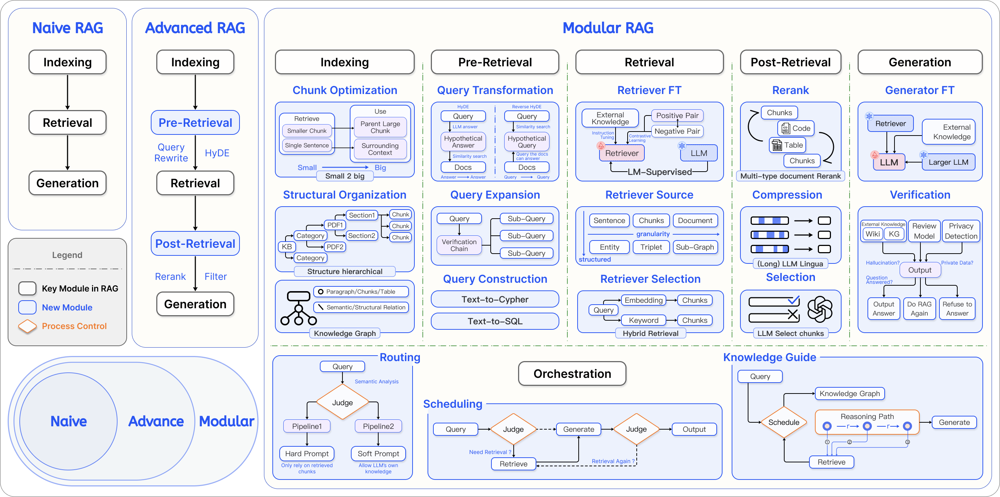
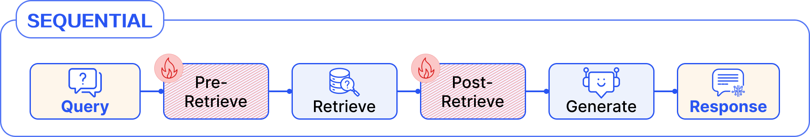

# Naive RAG에서 모듈러 RAG로: 스프링 AI RAG 프레임워크

<div class="post-meta" markdown>
<span class="tier-chip t3">T3 능력</span> 책 3.7~3.8절 | 예제 [`chapter3`](https://github.com/JM-Lab/spring-ai-agent-book/tree/main/chapter3)
</div>

앞의 두 글에서 [ETL 파이프라인](../part3/06-rag-architecture-and-etl-pipeline.md)으로 문서를 가공하고, [임베딩 모델](../part3/07-embedding-models-and-vector-stores.md)로 벡터를 만들어 벡터 데이터베이스에 적재했습니다. 지식 베이스는 준비됐지만 저장소에 들어 있기만 해서는 답변이 달라지지 않습니다. 사용자가 질문하는 순간 관련 문서를 꺼내 프롬프트에 넣어야 모델이 그 지식을 활용합니다.

스프링 AI는 이 과정을 별도 시스템이 아니라 어드바이저로 구현합니다. [대화 메모리 어드바이저](../part2/05-chat-memory-and-advisor-chain.md)가 요청에 이전 대화를 붙였듯이, RAG 어드바이저는 요청이 모델로 가기 전에 관련 문서를 검색해 프롬프트에 끼워 넣습니다. 이 글은 RAG가 Naive, Advanced, 모듈러 RAG로 발전해 온 흐름을 먼저 보고, `QuestionAnswerAdvisor`와 `RetrievalAugmentationAdvisor`로 각 방식을 구현합니다. 끝으로 정해진 순서로만 도는 파이프라인의 한계를 짚고 3장 실습 프로젝트를 소개합니다.

## RAG 패러다임의 진화

RAG는 환각과 지식 단절이라는 LLM의 약점을 보완하는 기술로 출발했습니다. 이후 쓰임새가 넓어지면서 데이터 성격과 서비스 요구에 따라 구조도 달라졌습니다. Gao 등은 2024년 논문에서 이 흐름을 Naive, Advanced, 모듈러 RAG로 나누고, RAG 기법을 모듈 단위로 쪼개 필요에 따라 다시 조립하는 구조를 제안했습니다.

<figure class="wide-figure" markdown>

<figcaption>Naive, Advanced, Modular로 진화한 RAG 패러다임의 비교 (출처: <a href="https://arxiv.org/html/2407.21059v1">Modular RAG: Transforming RAG Systems into LEGO-like Reconfigurable Frameworks</a>)</figcaption>
</figure>

Naive RAG는 질문을 임베딩해 유사도가 높은 상위 k개 문서를 찾고, 찾은 문서를 손대지 않고 프롬프트에 넣어 LLM에 보냅니다. 이름과 달리 실무에서 널리 쓰이는 기본 방식입니다. 단계가 적어 응답이 빠르고 토큰 비용이 낮으며, 사내 규정이나 FAQ처럼 구조가 분명하고 중복이 적은 데이터라면 이것으로 충분할 때가 많습니다. 스프링 AI의 `VectorStoreChatMemoryAdvisor`도 이 방식으로 지난 대화를 검색합니다.

한계는 데이터가 크고 복잡해질 때 드러납니다. "그거 안 되면 어떻게 해?"처럼 지시어가 섞인 모호한 질문은 벡터 유사도만으로 제대로 찾기 어렵습니다. 점수는 높지만 실제로는 무관한 문서가 섞이면 모델이 엉뚱하게 답할 수 있고, 긴 입력의 중간 내용을 놓치는 경향(lost in the middle) 때문에 문서를 많이 넣는 것도 해법이 되지 못합니다.

Advanced RAG는 검색 앞뒤에 처리 단계를 더해 이 한계를 줄입니다. 검색 전에는 모호한 질문을 검색하기 좋은 문장으로 고쳐 쓰거나, 비슷한 질문 여러 개로 늘리거나, 문서의 언어로 번역합니다. 검색 후에는 교차 인코더 같은 더 정교한 모델로 순위를 다시 매기고, 질문과 무관한 문장을 빼고, 점수가 기준보다 낮은 문서를 버립니다.

하지만 이런 처리를 모두 직접 구현하면 파이프라인 코드가 금방 불어납니다. 모듈러 RAG는 재작성, 검색, 재순위화 같은 기능을 독립 모듈로 떼어 내 필요한 것만 조립하는 구조이고, 스프링 AI의 RAG 프레임워크가 이 구조를 따릅니다. 그림의 인덱싱 단계는 앞 글들의 ETL 파이프라인이 오프라인으로 맡고, 어드바이저로 구현된 RAG 프레임워크는 그 뒤의 단계를 담당합니다.

## QuestionAnswerAdvisor로 만드는 Naive RAG

Naive RAG는 `spring-ai-vector-store-advisor` 모듈의 `QuestionAnswerAdvisor` 하나로 만들 수 있습니다. 재작성이나 후처리 없이 질문으로 검색하고, 찾은 문서를 프롬프트에 넣는 어드바이저입니다.

```java title="NaiveRagService.java"
--8<-- "chapter3/src/main/java/kr/jmlab/spring/ai/agent/book/chapter3/examples/NaiveRagService.java:17:37,54:64"
```
<span class="code-link">[전체 코드 보기](https://github.com/JM-Lab/spring-ai-agent-book/blob/main/chapter3/src/main/java/kr/jmlab/spring/ai/agent/book/chapter3/examples/NaiveRagService.java)</span>

생성자에서 정한 `SearchRequest`는 어드바이저에 고정됩니다. 이 서비스는 유사도 0.8 이상, 상위 6개, `category == 'tech_docs'` 조건으로 검색합니다. `askWithFilter()`는 요청마다 `QuestionAnswerAdvisor.FILTER_EXPRESSION` 파라미터로 필터를 넘겨 고정 필터를 덮어씁니다. 사용자 권한이나 테넌트에 따라 검색 범위를 나눠야 할 때 쓰는 방법입니다.

질문과 검색 문서를 합치는 기본 프롬프트 템플릿은 영어라서 한국어 질문에 영어로 답하는 경우가 생길 수 있습니다. 템플릿을 한국어로 바꿀 때는 질문이 들어갈 `query`와 검색 문서가 들어갈 `question_answer_context` 플레이스홀더를 꼭 남겨야 합니다.

질문 재작성이나 번역이 필요해질 때마다 `QuestionAnswerAdvisor`를 감싸는 코드를 덧대면 구조가 금방 복잡해집니다. `RetrievalAugmentationAdvisor`는 검색 모듈 하나만 끼우면 같은 Naive RAG로 동작하면서, 필요할 때 모듈을 하나씩 더할 수 있습니다. 그래서 책은 실무 프로젝트라면 처음부터 이 어드바이저로 설계하길 권합니다.

## RetrievalAugmentationAdvisor를 구성하는 모듈

`spring-ai-rag` 모듈의 `RetrievalAugmentationAdvisor`는 전처리, 검색, 후처리, 생성의 네 단계를 정해 두고, 단계마다 인터페이스로 모듈을 받습니다. 기본 구현체를 쓰거나 직접 만든 구현체로 바꿔 끼우면 됩니다.

| 단계 | 인터페이스 | 설정 메서드 | 기본 구현체 |
| --- | --- | --- | --- |
| 전처리 | `QueryTransformer` | `queryTransformers()` | `RewriteQueryTransformer`, `CompressionQueryTransformer`, `TranslationQueryTransformer` |
| 전처리 | `QueryExpander` | `queryExpander()` | `MultiQueryExpander` |
| 검색 | `DocumentRetriever` | `documentRetriever()` | `VectorStoreDocumentRetriever` |
| 검색 | `DocumentJoiner` | `documentJoiner()` | `ConcatenationDocumentJoiner` |
| 후처리 | `DocumentPostProcessor` | `documentPostProcessors()` | 없음(직접 구현) |
| 생성 | `QueryAugmenter` | `queryAugmenter()` | `ContextualQueryAugmenter` |

전처리 모듈은 질문을 검색하기 좋게 다듬습니다. `QueryTransformer` 구현체는 내부에서 LLM을 호출해 질문을 바꿉니다. `CompressionQueryTransformer`는 대화 기록과 현재 질문을 합쳐 완결된 질문을 만듭니다. 덴마크의 수도를 물은 뒤 나온 "그곳의 두 번째로 큰 도시는?"을 "덴마크의 두 번째로 큰 도시는?"으로 바꾸는 식입니다. `RewriteQueryTransformer`는 인사말 같은 불필요한 부분을 빼고 검색어 중심으로 고쳐 쓰고, `TranslationQueryTransformer`는 질문을 문서가 저장된 언어로 번역합니다. 변환 결과가 흔들리지 않도록 temperature는 0.0으로 두는 편이 좋습니다. `MultiQueryExpander`는 질문 하나를 표현이 다른 여러 질문으로 늘려, 한 가지 표현으로는 놓칠 문서까지 찾게 합니다.

검색 단계의 `VectorStoreDocumentRetriever`는 유사도 임계값, Top-K, 메타데이터 필터를 지원합니다. 요청마다 필터를 바꿀 때는 `VectorStoreDocumentRetriever.FILTER_EXPRESSION` 키를 쓰는데, `QuestionAnswerAdvisor`의 상수와 다르므로 잘못 쓰면 필터가 적용되지 않을 수 있습니다. 질문을 여러 개로 늘리면 검색 결과도 여러 묶음이 나오는데, `ConcatenationDocumentJoiner`가 이를 이어 붙이면서 중복 문서를 걸러 한 목록으로 만듭니다. 후처리를 맡는 `DocumentPostProcessor`는 관련성이 낮은 문서를 거르거나 순서를 다시 매기는 자리인데, 기본 구현체가 없어 서비스에 맞게 직접 구현합니다. 생성 단계의 `QueryAugmenter`는 남은 문서를 질문과 엮어 최종 프롬프트를 완성합니다.

## Advanced RAG 파이프라인 조립

예제 저장소의 `AdvancedRagService`는 네 단계에 모두 모듈을 끼운 Advanced RAG입니다. 먼저 전처리, 검색, 후처리 모듈을 만듭니다.

```java title="AdvancedRagService.java"
--8<-- "chapter3/src/main/java/kr/jmlab/spring/ai/agent/book/chapter3/examples/AdvancedRagService.java:41:57"
```
<span class="code-link">[전체 코드 보기](https://github.com/JM-Lab/spring-ai-agent-book/blob/main/chapter3/src/main/java/kr/jmlab/spring/ai/agent/book/chapter3/examples/AdvancedRagService.java)</span>

`RewriteQueryTransformer`는 복제한 `ChatClient.Builder`로 LLM을 불러 질문을 다시 씁니다. `targetSearchSystem` 값은 재작성 프롬프트에 들어갈 검색 대상의 이름입니다. 검색기는 후보를 충분히 확보하도록 임계값을 0.5로 낮게 잡고 상위 10개까지 가져옵니다. 후처리기는 람다로 만든 `DocumentPostProcessor`로, 메타데이터 `isActive`가 true인 문서만 남깁니다.

```java title="AdvancedRagService.java"
--8<-- "chapter3/src/main/java/kr/jmlab/spring/ai/agent/book/chapter3/examples/AdvancedRagService.java:59:92"
```
<span class="code-link">[전체 코드 보기](https://github.com/JM-Lab/spring-ai-agent-book/blob/main/chapter3/src/main/java/kr/jmlab/spring/ai/agent/book/chapter3/examples/AdvancedRagService.java)</span>

`ContextualQueryAugmenter`에는 한국어 템플릿을 넣습니다. `{context}` 자리에 검색 문서가, `{query}` 자리에 질문이 들어갑니다. `allowEmptyContext(false)`로 두면 검색 결과가 없을 때 질문 대신 `emptyContextPromptTemplate`을 보내므로, 모델은 근거 없이 답하지 않고 검색 가능한 범위에서 다시 질문하라고 안내합니다. 반대로 true로 두면 검색 결과가 없어도 원래 질문을 그대로 보내 모델이 문서 없이 답합니다. 기본 템플릿은 영어이고 제약이 엄격하므로, 한국어 서비스라면 두 템플릿을 모두 바꾸는 편이 좋습니다.

마지막으로 `RetrievalAugmentationAdvisor` 빌더에 모듈을 단계 순서대로 넘깁니다. 후처리 단계에는 `isActive` 필터와 함께, 질문에 "긴급"이 있으면 본문에도 "긴급"이 든 문서만 남기는 커스텀 후처리기 `KeywordFilteringPostProcessor`를 등록합니다. 완성한 어드바이저를 `defaultAdvisors()`에 넣으면 이 `ChatClient`로 보내는 모든 요청이 네 단계를 거칩니다.

## 파이프라인 실행과 검색 결과 확인

```java title="Ch3Step6_AdvancedRag.java"
--8<-- "chapter3/src/main/java/kr/jmlab/spring/ai/agent/book/chapter3/Ch3Step6_AdvancedRag.java:29:41"
```
<span class="code-link">[전체 코드 보기](https://github.com/JM-Lab/spring-ai-agent-book/blob/main/chapter3/src/main/java/kr/jmlab/spring/ai/agent/book/chapter3/Ch3Step6_AdvancedRag.java)</span>

호출하는 쪽에는 검색 코드가 없습니다. `Ch3Step6_AdvancedRag`는 질문을 받아 `ragService.stream()`이 흘려보내는 응답을 출력할 뿐이고, 질문 재작성, 검색, 후처리, 프롬프트 증강은 모두 어드바이저 안에서 일어납니다. 그만큼 중간 결과가 보이지 않으므로 [`Ch3Step5_AdvancedRagModules`](https://github.com/JM-Lab/spring-ai-agent-book/blob/main/chapter3/src/main/java/kr/jmlab/spring/ai/agent/book/chapter3/Ch3Step5_AdvancedRagModules.java)는 파이프라인 구성을 출력하고 검색 문서를 따로 보여 줍니다. 이때 쓰는 `AdvancedRagService.retrieve()`는 재작성 없이 원래 질문으로 벡터 검색을 한 뒤, 같은 임계값과 두 후처리 규칙을 적용합니다. 그래서 화면에 보이는 문서는 재작성된 질문으로 검색한 실제 답변의 근거와 다를 수 있습니다. 책의 실행 결과에서는 "긴급 장애 대응 문서는 어떤 정보를 기록해야 하나요?"라는 질문에 장애 발생 시각과 영향 범위를 기록하라는 정책 문서 청크가 검색됩니다.

최종 CLI도 답변 전에 이렇게 검색 문서를 먼저 보여 줍니다. 답이 틀렸을 때 검색부터 어긋났는지 가늠하는 참고가 되지만, 실제 근거를 정확히 보려면 어드바이저가 검색한 문서를 따로 기록해야 합니다.

## 선형 오케스트레이션의 한계

<figure class="wide-figure" markdown>

<figcaption>선형 패턴 RAG 흐름 (출처: <a href="https://arxiv.org/html/2407.21059v1">Modular RAG: Transforming RAG Systems into LEGO-like Reconfigurable Frameworks</a>)</figcaption>
</figure>

`RetrievalAugmentationAdvisor`로 만든 파이프라인은 모듈을 늘 같은 순서로 실행합니다. 모듈러 RAG 논문은 이런 구조를 선형 패턴이라고 부릅니다. 질문 내용과 상관없이 매번 같은 길을 가므로, "안녕?"이라는 인사를 받아도 검색부터 합니다. 동작을 예측하기 쉽지만 상황에 맞춰 경로를 바꾸지는 못합니다. 논문은 시스템의 성숙도를 높이려면 선형 구조를 넘어 세 가지 패턴이 필요하다고 봅니다. 질문 유형에 따라 검색 여부를 정하는 조건부 실행, 사내 위키와 웹 검색 가운데 경로를 고르는 라우팅, 결과가 부족하면 검색어를 고쳐 다시 찾는 반복입니다.

이 파이프라인은 코드로 고정한 책임 연쇄라서 이런 판단 단계가 없습니다. 조건 분기는 커스텀 어드바이저나 라우팅 코드로도 만들 수 있지만, 검색 여부를 모델이 정하게 하려면 검색을 고정 단계가 아니라 LLM이 골라 쓰는 툴로 제공합니다. 그러면 흐름을 결정하는 주체가 개발자의 자바 코드에서 모델의 추론으로 옮겨 가고, 모든 요청마다 검색하던 구조가 필요할 때만 검색하는 구조로 바뀝니다. 특정 도메인의 질의응답 봇이라면 선형 패턴이, 다양한 작업을 처리하는 AI 비서라면 툴 기반 오케스트레이션이 어울립니다.

## 4-티어 아키텍처에서의 위치

RAG는 4-티어 아키텍처의 T3 능력에 속합니다. T4 파운데이션에 쌓아 둔 임베딩 모델과 벡터 데이터베이스를 에이전트가 쓸 수 있는 지식 검색 능력으로 바꾸기 때문입니다. 이 글에서는 그 능력을 어드바이저로 `ChatClient`에 붙여 모든 요청에 같은 파이프라인을 적용했습니다. 검색을 모델이 필요할 때 부르는 능력으로 만들려면 앞에서 본 것처럼 툴로 연결해야 합니다. LLM이 툴을 고르고 스프링 AI가 실행해 결과를 돌려주는 과정은 다음 글 [툴 호출 설계: LLM이 현실 세계와 연결되는 방법](../part4/09-tool-calling-design-in-spring-ai.md)에서 다룹니다.

## 이 장의 실습 프로젝트

!!! example "3.8 RAG AI 챗봇 CLI 프로젝트"
    3장의 흐름을 하나로 묶은 문서 기반 RAG 챗봇입니다. 시작하면 `src/main/resources/data`의 텍스트, JSON, 마크다운, HTML 문서를 읽어 메타데이터를 통일하고, 민감 정보를 가린 뒤 청크로 나눠 `SimpleVectorStore`에 적재하는 오프라인 파이프라인이 먼저 실행됩니다. 이어서 질문마다 검색된 문서와 점수를 보여 준 뒤, 이 글의 Advanced RAG 파이프라인으로 답변을 스트리밍합니다. 전체 실행 과정은 예제 저장소 [`chapter3/`](https://github.com/JM-Lab/spring-ai-agent-book/tree/main/chapter3)의 README를 따릅니다.

    ```bash
    ollama pull qwen3.5:4b
    ollama pull bge-m3
    cd chapter3
    ./mvnw spring-boot:run
    # 단계별 실행: ch3-step1 ~ ch3-step6
    ./mvnw spring-boot:run -Dspring-boot.run.arguments="--spring.ai.cli.step=ch3-step5"
    ```

## 책에서 더 다루는 내용

!!! book "책 3.7~3.8절"
    - `QuestionAnswerAdvisor`의 기본 프롬프트 템플릿 구조와, 구분자를 바꾼 한국어 커스텀 템플릿 적용
    - 압축, 재작성, 번역 변환기를 순서대로 잇는 설정과 변환 전용 `ChatClient`의 temperature 조정
    - `MultiQueryExpander`와 `ConcatenationDocumentJoiner`로 검색 범위를 넓히고 결과를 합치는 설정
    - `VectorStoreDocumentRetriever`에 런타임 필터를 걸어 테넌트별로 데이터를 나누는 방법
    - `ContextualQueryAugmenter`의 기본 영문 템플릿 내용과 커스터마이징 옵션
    - 오프라인 ETL과 런타임 RAG로 나눈 실습 프로젝트의 단계별 구현과 실행 결과

    [책 소개](../book.md){ .md-button } [온라인 구매](https://wikibook.co.kr/springai-agents/){ .md-button .md-button--primary }

## 참고 자료

- [Modular RAG: Transforming RAG Systems into LEGO-like Reconfigurable Frameworks](https://arxiv.org/html/2407.21059v1): 모듈러 RAG의 모듈 구성과 오케스트레이션 패턴을 정리한 Gao 등의 논문
