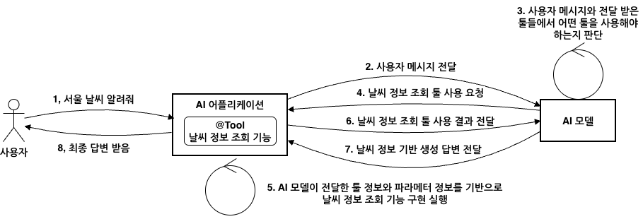
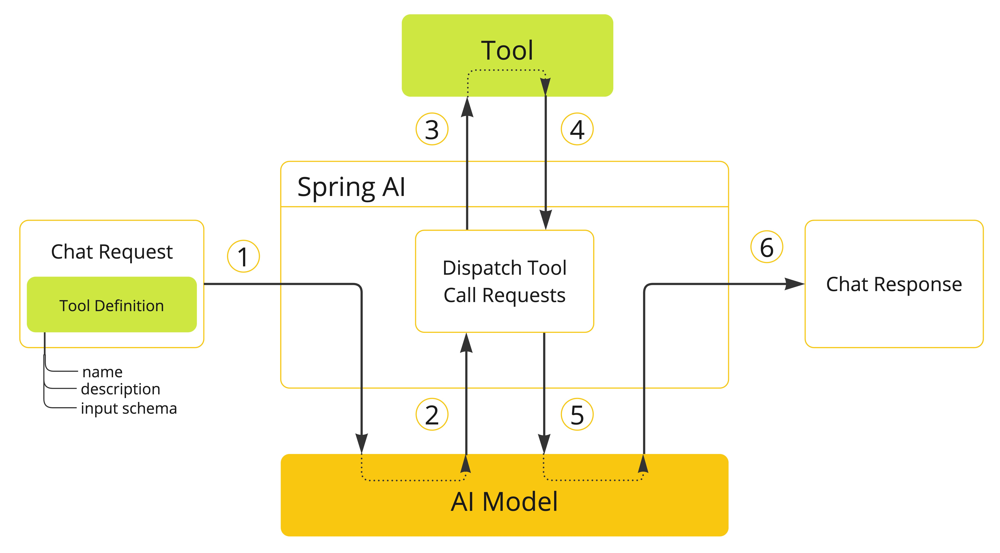
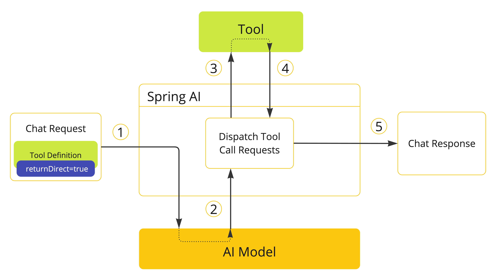

# Designing Tool Calling: How LLMs Connect to the Real World

<div class="post-meta" markdown>
<span class="tier-chip t3">T3 Capability</span> Book sections 4.1-4.2 | Example [`chapter4`](https://github.com/JM-Lab/spring-ai-agent-book/tree/main/chapter4)
</div>

Summarizing documents or writing drafts can be handled with just the model's knowledge and the documents that RAG finds. But many of the business tasks you want to hand off to AI require acting on outside systems, such as checking today's inventory, submitting an approval request to the ERP, or sending an email to a customer. The Modular RAG from the previous article finds the knowledge an answer needs, but it does not change the state of external systems. Tool calling is the technology that bridges this gap.

This article covers tool calling design, the first part of Chapter 4. It starts with OpenAI's function calling flow to see what problem tool calling grew out of, then looks at the interfaces Spring AI uses to divide up that flow. After that, it goes through, in order, tool definitions that describe tools to the model, tool context that passes execution information without the model seeing it, return direct that keeps tool results from going back to the model, and converters that turn return values into strings.

## The emergence of tool calling

There are three reasons an LLM cannot work with external systems directly. First, its knowledge stops at training time, so it does not know about anything after that. Second, it is a model that generates text, so it cannot execute code such as calling an API or inserting a record. Ask it about the weather in Seoul, and all it can offer is a sentence guessed from the season. Finally, enterprise ERP, CRM, messaging, and payment systems each have their own API specifications and authentication methods, so you cannot train the model on how to integrate with all of them or spell each one out in the prompt.

Early on, the current date or search results were pasted into the system prompt, but token costs grew as the information grew. RAG largely solved the knowledge cutoff problem, but it does not perform operations that change state. Writing code that calls an API is familiar work for developers. The hard part was designing a flow in which the model interprets a natural language request, decides on its own which API to call, when, and with what arguments, and then turns the result back into an answer.

The first to present this flow was function calling, which OpenAI released in June 2023. Functions were originally defined in a `functions` field, but as models expanded to cover a code interpreter and file search, this changed to a `tools` array. A function is now one kind of tool, defined with `"type": "function"`. The key point is that the model does not execute the function. The model only proposes, in JSON, which tool to call with which arguments, and the application handles the actual execution.

<figure class="wide-figure" markdown>

<figcaption>Tool calling flow when you implement tools yourself</figcaption>
</figure>

The figure shows what the application and the model exchange in a conversation that asks about the weather. The application sends the user message to the model along with the name, description, and parameter schema of the `getCurrentWeather` tool in the `tools` array (1-2). If the model decides this tool is a good fit, it extracts the `location` argument from the message and returns the call information in `tool_calls` (3-4). A `finish_reason` of `"tool_calls"` at this point means the model has not finished its answer but has paused to wait for the tool result. The application runs the weather lookup, appends the result to the conversation history as a `role: "tool"` message, and sends it back. The `tool_call_id` links each result to the call it belongs to (5-6). The final answer that the model builds from this result comes back in a response whose `finish_reason` is `"stop"`, and the application delivers it to the user (7-8).

Before tool calling, developers specified the output format in the prompt and parsed responses with regular expressions, so parsing failed whenever the model broke the format. As more models officially supported tool calling, applications could reliably receive JSON. Frameworks now had to help developers focus on integrating business functions instead of parsing responses, and to unify the tool calling formats that differ from model to model.

## Characteristics and flow of Spring AI tool calling

Tools do two kinds of work. Information retrieval fetches information from databases, web services, and search engines. Taking action triggers operations in a system, such as sending an email or creating a record. Where RAG is mostly about reading, tool calling does both reading and writing whenever the need arises during reasoning. Tool calling looks like a capability of the model, but the model has no authority to execute tools. The model only makes requests, and execution always happens in the application. This boundary is also significant for security.

Spring AI wraps this flow in an abstraction that is not tied to any particular provider. When you register a method or function as a tool, the framework handles conversion to the provider's format, detection of tool call requests, execution, and delivery of the results.

<figure class="wide-figure" markdown>

<figcaption>Tool calling flow in Spring AI (Source: <a href="https://docs.spring.io/spring-ai/reference/api/tools.html">Tool Calling</a>)</figcaption>
</figure>

When a request carrying tool definitions (name, description, and input schema) is sent (1), the model responds with a tool name and arguments (2). The application finds the tool by that name and runs it (3, 4), then returns the result to the model (5), and the model uses the result as context to generate the final response (6).

If you implemented this process yourself, you would have to write JSON schemas by hand, branch every time on whether a response is text or a tool call, deserialize the arguments into Java objects, and then match tool names to methods with conditional statements. You would also have to serialize the results into tool messages, append them to the conversation history, and call the model again. Spring AI splits this repetitive work across three interfaces.

- `ToolCallback`: Wraps the definition and execution of a single tool. The framework analyzes method or function signatures to create this definition automatically.
- `ToolCallingManager`: Manages the tool execution lifecycle. When a tool call response is detected in the advisor chain, it converts the arguments, runs the tool, and adds the result to the conversation history as a tool message so that the model is called again.
- `ToolCallbackResolver`: Resolves the tool name that the model sends as a string to the actual `ToolCallback` object. You do not need a conditional statement for each name.

Developers just write business logic as methods and register them as tools, leaving the implementation details of the protocol for exchanging messages with the model to the framework.

## Tool definitions: name, description, and schema

In Spring AI, every tool becomes a `ToolCallback` implementation, however it was created. This interface separates the definition, which is for the model, from the execution, which is for the application. `getToolDefinition()` returns the definition, and `call()` runs the actual code with the JSON input sent by the model.

The definition, `ToolDefinition`, consists of three elements: `name`, which must be unique within the set of tools passed to the model, `description`, which the model uses to decide when to use the tool, and `inputSchema`, which holds the parameter structure. The framework collects these definitions and builds a prompt that tells the model which tools it can use. So if a definition is vague, the model can easily go wrong as early as the step of choosing a tool.

```java title="ToolDefinitionExamples.java"
--8<-- "chapter4/src/main/java/kr/jmlab/spring/ai/agent/book/chapter4/examples/ToolDefinitionExamples.java:20:46"
```
<span class="code-link">[View full code](https://github.com/JM-Lab/spring-ai-agent-book/blob/main/chapter4/src/main/java/kr/jmlab/spring/ai/agent/book/chapter4/examples/ToolDefinitionExamples.java)</span>

`ToolDefinition.builder()` sets the three elements directly, and the `MethodToolCallback` builder receives the definition, the metadata, and the method and object to execute as separate inputs. The code directly reflects the split between the information the model sees and the information the application uses for execution. The JSON in `inputSchema` is not the whole request but a fragment for the parameters, and because this tool takes no parameters, `properties` is empty. When sending to a provider such as OpenAI, Spring AI assembles the provider's format by placing the name and description at the top and this fragment under `parameters`.

However, if you edit the JSON string every time a parameter changes, mistakes with brackets and commas are common. So you usually let `JsonSchemaGenerator` analyze method parameters or object fields and generate the schema. Here are the same `current_date` tool and a `current_datetime` tool that takes a time zone, declared with annotations.

```java title="DateTimeTools.java"
--8<-- "chapter4/src/main/java/kr/jmlab/spring/ai/agent/book/chapter4/examples/DateTimeTools.java:24:44"
```
<span class="code-link">[View full code](https://github.com/JM-Lab/spring-ai-agent-book/blob/main/chapter4/src/main/java/kr/jmlab/spring/ai/agent/book/chapter4/examples/DateTimeTools.java)</span>

You add parameter descriptions with `@ToolParam`. If a parameter is an object, annotations you may already use are also recognized, such as Jackson's `@JsonClassDescription` and `@JsonPropertyDescription` or Swagger's `@Schema`, and schemas are generated the same way for nested types as well. A parameter without any marking goes into `required`. When a value is marked as required but the context has no information for it, the model is likely to make it up, so you mark values that can be omitted, such as `zoneId`, with `required = false`. If several markings that decide whether a parameter is optional overlap, they take precedence in the order `@ToolParam`, `@JsonProperty`, `@Schema`, `@Nullable`.

## Tool context and return direct

Besides the arguments the model generates, a tool sometimes needs values that only the application knows, such as the logged-in user, a tenant ID, or a conversation ID. The model does not know who is logged in, so it cannot produce these values as arguments. Tool context carries these values with the request and hands them over only when the tool runs. Because the context is not sent to the model, tool logic can use it without exposing internal information.

Return direct (`returnDirect`) is a setting that changes where the result goes. By default, a tool result goes back to the model and becomes material for the final answer, but with this attribute turned on, the result returns straight to the caller. You use it when you want to show retrieved source material without a summary, when you need to stop the AI's involvement and hand over control, as when connecting a customer to a human representative, or when the model's wording is not needed, as with a tool that only has to deliver a download URL.

<figure class="wide-figure" markdown>

<figcaption>Tool calling flow with return direct enabled (Source: <a href="https://docs.spring.io/spring-ai/reference/api/tools.html">Tool Calling</a>)</figcaption>
</figure>

In the figure, the tool execution result becomes the response right away, without going through the model again. `ToolCallingManager` makes this branching decision based on the tool's `returnDirect` value. If the model requested several tools at once, the flow ends this way only when all of them are set to return direct. If even one is not, all the results are sent to the model.

```java title="Chapter4ToolCallbacks.java"
--8<-- "chapter4/src/main/java/kr/jmlab/spring/ai/agent/book/chapter4/examples/Chapter4ToolCallbacks.java:64:85"
```
<span class="code-link">[View full code](https://github.com/JM-Lab/spring-ai-agent-book/blob/main/chapter4/src/main/java/kr/jmlab/spring/ai/agent/book/chapter4/examples/Chapter4ToolCallbacks.java)</span>

The session summary tool receives `ToolContext` as the second argument of its `BiFunction` and reads the user name and conversation ID from it. The input generated by the model contains only `topic`. The Step 3 runner, `Ch4Step3_ToolContext`, registers this tool with `sessionSummary(true)` and passes the two values with `.toolContext(Map.of(...))` on each request. Because return direct is turned on, the book's run also prints the summary created by the tool as is, with no follow-up answer from the model.

This code also shows how the two settings differ in nature. `ToolContext` is runtime data that changes with each request, while `ToolMetadata`, which holds `returnDirect`, is a fixed attribute set when the tool is registered. Return direct is less an option for making responses slightly faster than an execution strategy that decides where to cut off the reasoning loop. With this setting, you control token costs, latency, and how much is exposed to the model.

## Tool call result conversion

Most model APIs accept tool results as strings. In Spring AI, the functional interface `ToolCallResultConverter` takes the object a tool returned and its return type, and converts the object into a string. Unless you specify otherwise, `DefaultToolCallResultConverter` serializes the result to JSON with Jackson. It sends `"Done"` when the return type is `void` and `"null"` when the result is `null`, which distinguishes successful completion from the absence of a value.

When the default JSON is not enough, you implement your own converter, for example when you need to mask sensitive information or need a format such as XML or CSV.

```java title="EmailMaskingToolCallResultConverter.java"
--8<-- "chapter4/src/main/java/kr/jmlab/spring/ai/agent/book/chapter4/examples/EmailMaskingToolCallResultConverter.java:12:22"
```
<span class="code-link">[View full code](https://github.com/JM-Lab/spring-ai-agent-book/blob/main/chapter4/src/main/java/kr/jmlab/spring/ai/agent/book/chapter4/examples/EmailMaskingToolCallResultConverter.java)</span>

Serialization is left to `DefaultToolCallResultConverter`, held as `delegate`, and only the email addresses in the resulting string are replaced with `[EMAIL]`. The customer contact lookup tool in `Chapter4ToolCallbacks` sets this converter with the builder's `toolCallResultConverter()`, so the model sees only the masked result. The unit test `Chapter4ToolTests` also checks that no original address remains in the result.

## Where this fits in the 4-tier architecture

In the 4-tier architecture, a tool is the basic unit of the external capabilities an agent uses, that is, of the T3 Capability tier. Because the definition and execution are bundled into a single `ToolCallback`, a method and a function look like the same kind of tool to the T2 Orchestration tier, which chooses tools and runs the loop. The model chooses tools by looking only at their definitions, while the authority to execute them and internal information such as tool context stay in the application. The next article, [Implementing Tools and Controlling Execution: From @Tool to ToolCallingManager](../part4/10-tool-implementation-and-execution-control.md), covers how to implement methods and functions as tools, and whether control over running the tool loop should sit with the framework, an advisor, or user code.

## More in the book

!!! book "Book sections 4.1-4.2"
    - The complete request and response JSON, traced through OpenAI's function calling specification, and the parallel tool calling option
    - The source of the `ToolCallback` and `ToolDefinition` interfaces, and the backward-compatible design of the `call()` method that takes `ToolContext`
    - The actual tool JSON payload that Spring AI sends to OpenAI
    - A summary of the annotations that generate schema descriptions, with the library that provides each one and what it is for
    - The rules for merging with default settings when you pass tool context through `ToolCallingChatOptions`
    - How `DefaultToolCallResultConverter` handles each return type, including `RenderedImage`

    [About the book](../book.md){ .md-button } [Buy the book (Korean)](https://wikibook.co.kr/springai-agents/){ .md-button .md-button--primary }

## References

- [OpenAI Function calling](https://developers.openai.com/api/docs/guides/function-calling/): OpenAI's explanation of function calling and tool calling
- [Spring AI Chat Models Comparison](https://docs.spring.io/spring-ai/reference/api/chat/comparison.html): a table of which features, such as tool calling, each provider supports
- [Tool Calling](https://docs.spring.io/spring-ai/reference/api/tools.html): the Spring AI reference documentation for tool calling
