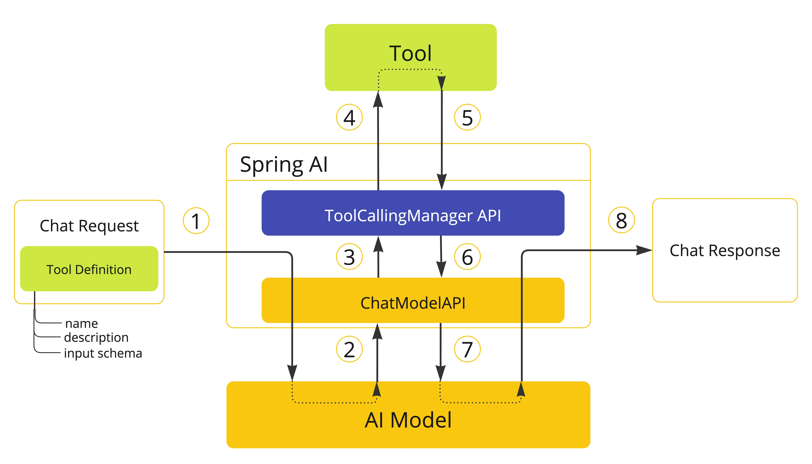

# 툴 구현과 실행 제어: @Tool에서 ToolCallingManager까지

<div class="post-meta" markdown>
<span class="tier-chip t2">T2 오케스트레이션</span> <span class="tier-chip t3">T3 능력</span> 책 4.3~4.4절 | 예제 [`chapter4`](https://github.com/JM-Lab/spring-ai-agent-book/tree/main/chapter4)
</div>

[앞 글](09-tool-calling-design-in-spring-ai.md)에서는 모델이 툴 명세를 보고 호출을 요청하면 애플리케이션이 실행해 결과를 돌려주는 흐름과, 그 흐름을 나눠 맡는 `ToolCallback`, `ToolCallingManager`, `ToolCallbackResolver`를 봤습니다. 이 글은 두 질문으로 이어집니다. 툴을 코드로 어떻게 만들어 모델에 넘기는가, 그리고 툴 실행과 모델 재호출의 반복을 누가 쥐는가입니다.

스프링은 데이터 접근에는 스프링 데이터 JPA와 `JdbcTemplate`을, 웹 계층에는 `@RestController`와 `RouterFunction`을 함께 제공해 왔고, 개발자는 프로젝트에 맞는 쪽을 골랐습니다. 스프링 AI의 툴 구현도 마찬가지입니다. 메서드에 `@Tool`을 붙이는 선언적 방식, 빌더로 조립하는 프로그래밍 방식, 자바 함수형 인터페이스를 쓰는 방식이 있고, 어느 쪽이든 프레임워크 안에서는 `ToolCallback`으로 통일됩니다.

## 메서드를 툴로: @Tool과 MethodToolCallback

가장 간단한 방법은 메서드에 `@Tool`을 붙이는 것입니다. `name`을 생략하면 메서드 이름이 툴 이름이 되고 `description`도 생략하면 메서드 이름이 들어가지만, 모델이 툴을 제대로 고르려면 둘 다 명시하는 편이 안전합니다. 이름은 같은 요청에 들어가는 툴 사이에서 겹치면 안 됩니다. 이 밖에 직접 반환 여부를 정하는 `returnDirect`와 결과 변환기를 지정하는 `resultConverter` 속성이 있습니다. `@Tool`은 접근 제어자나 static 여부와 상관없이 붙일 수 있고, 한 클래스에 여러 개를 선언해도 됩니다.

```java title="CalculatorTools.java"
--8<-- "chapter4/src/main/java/kr/jmlab/spring/ai/agent/book/chapter4/examples/CalculatorTools.java:18:40"
```
<span class="code-link">[전체 코드 보기](https://github.com/JM-Lab/spring-ai-agent-book/blob/main/chapter4/src/main/java/kr/jmlab/spring/ai/agent/book/chapter4/examples/CalculatorTools.java)</span>

메서드 파라미터는 툴의 입력 파라미터가 되고 프레임워크가 여기서 JSON 스키마를 만듭니다. `@ToolParam`에는 이름 속성이 없어서 스키마의 키는 자바 파라미터 이름인 `operation`, `left`, `right`가 됩니다. 컴파일된 클래스에 이 이름이 남는 것은 스프링 부트가 `-parameters` 옵션을 켜고 컴파일하기 때문입니다. 다른 키가 필요하면 파라미터 이름을 바꾸거나, 입력을 레코드로 감싸고 필드에 잭슨 `@JsonProperty`를 붙입니다.

`@Tool`을 붙였다고 해서 스프링이 메서드를 모아 전역에 등록하지는 않습니다. 스프링 AI가 일부러 그렇게 설계했습니다. 툴은 모델이 내부 API를 호출하고 데이터베이스를 다루게 허용하는 실행 권한이라, 전역에 자동 등록되면 의도하지 않은 기능까지 모델이 부를 수 있습니다. 또 대화 목적과 사용자 권한에 따라 필요한 툴이 다른데 모든 툴을 늘 노출하면 선택지만 늘어 잘못 고를 위험이 커집니다. 그래서 어떤 툴을 어느 맥락에 노출할지는 개발자가 등록 코드로 정합니다.

애너테이션 대신 코드로 조립하려면 `MethodToolCallback` 빌더에 명세, 실행할 `Method`, 대상 객체를 넘깁니다. 앞 글의 `ToolDefinitionExamples`가 이 방식이며, 실행 중 권한이나 조건에 따라 설명과 메타데이터를 바꿔야 할 때 씁니다. 스키마를 직접 주지 않으면 프레임워크가 메서드 파라미터로 스키마를 만들고, 이때 파라미터에 붙인 `@ToolParam`과 `@Nullable`도 반영합니다. 다만 메서드 툴은 `Optional`, 비동기와 리액티브 타입, 함수형 인터페이스 파라미터를 지원하지 않습니다.

GraalVM 네이티브 이미지로 빌드한다면 리플렉션도 신경 써야 합니다. 스프링 AI는 빈으로 등록된 `@Tool` 클래스에만 리플렉션 힌트를 자동으로 만들기 때문에, 빈으로 등록하지 않은 클래스의 객체를 툴로 쓰면 런타임 오류가 납니다. 이때는 그 클래스에 `@RegisterReflection(memberCategories = MemberCategory.INVOKE_DECLARED_METHODS)`를 선언합니다.

## 함수를 툴로: FunctionToolCallback

`java.util.function`의 `Function`, `Supplier`, `Consumer`, `BiFunction`도 툴이 됩니다. 함수 객체를 `FunctionToolCallback` 빌더로 감싸고, 필요하면 그 결과인 `ToolCallback`을 빈으로 등록합니다.

```java title="Chapter4ToolCallbacks.java"
--8<-- "chapter4/src/main/java/kr/jmlab/spring/ai/agent/book/chapter4/examples/Chapter4ToolCallbacks.java:26:47"
```
<span class="code-link">[전체 코드 보기](https://github.com/JM-Lab/spring-ai-agent-book/blob/main/chapter4/src/main/java/kr/jmlab/spring/ai/agent/book/chapter4/examples/Chapter4ToolCallbacks.java)</span>

빌더의 첫 인자는 모델에 노출할 툴 이름, 두 번째 인자는 실행할 함수입니다. `inputType`에 넘긴 `DiscountRequest` 레코드로 입력 스키마가 만들어지고, 모델이 보낸 JSON은 이 레코드로 바뀌어 함수에 들어갑니다. 단위 테스트 `Chapter4ToolTests`는 `{"price": 35000, "ratePercent": 18}`을 `call()`에 직접 넣어 결과에 28,700원이 담기는지 확인합니다. Step 2 실행기 `Ch4Step2_FunctionTools`는 이 툴과 고객 연락처 조회 툴을 `defaultTools()`로 등록합니다.

결과를 JSON으로 직렬화해 모델에 보내므로 함수의 입력과 출력은 `Void`이거나 잭슨이 직렬화할 수 있는 POJO여야 하고, 함수와 타입은 public이어야 합니다. `int` 같은 원시 타입이나 `List`, `Map` 같은 컬렉션은 단독으로 쓸 수 없어 POJO 안에 넣어야 합니다. 원시 타입이나 컬렉션을 그대로 주고받아야 한다면 `@Tool` 방식을 씁니다.

## 구현 방식 고르기와 모델에 전달하기

세 방식은 쓰임이 다릅니다. `@Tool`은 관련 메서드를 한 클래스로 묶어 응집도가 높고, 기존 서비스 계층을 거의 손대지 않고 툴로 노출하기 좋습니다. `MethodToolCallback`은 외부 라이브러리 메서드를 감싸거나 권한에 따라 설명을 바꿀 때, `FunctionToolCallback`은 컨테이너와 무관한 작은 로직을 즉석에서 툴로 만들 때 어울립니다. 툴이 많아지면 `@Tool`로 묶는 방식과 `ToolCallback`을 `@Bean`으로 노출해 의존성을 주입받는 방식이 주로 쓰입니다. 후자는 툴 이름이 문자열이라 오타를 컴파일 시점에 잡지 못하므로 이름을 상수로 모아 둡니다. 예제 저장소의 [`support/ToolNames`](https://github.com/JM-Lab/spring-ai-agent-book/blob/main/chapter4/src/main/java/kr/jmlab/spring/ai/agent/book/chapter4/support/ToolNames.java)가 그 역할을 하며, `@Tool`의 `name`과 함수 툴 빌더가 같은 상수를 씁니다. 정리하면 기존 코드를 객체 단위로 묶어 노출할 때는 `@Tool`, 의존성이 많은 새 툴을 모듈 단위로 만들 때는 이름 규칙을 갖춘 `FunctionToolCallback`이 어울립니다.

만든 툴은 보통 `ChatClient`에 넘깁니다. 빌더의 `defaultTools()`는 모든 요청에 쓸 기본 툴을, `prompt()` 뒤의 `tools()`는 그 요청에만 쓸 툴을 받습니다. 둘 다 `@Tool` 객체와 `ToolCallback`을 가리지 않고 가변 인자로 받습니다.

```java title="Ch4Step5_ToolCallingAdvisor.java"
--8<-- "chapter4/src/main/java/kr/jmlab/spring/ai/agent/book/chapter4/Ch4Step5_ToolCallingAdvisor.java:36:51"
```
<span class="code-link">[전체 코드 보기](https://github.com/JM-Lab/spring-ai-agent-book/blob/main/chapter4/src/main/java/kr/jmlab/spring/ai/agent/book/chapter4/Ch4Step5_ToolCallingAdvisor.java)</span>

Step 5 실행기는 `@Tool` 빈 네 개와 함수형 툴 세 개를 두 번의 `defaultTools()`로 함께 등록합니다. 구현 방식이 달라도 모델에게는 모두 호출할 수 있는 툴입니다. 요청에서 `tools()`로 넘긴 툴은 기본 툴을 대체하지 않고 뒤에 덧붙으며, 이름이 겹치면 `IllegalStateException`이 납니다. 특정 요청에서 기본 툴 일부를 빼야 한다면 `mutate()`로 설정을 복제한 클라이언트를 따로 만듭니다.

하위 수준의 `ChatModel`을 직접 쓸 때는 이런 메서드가 없어서 옵션 객체에 `ToolCallback`을 담아야 하고, `@Tool` 객체는 `ToolCallbacks.from()`으로 변환해야 합니다. 요청 옵션이 기본 옵션과 병합되지 않고 통째로 대체된다는 점도 다르므로, 특별한 제어가 필요하지 않다면 `ChatClient`를 쓰는 편이 안전합니다.

## ToolCallingManager API와 내부 구현

어떤 제어 방식을 쓰든 툴 실행의 생명주기는 `ToolCallingManager`가 맡습니다. 인터페이스의 두 메서드 중 `resolveToolDefinitions()`는 요청 옵션에 담긴 툴에서 모델에 보낼 `ToolDefinition` 목록을 뽑습니다. `executeToolCalls()`는 처음 보낸 `Prompt`와 툴 호출이 담긴 `ChatResponse`를 받아 툴을 실행하고 `ToolExecutionResult`를 돌려줍니다.

결과의 `conversationHistory()`에는 사용자 요청, 모델의 툴 호출 메시지, 툴 결과 메시지가 이어진 대화 이력이 들어 있습니다. 보통은 이 이력으로 모델을 다시 부르지만, 호출된 툴이 모두 직접 반환이면 재호출 없이 결과를 돌려줍니다. 한 응답에 여러 툴 호출을 담는 병렬 툴 호출은 모델 쪽 기능입니다. 기본 구현인 `DefaultToolCallingManager`는 툴 호출 목록을 멀티스레드가 아니라 for 루프로 하나씩 실행합니다.

`DefaultToolCallingManager`는 자동 구성으로 빈이 등록됩니다. 동작을 바꾸려면 `ToolCallingManager.builder()`로 만든 빈을 직접 정의합니다. 기본 구현은 안에서 세 협력 객체를 씁니다. `ObservationRegistry`는 툴 실행 시간과 성공 여부를 기록합니다. 따로 설정하지 않으면 아무것도 남기지 않는 NOOP이고, 액추에이터 의존성이 있으면 자동 구성된 레지스트리를 받습니다. `ToolCallbackResolver`는 모델이 보낸 이름으로 `ToolCallback`을 찾습니다. 기본 구성에서는 `DelegatingToolCallbackResolver`가 내부 리졸버들에 해석을 맡기고, 그중 `StaticToolCallbackResolver`가 시작 시점에 모아 둔 `ToolCallback` 빈 목록에서 이름을 찾습니다. 마지막으로 `ToolExecutionExceptionProcessor`는 툴에서 난 `ToolExecutionException`을 모델에 보낼 문자열로 바꾸거나 호출자에게 던집니다. 기본 구현인 `DefaultToolExecutionExceptionProcessor`는 `RuntimeException` 계열을 메시지로 바꿔 모델에 전하고, 체크 예외와 `Error` 계열은 호출자에게 그대로 넘깁니다. 모든 툴 오류를 자바 예외로 받고 싶다면 `spring.ai.tools.throw-exception-on-error`를 `true`로 설정합니다.

```java title="ManualToolCallingService.java"
--8<-- "chapter4/src/main/java/kr/jmlab/spring/ai/agent/book/chapter4/examples/ManualToolCallingService.java:38:76"
```
<span class="code-link">[전체 코드 보기](https://github.com/JM-Lab/spring-ai-agent-book/blob/main/chapter4/src/main/java/kr/jmlab/spring/ai/agent/book/chapter4/examples/ManualToolCallingService.java)</span>

생성자는 빌더로 매니저를 직접 만듭니다. `ToolCallbacks.from()`으로 바꾼 툴 배열을 `StaticToolCallbackResolver`에 넣고, `toolExecutionExceptionProcessor()`에는 예외를 "툴 실행 중 문제가 발생했다"는 안내 문장으로 바꾸는 `FriendlyToolExceptionProcessor`를 넘깁니다. `ask()`는 `ChatModel`을 직접 부르므로 `OllamaChatOptions`에 툴을 담으며, 이 메서드의 루프가 다음 절에서 볼 사용자 제어 방식입니다.

## 프레임워크 제어, 어드바이저 제어, 사용자 제어

모델의 툴 호출 요청을 받아 실행하고 모델을 다시 부르는 반복을 누가 쥐는지에 따라 실행 방식은 세 가지로 나뉩니다.

### 프레임워크 제어

별도 설정이 없을 때의 방식입니다. 툴을 `ChatClient`에 등록해 두면 `ToolCallingAdvisor`가 자동으로 어드바이저 체인에 들어가고, 개발자가 부르는 `call()` 한 번 안에서 반복이 끝납니다.

<figure class="wide-figure" markdown>

<figcaption>프레임워크-제어 툴 실행 흐름 (출처: <a href="https://docs.spring.io/spring-ai/reference/api/tools.html">Tool Calling</a>)</figcaption>
</figure>

요청에 툴 정의를 담아 보내고(1) 모델이 툴 호출로 응답하면(2), 체인의 `ToolCallingAdvisor`가 응답을 가로채 `ToolCallingManager`에 넘깁니다(3). 매니저는 툴을 실행해 결과를 받아(4, 5) 어드바이저에 돌려주고(6), 어드바이저는 결과를 툴 응답 메시지로 프롬프트에 더해 모델을 다시 부릅니다(7). 모델의 최종 답이 응답으로 돌아옵니다(8). 그림에서 ChatModel API가 매니저를 부르는 자리를, 책은 `ChatClient` 체인에 들어간 `ToolCallingAdvisor`가 응답을 가로채는 단계로 설명합니다. 자동 등록을 끄려면 요청 단위로는 `.advisors(AdvisorParams.toolCallingAdvisorAutoRegister(false))`를 넘기고, 애플리케이션 전체에서는 `spring.ai.chat.client.tool-calling.enabled=false`를 설정합니다.

### 어드바이저 제어

루프 동작을 세밀하게 다뤄야 하면 `ToolCallingAdvisor`를 직접 구성해 체인에 넣습니다. 초기 스프링 AI는 `ChatModel` 구현체 안에서 툴을 찾고 재귀적으로 실행했습니다. 그러다 보니 모델 통신만 맡아야 할 객체가 무거워졌고, 루프가 모델 안쪽에 숨어 있어 중간 과정을 로깅하거나 메모리에 남길 방법이 없었습니다. MCP처럼 외부의 많은 툴을 동적으로 연결하려면 툴 제어를 모델 밖으로 꺼내야 했습니다. 제어가 어드바이저 체인으로 넘어오면 툴 호출 메시지가 체인을 지나가므로 로깅과 모니터링이 쉬워지고, 반복 중의 대화 이력을 메모리와 연동하거나 재시도 로직을 끼워 넣기도 수월해집니다. 앞의 Step 5도 `ToolCallingAdvisor`를 `defaultAdvisors()`에 직접 넣고 `SimpleLoggerAdvisor`를 함께 둡니다.

빌더로는 사용할 매니저(`toolCallingManager()`)와 체인 안의 위치(`advisorOrder()`)를 정합니다. `toolExecutionEligibilityChecker()`로 다음 루프를 돌지 판정하는 조건을 바꿔 무한 루프를 막는 가드를 둘 수 있고, `disableInternalConversationHistory()`로 어드바이저 자체의 대화 이력 유지를 끌 수 있습니다. 위치가 중요한 이유는 order 값이 루프 안팎을 가르기 때문입니다. 값이 작을수록 클라이언트 쪽에 가까워 요청을 먼저 받고, `ToolCallingAdvisor`보다 값이 큰 어드바이저는 하위 체인으로 복사돼 루프 안에서 반복마다 실행됩니다.

책의 어드바이저 제어 예제는 `ToolCallingAdvisor`를 `HIGHEST_PRECEDENCE + 300`, 메모리 어드바이저를 `+ 400`에 두어 메모리가 루프 안에서 중간 과정까지 기록하게 하고, 이력이 두 번 들어가지 않도록 `disableInternalConversationHistory()`를 호출합니다. 최종 프로젝트의 `ToolEnabledChatService`는 반대로 메모리 어드바이저를 `+ 200`, `ToolCallingAdvisor`를 `+ 300`에 둡니다. 메모리는 루프 바깥에서 요청마다 한 번 이전 대화를 불러오고 사용자 메시지와 최종 답변만 저장하며, 루프 도중의 이력은 어드바이저가 기본값대로 관리합니다. 어드바이저 배치는 6장의 [재귀적 어드바이저와 툴 루프 제어](../part6/16-recursive-advisor-and-tool-loop-control.md)에서 더 깊이 다룹니다.

### 사용자 제어

툴을 실행하기 전에 사용자 승인을 받아야 하는 사용자 개입(HITL)이나, 체인으로 표현하기 어려운 업무 흐름이라면 자동 개입을 빼고 코드가 직접 루프를 돌립니다. 앞의 `ask()`가 그 예입니다. `ChatModel.call()`은 툴을 자동으로 실행하지 않으므로, 응답의 `hasToolCalls()`를 확인해 `executeToolCalls()`로 실행하고 결과의 대화 이력으로 새 `Prompt`를 만들어 다시 부릅니다. 직접 반환이면 그 자리에서 툴 결과를 돌려주고, 반복은 `MAX_TOOL_LOOPS`로 세 번까지 제한합니다. Step 4 실행기 `Ch4Step4_ToolCallingManager`가 이 서비스를 CLI로 실행합니다.

매니저를 거치므로 이름 해석과 예외 처리는 그대로 쓸 수 있습니다. 다만 툴이 늘어 중첩 호출, 부분 실패 뒤 재시도, 권한 검증과 감사 로깅이 붙으면 하나의 루프가 빠르게 복잡해지고, 흐름 제어와 메모리 동기화까지 코드가 맡게 됩니다. 그래서 책은 특별한 경우가 아니면 어드바이저 제어를 권합니다.

## 4-티어 아키텍처에서의 위치

`@Tool` 메서드와 `FunctionToolCallback`은 T3 능력 계층의 부품을 만드는 방법이고, 툴 루프를 누가 어떻게 제어하는지는 T2 오케스트레이션의 문제입니다. `ToolCallingAdvisor`로 툴 루프를 어드바이저 체인에 올리는 구성은 6장에서 AI 에이전트 시스템을 만들 때 다시 쓰입니다. 지금까지 본 툴은 모두 같은 애플리케이션 안에 있었습니다. 애플리케이션 밖의 툴을 표준 프로토콜로 연결하는 방법은 다음 글 [MCP 기본과 스프링 AI MCP 클라이언트](../part5/11-mcp-basics-and-spring-ai-mcp-client.md)에서 다룹니다.

## 이 장의 실습 프로젝트

!!! example "4.5 툴 지원 AI 챗봇 CLI 프로젝트"
    고객 문의를 처리하는 작은 업무 지원 챗봇을 가정하고 날짜, 계산, 할인, 고객 연락처, 상품 재고, 할 일 툴을 하나의 `ChatClient`에 묶은 CLI를 만듭니다. 메서드 툴과 함수형 툴을 함께 등록하고 대화 메모리와 `ToolCallingAdvisor`를 조합해, "SKU-100 재고 2개 예약하고 그 내용을 할 일로 추가해줘" 같은 요청을 스트리밍으로 처리합니다. 전체 실행 과정은 예제 저장소 [`chapter4/`](https://github.com/JM-Lab/spring-ai-agent-book/tree/main/chapter4)의 README를 따릅니다.

    ```bash
    ollama pull qwen3.5:4b
    cd chapter4
    ./mvnw spring-boot:run
    # 단계별 실행: ch4-step1 ~ ch4-step5
    ./mvnw spring-boot:run -Dspring-boot.run.arguments="--spring.ai.cli.step=ch4-step4"
    ```

## 책에서 더 다루는 내용

!!! book "책 4.3~4.4절"
    - `@Tool`, `@ToolParam` 속성 표와 `MethodToolCallback`, `FunctionToolCallback` 빌더의 설정 항목 표
    - `ToolCallback`을 `@Bean`으로 노출하고 툴 이름을 상수로 관리하는 설계 예제
    - `ChatModel`에 기본 툴과 요청 툴을 넣는 예제와 옵션이 대체되는 동작
    - 이름으로 해석되도록 툴을 `ToolCallback` 빈으로 등록하는 방법과 커스텀 `ToolCallbackResolver` 구성
    - 오픈AI `parallel_tool_calls`, 앤트로픽 `disableParallelToolUse` 같은 병렬 툴 호출 옵션
    - `ChatMemory`와 결합한 사용자 제어 루프, 메모리 어드바이저를 루프 안쪽에 두는 어드바이저 제어 예제 코드

    [책 소개](../book.md){ .md-button } [온라인 구매](https://wikibook.co.kr/springai-agents/){ .md-button .md-button--primary }

## 참고 자료

- [Tool Calling](https://docs.spring.io/spring-ai/reference/api/tools.html): 스프링 AI 툴 호출 레퍼런스 문서
- [Ahead of Time Optimizations](https://docs.spring.io/spring-framework/reference/core/aot.html): 네이티브 이미지 빌드와 리플렉션 힌트를 다루는 스프링 프레임워크 문서
