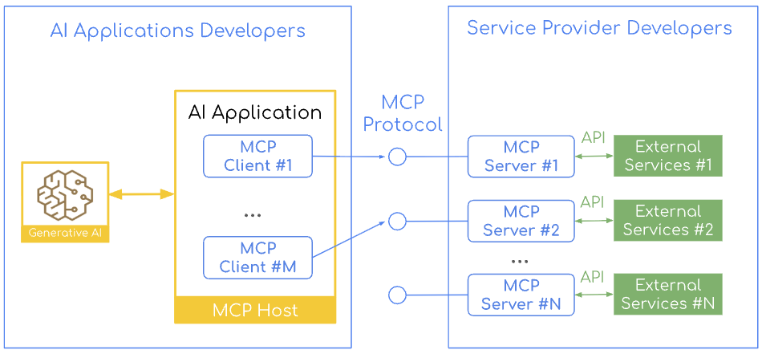
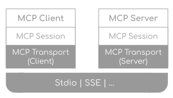

# MCP Basics and the Spring AI MCP Client

<div class="post-meta" markdown>
<span class="tier-chip t3">T3 Capability</span> Book sections 5.1-5.2 | Example [`chapter5`](https://github.com/JM-Lab/spring-ai-agent-book/tree/main/chapter5)
</div>

The tools covered up to the [previous article](../part4/10-tool-implementation-and-execution-control.md) all ran inside the application. The format for describing tools to a model, however, differs from provider to provider. OpenAI uses `"type": "function"`, Anthropic uses `input_schema`, and Google Gemini uses `function_declarations`. To switch models or support several of them, you have to rewrite your tool definitions.

MCP (Model Context Protocol), which Anthropic released in November 2024, standardizes how AI applications connect to external systems with a single open protocol. The AI application gets an MCP client, the external system gets an MCP server, and the two communicate through standard messages. By analogy with one connector replacing a jumble of different charging ports, it is also called a "USB-C port for AI."

As the first article of Chapter 5, this article summarizes the structure, primitives, and transports of MCP, then uses the `chapter5` example code to show how to configure and extend the Spring AI MCP client.

## Hosts, clients, and servers

Participants in MCP take one of three roles.

<figure class="wide-figure" markdown>

<figcaption>MCP client-server architecture (Source: <a href="https://spring.io/blog/2025/09/16/spring-ai-mcp-intro-blog">Connect Your AI to Everything: Spring AI's MCP Boot Starters</a>)</figcaption>
</figure>

- **MCP host**: An AI application such as Claude Desktop or Visual Studio Code. It creates and coordinates an MCP client for each external system it connects to.
- **MCP client**: Maintains a dedicated connection to a single server from within the host. With three servers there are three clients, so context and permissions are kept separate for each connection.
- **MCP server**: An independent program that provides data or tools. It connects to multiple clients at the same time (1:N) and keeps a separate session for each connection.

Because each server runs in its own process, even a compromised GitHub server would have a hard time affecting the permissions of the database server. Each server gets only the minimum permissions it needs for the system it is responsible for, and the host keeps track of which server has which tools and sends each request to the right client. MCP is a protocol that maintains sessions, so servers isolate the session of each client, and clients handle timeouts, errors, and reconnection. Thanks to this division of roles, a server built once to the standard can be used from any host, and a host connects to any server with the same client implementation, regardless of the language the server is written in.

## Primitives: the units of functionality exchanged

The units of functionality that clients and servers exchange are called primitives. They fall into three groups, depending on who offers a feature and who calls it.

| Direction | Primitives | Used for |
| --- | --- | --- |
| Offered by the server, called by the client | Tools, resources, prompts, completions | Performing actions, read-only context, reusable templates, argument suggestions |
| Offered by the client, called by the server | Sampling, elicitation, roots | Borrowing the client's LLM, user input and approval, setting the access scope |
| Both directions | Notifications, progress, ping | List change notifications, progress updates, connection checks |

Sampling lets a server use the client's model without an API key of its own.

## The Java MCP stack and the client's role

The MCP specification divides the protocol into a data layer and a transport layer, and the MCP Java SDK implements this as a stack with the same shape on both the client and the server.

<figure class="wide-figure" markdown>

<figcaption>MCP stack architecture (Source: <a href="https://docs.spring.io/spring-ai/reference/api/mcp/mcp-overview.html">Model Context Protocol (MCP), Spring AI Reference</a>)</figcaption>
</figure>

- **Client and server layer (data layer)**: Works with primitives. The client requests tool execution or resource lookups based on the model's decisions, and the server exposes and executes primitives.
- **Session layer (data layer)**: Handles routing of JSON-RPC 2.0 messages, matching of request and response IDs, and error handling. `McpClientSession` negotiates the version and capabilities with an `initialize` request, and once the server responds, it signals that it is ready with an `initialized` notification. `McpServerSession` validates initialization requests and manages the sessions of multiple clients separately.
- **Transport layer**: Abstracted by the `McpTransport` interface, it serializes messages and sends and receives them over the actual channel. On the client side, it decides whether to connect to a remote URL or launch a local process, and on the server side, it opens an endpoint and waits.

There are three transport protocols. STDIO connects two processes on the same machine through standard input and output, without going over the network. Streamable HTTP is for remote use: a single endpoint accepts POST and GET requests and streams over SSE when needed. HTTP with SSE is the remote transport used in the 2024-11-05 specification. Starting with the 2025-03-26 specification it was replaced by Streamable HTTP, but SDKs continue to support it for backward compatibility. Because the layers are separate, switching the transport leaves the logic above it unchanged.

In this structure, the model does not talk to servers directly. Instead, a Java MCP client attached to each server handles the connection. The client negotiates the protocol version, retrieves the lists of tools, resources, and prompts, and passes request results to the application. With the STDIO transport, it also launches the server as a child process. Remote and local servers are handled the same way, so you can focus on what a tool does rather than where it runs.

## Direct tool calling and MCP tool calling

Both approaches give the model a list of tools with their JSON schemas and let the model choose. What differs is where the tools are implemented and how they are called.

With direct tool calling, the tools live in the same JVM as the application, so calls are fast, and the tools can use Spring transactions and user sessions right away. However, the tools also have to be written in Java, other teams have to reimplement them to use them, and even when the load falls on a single tool, you have to scale the entire application.

MCP tool calling splits tools out into independent servers. When the model requests a tool, the client hands the execution to the server over JSON-RPC and returns the result to the model. You can call a Python analysis tool as if it were a local function, and several systems can share a server, but this comes at a cost: running and monitoring the servers, and preparing for latency and network failures.

This choice resembles the trade-offs of moving from monoliths to microservices. The book recommends starting with direct tool calling and splitting tools out into an MCP server once you need to share tools, use other languages, or separate permissions. Spring AI supports both approaches, so you can also expose existing tool code as an MCP server by adding dependencies and configuration.

## MCP client Boot starters and common settings

Spring AI has two MCP client Boot starters: `spring-ai-starter-mcp-client`, based on the JDK `HttpClient`, and `spring-ai-starter-mcp-client-webflux`, based on WebFlux. They differ only in their transport implementation, and both support STDIO, Streamable HTTP, and sync and async modes equally. For a typical Spring MVC environment, choose the standard starter, and if the whole stack is reactive, choose the WebFlux starter. `chapter5` uses the standard starter and keeps all of its settings under `spring.ai.mcp.client`.

```yaml title="application.yml"
--8<-- "chapter5/src/main/resources/application.yml:10:24"
```
<span class="code-link">[View full code](https://github.com/JM-Lab/spring-ai-agent-book/blob/main/chapter5/src/main/resources/application.yml)</span>

The example also writes out properties that are at their default values, and changes only `name`, `version`, and `request-timeout` (from the default 20 seconds to 30 seconds). Three properties have a large effect on behavior.

- `type`: `SYNC` (default) or `ASYNC`. Whereas the starter decides the transport implementation, this value decides whether the client waits for responses or receives them as reactive types. It applies to the entire application as a single choice, and which annotation handlers get registered also depends on this value.
- `initialized`: When `true` (default), the handshake happens when the bean is created, so startup fails if the server is down. When `false`, the application starts, but you have to call `initialize()` yourself at the point you need it.
- `toolcallback.enabled`: When `true` (default), a `SyncMcpToolCallbackProvider` bean (`AsyncMcpToolCallbackProvider` for async) that gathers the server tools as `ToolCallback`s is registered. If you turn it off, this bean is not created, so you have to call tools directly through the client.

## Connecting to STDIO and remote servers

Each connection is declared under the prefix for its transport, with a name as the key. This name also serves as the identifier that customizers and annotations use to point to the target server.

For STDIO, write `command`, `args`, and `env` under `stdio.connections.<name>`, or use `servers-configuration` to point to a JSON file in the Claude Desktop format. On Windows, `npx` is a batch file that `ProcessBuilder` cannot run directly, so wrap it with `cmd.exe /c`. If your team works on a mix of operating systems, have each profile read a different JSON file.

For a remote server, use `url` and `endpoint` (default `/mcp`) under `streamable-http.connections.<name>` for Streamable HTTP, or `url` and `sse-endpoint` (default `/sse`) under `sse.connections.<name>` for HTTP with SSE. Put only the scheme, host, and port in `url`, and put the path and query parameters in the endpoint value, which starts with `/`. If you get a 404 when connecting, check this split first.

There was a discussion (issue #3948, PR #3949) about adding a `headers` field under the connection settings for authenticating with remote servers, but the Spring AI team decided not to broaden the scope of the configuration. The reasons were that tokens are short-lived and rotate periodically, each request may need to carry different user permissions, and authentication methods differ from server to server. You can add fixed headers with a `McpSyncHttpClientRequestCustomizer` bean, but the same token then goes out to every server, so this is better suited to local testing. OAuth2-based security is covered in the [MCP security article](../part5/13-mcp-security-oauth2-and-jwt.md).

## Auto-configured clients and tool callback providers

Depending on `type`, the auto-configured clients are injected as `List<McpSyncClient>` or `List<McpAsyncClient>`, and the provider that gathers the tools of all servers is injected as `SyncMcpToolCallbackProvider` or `AsyncMcpToolCallbackProvider`. The example uses the sync setting, so its `McpClientCatalogService` receives `List<McpSyncClient>` and `SyncMcpToolCallbackProvider` through its constructor.

```java title="McpClientCatalogService.java"
--8<-- "chapter5/src/main/java/kr/jmlab/spring/ai/agent/book/chapter5/client/McpClientCatalogService.java:18:52"
```
<span class="code-link">[View full code](https://github.com/JM-Lab/spring-ai-agent-book/blob/main/chapter5/src/main/java/kr/jmlab/spring/ai/agent/book/chapter5/client/McpClientCatalogService.java)</span>

`serverSummary()` fetches the server information and capabilities received during initialization, and `listTools()` fetches the tool list. Client Step 1 (`Ch5Step1_McpDiscovery`) prints these together with the resource and prompt lists, and Step 2 (`Ch5Step2_McpPrimitiveCalls`) uses the same service to call `callTool`, `readResource`, `getPrompt`, and `completeCompletion`, trying out primitives beyond tools.

The callbacks the provider returns are ordinary Spring AI `ToolCallback`s. Step 3 takes `rag_search_documents` from among them and runs it directly, without a model.

```java title="Ch5Step3_ToolCallbackProvider.java"
--8<-- "chapter5/src/main/java/kr/jmlab/spring/ai/agent/book/chapter5/Ch5Step3_ToolCallbackProvider.java:28:44"
```
<span class="code-link">[View full code](https://github.com/JM-Lab/spring-ai-agent-book/blob/main/chapter5/src/main/java/kr/jmlab/spring/ai/agent/book/chapter5/Ch5Step3_ToolCallbackProvider.java)</span>

The `ToolContext` passed along with the JSON arguments is converted into metadata for the MCP tool call and sent to the server. To connect the tools to a model, register the result of `getToolCallbacks()` as tools on `ChatClient`. The final CLI's `McpEnabledChatService` passes it to `defaultTools()`.

## Customizers and tool policies

Servers, too, ask the client for sampling or elicitation and send it logs and progress updates. Spring AI opens up the handling of these messages and the tool exposure policies as extension points, and when implementation beans exist, auto-configuration applies them. The example's `Chapter5McpClientConfiguration` registers all four of the following as beans.

```java title="Chapter5McpClientConfiguration.java"
--8<-- "chapter5/src/main/java/kr/jmlab/spring/ai/agent/book/chapter5/client/Chapter5McpClientConfiguration.java:38:68"
```
<span class="code-link">[View full code](https://github.com/JM-Lab/spring-ai-agent-book/blob/main/chapter5/src/main/java/kr/jmlab/spring/ai/agent/book/chapter5/client/Chapter5McpClientConfiguration.java)</span>

- **Client behavior**: A `McpClientCustomizer<McpClient.SyncSpec>` bean (`McpClientCustomizer<McpClient.AsyncSpec>` for async) receives the connection name and the spec, and registers the timeout, roots, and progress and logging consumers. `sampling` and `elicitation` handlers also go on the same spec, and by branching on the connection name, you can apply a different policy to each server.
- **Tool filter**: `McpToolFilter` selects which tools to expose. The example keeps only tools whose names start with `rag_` and whose descriptions do not contain `experimental`, and you can have only one filter bean.
- **Tool names**: `McpToolNamePrefixGenerator` prevents name collisions between servers. The default implementation, `DefaultMcpToolNamePrefixGenerator`, adds a prefix such as `alt_1_` to duplicate names, and the example uses `noPrefix()` because it has only one connection. If you use `noPrefix()` with multiple servers and names collide, an `IllegalStateException` is thrown.
- **Metadata**: `ToolContextToMcpMetaConverter` moves the values in `ToolContext`, the tool execution context, into the metadata of the MCP tool call. The default, `ToolContextToMcpMetaConverter.defaultConverter()`, passes along every entry that has a value, so the example's `toMcpMeta()` lets through only `userId`, `conversationId`, `clientSession`, and `progressToken`.

Client Step 4 (`Ch5Step4_McpClientPolicy`) converts a `ToolContext` that includes `rawSecret` with this converter and prints the result. Because `rawSecret` is not on the allowlist, it does not appear in the result.

## MCP client annotations

You can also use annotations to declare how server requests and notifications are handled. The client starter includes `spring-ai-mcp-annotations`, so when you put these annotations on methods of Spring beans, the scanner (`annotation-scanner.enabled`, default `true`) registers them.

| Annotation | Handles | Return type (sync / async) |
| --- | --- | --- |
| `@McpSampling` | Sampling requests | `CreateMessageResult` / `Mono<CreateMessageResult>` |
| `@McpElicitation` | Elicitation requests | `ElicitResult` / `Mono<ElicitResult>` |
| `@McpLogging`, `@McpProgress`, `@McpToolListChanged`, and others | Log, progress, and list change notifications | `void` / `void` or `Mono<Void>` |

You specify the target server by connection name in the `clients` attribute, as in `@McpLogging(clients = "rag")`. This attribute is a string array, so you can also bind several connections to one method. If a class has both sync and async methods, only the methods whose return types match the `type` setting are registered.

However, annotations cannot set roots, and because the connection names are fixed in code, you cannot change the target at runtime. Also, auto-configuration registers the annotation handlers first and then runs the customizers, so if both set the same handler slot, such as sampling or elicitation, the customizer overwrites it. Annotations fit when the servers are fixed, and customizers fit when connections change often. Within a team, it helps to settle on one approach.

## Where this fits in the 4-tier architecture

In the 4-tier architecture, T2 Orchestration and T3 Capability meet at the standard interface for calling capabilities. The book uses MCP for this interface. The MCP client turns remote T3 capabilities into `ToolCallback`s so that the T2 tool loop calls them the same way it calls local tools. If you keep capabilities that run in the same process as local tools and split capabilities operated separately into MCP servers, the orchestration code stays the same even as you add capabilities. The next article, [Building an MCP Server with Spring AI: From Boot Starters to Annotations](../part5/12-building-an-mcp-server-with-spring-ai.md), builds the MCP server on the other side of this boundary.

## More in the book

!!! book "Book sections 5.1-5.2"
    - The exposure direction and a description of each of the 11 MCP primitives
    - A table comparing direct tool calling with an MCP-based architecture
    - A table of common configuration properties and the recommended environment for each of the two starters
    - STDIO JSON configuration, Windows path rules, and examples of profiles for each operating system
    - Guidelines for splitting remote URLs, routing custom headers per server, and complete customizer and annotation examples

    [About the book](../book.md){ .md-button } [Buy the book (Korean)](https://wikibook.co.kr/springai-agents/){ .md-button .md-button--primary }

## References

- [Model Context Protocol](https://modelcontextprotocol.io): the official site, with the specification and SDKs for each language
- [Transports (2024-11-05)](https://modelcontextprotocol.io/specification/2024-11-05/basic/transports): the definition of HTTP with SSE
- [Transports (2025-03-26)](https://modelcontextprotocol.io/specification/2025-03-26/basic/transports): the introduction of Streamable HTTP
- [MCP Java SDK Overview](https://java.sdk.modelcontextprotocol.io/latest/overview/): the structure of Java MCP clients and servers
- [Connect Your AI to Everything: Spring AI's MCP Boot Starters](https://spring.io/blog/2025/09/16/spring-ai-mcp-intro-blog): an introduction to the Spring AI MCP Boot starters
- [Support custom HTTP headers for MCP transport](https://github.com/spring-projects/spring-ai/issues/3948) (issue #3948, [PR #3949](https://github.com/spring-projects/spring-ai/pull/3949)): discussion of a per-connection `headers` setting
