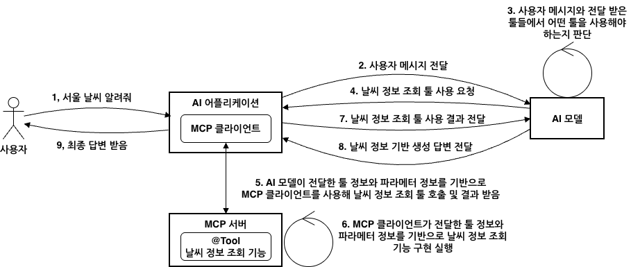

# Building an MCP Server with Spring AI: From Boot Starters to Annotations

<div class="post-meta" markdown>
<span class="tier-chip t3">T3 Capability</span> Book section 5.3 | Example [`chapter5`](https://github.com/JM-Lab/spring-ai-agent-book/tree/main/chapter5)
</div>

The [previous article](../part5/11-mcp-basics-and-spring-ai-mcp-client.md) used an MCP client to connect to a server and call its features. This article builds the other side, the MCP server, with Spring AI.

You can build a server with the MCP Java SDK alone. However, you then have to wire everything together in code: the transport layer, the server name and version, supported capabilities, tool and resource specifications, the sync and async models, and change notifications. With Spring AI's MCP server Boot starters, auto-configuration takes care of this assembly, and developers only need to register features as Spring beans. In effect, you develop an MCP server in the same familiar Spring way you have built REST API servers.

This article summarizes Section 5.3 of the book in the order you build a server. The examples are the server code of the `chapter5` project, which exposes the RAG features from Chapter 3 as an MCP server.

## What an MCP server does in tool calling

<figure class="wide-figure" markdown>

<figcaption>Tool calling flow when tools are implemented in an MCP server</figcaption>
</figure>

In the figure, everything up to step 4, where the model requests the weather lookup tool, is the same as when the tools live inside the application. The difference comes after that. The application's MCP client sends the tool name and parameters the model chose to the MCP server (step 5), and the server runs the actual feature (step 6). The client only receives the result and passes it to the model (step 7).

A server's job is to organize its features into primitives such as tools, resources, prompts, and completions, and to expose them. With the Spring AI starters, this process changes as follows.

- You set the server type, the transport, and the features to expose with `application.yml` properties.
- When you register tools, resources, and prompts as Spring beans, the starter converts them into MCP specifications.
- Tools you have already built on `ToolCallback`, `ToolCallbackProvider`, or `@Tool` are exposed as MCP tools without modification.
- You declare features at the method level with `@McpTool`, `@McpResource`, `@McpPrompt`, and `@McpComplete`.

## Choosing a starter: transport, web stack, and server type

When choosing dependencies, keeping three different kinds of choices separate prevents confusion.

The first is the transport. STDIO is a local transport in which the client launches the server process itself and communicates with it through standard input and output. Streamable HTTP is the standard transport for remote servers. It adds SSE streaming on top of HTTP POST and GET only when needed, and it replaces the older HTTP with SSE transport. Stateless belongs to the Streamable HTTP family but is a mode that keeps no session state.

The second is the web stack. WebMVC and WebFlux are not protocols but runtime choices that decide which I/O model processes HTTP requests. The starters are `spring-ai-starter-mcp-server`, which supports only STDIO without a web server, and `spring-ai-starter-mcp-server-webmvc` and `spring-ai-starter-mcp-server-webflux`, which you pick to match your web stack. Both web starters support every transport, so which transport to use is decided by configuration, not by dependencies.

The third is the server type, set with `spring.ai.mcp.server.type`. It determines the return types of the methods developers write. A SYNC server registers only methods that return plain Java objects as features, and an ASYNC server registers only methods that return reactive types such as `Mono` and `Flux`. Using WebFlux does not automatically make a server ASYNC. Still, it is more natural to pair WebMVC with SYNC and WebFlux with ASYNC.

The book also lays out which combinations fit which situations. For a local-only server, use `spring-ai-starter-mcp-server` with STDIO and SYNC. For most internal company systems, the combination of WebMVC, Streamable HTTP, and SYNC is a good fit. If the whole system is reactive and traffic is heavy, you can aim for horizontal scaling with WebFlux, Stateless, and ASYNC, but you have to give up the features in which the server sends requests to the client first. The `chapter5` example server uses the second combination, with `spring-ai-starter-mcp-server-webmvc`.

## Common settings and protocol settings

All settings go under `spring.ai.mcp.server`, but they play two roles. Common properties define the information that identifies the server and the features it exposes, regardless of transport, while protocol properties define how clients connect. First, here is how the deployment differs depending on the connection type.

<figure class="wide-figure" markdown>

<figcaption>Java MCP server architecture (Source: <a href="https://java.sdk.modelcontextprotocol.io/latest/overview/">MCP Java SDK Overview</a>)</figcaption>
</figure>

On the left is the HTTP-based server. The figure labels it SSE, but a Streamable HTTP server has the same structure. Multiple clients share a single server inside a web container. Deployment, scaling, authentication, and monitoring can be managed separately on the server side. On the right is the STDIO server. The client runs the server as a child process and also manages its lifecycle. This suits working with local resources without opening network access, or running quick experiments.

The key settings for each transport are as follows.

- **STDIO**: Enable it with `spring.ai.mcp.server.stdio=true`. If you enable it with a web starter, the web transport auto-configuration turns off and the server becomes STDIO-only. A single process cannot open HTTP and STDIO at the same time.
- **Streamable HTTP**: The default value of `spring.ai.mcp.server.protocol` is `STREAMABLE`, so you can omit it, but writing it out makes the setup clearer. Set the endpoint with `streamable-http.mcp-endpoint` (default `/mcp`). If you set `streamable-http.keep-alive-interval`, the server sends a ping to every session at that interval.
- **Stateless**: Change only `spring.ai.mcp.server.protocol` to `STATELESS` and use the Streamable HTTP settings for the rest. With no sessions, horizontal scaling is easy, but in exchange you cannot use the messages the server sends to the client, such as progress notifications, logs, pings, sampling, and elicitation.
- **SSE**: For compatibility with older clients. There is no reason to choose it for a new project.

```yaml title="application.yml (server mode document)"
--8<-- "chapter5/src/main/resources/application.yml:33:54"
```
<span class="code-link">[View full code](https://github.com/JM-Lab/spring-ai-agent-book/blob/main/chapter5/src/main/resources/application.yml)</span>

This is the second document in `application.yml`, the example server configuration that applies only under the `server` profile. It starts a servlet web server on port 8085 and opens a Streamable HTTP server at `/mcp`. `name`, `version`, and `instructions` introduce the server, and `instructions` in particular becomes the guidance clients use to decide in which situations to call this server's features. The exposure of tools, resources, prompts, and completions (`capabilities`) and the list change notifications are all enabled by default, so they are not written out. Because the same project also runs as the client, this profile turns off the MCP client.

## Registering features with specification beans

When you register features in code, the basic pattern is to define a specification object for each feature as a Spring bean. The server auto-configuration collects these beans and merges them into a single feature list.

Tools are even simpler. When `spring.ai.mcp.server.tool-callback-converter` is left at its default of `true`, the server finds `ToolCallback` beans, `List<ToolCallback>`, and `ToolCallbackProvider` beans in the context and converts them into MCP tools. The `@Tool` methods, `MethodToolCallback`, and `FunctionToolCallback` from the [tool implementation article](../part4/10-tool-implementation-and-execution-control.md) are also exposed as they are once you wrap them as `ToolCallback`s and define them as beans. With many tools, gathering the callbacks into a single `ToolCallbackProvider` bean makes it easier to manage what gets exposed. If you are worried about internal tools leaking out, turn this property off, convert only the tools you want to expose with `McpToolUtils.toSyncToolSpecifications()` or `McpToolUtils.toAsyncToolSpecifications()`, and register them as specification beans.

Resources, prompts, and completions are also registered as specification beans. Specifications come in Sync and Async variants to match the server type, and a stateless server uses the specifications in `McpStatelessServerFeatures` instead of `McpServerFeatures`. The example server is a SYNC stateful server, so it defines Sync specifications from `McpServerFeatures`.

```java title="Chapter5RagMcpPrimitiveConfig.java"
--8<-- "chapter5/src/main/java/kr/jmlab/spring/ai/agent/book/chapter5/server/Chapter5RagMcpPrimitiveConfig.java:23:55"
```
<span class="code-link">[View full code](https://github.com/JM-Lab/spring-ai-agent-book/blob/main/chapter5/src/main/java/kr/jmlab/spring/ai/agent/book/chapter5/server/Chapter5RagMcpPrimitiveConfig.java)</span>

`McpSchema.Resource` is metadata such as the URI, name, description, and MIME type, and `McpServerFeatures.SyncResourceSpecification` pairs this metadata with a handler for read requests. `rag://sources` returns the indexed source documents and their chunk counts as text, and `rag://pipeline` returns a description of the RAG pipeline as text. In the same class, `ragPrompts()` uses the `question` and `category` arguments to build a message that directs the use of the `rag_answer_question` tool, and `ragCompletions()` suggests category candidates that start with the value being typed. If you run the server steps in the README, `ch5-server-step1` through `ch5-server-step4`, you can check the indexing results and the exposed features one after another.

## Two-way features between server and client

An MCP server does not just answer requests. It also notifies the client on its own initiative or borrows the client's capabilities. The book divides these features into two groups.

- **Event-driven features**: Watching roots, in which the server reacts right away whenever the working boundaries (roots) allowed by the client change. This is unrelated to tool execution, so you register it as a `BiConsumer<McpSyncServerExchange, List<McpSchema.Root>>` handler bean.
- **Features used during tool execution**: Logging, progress notifications, and ping are notification-style features that report status, while sampling and elicitation are interactive features that turn to the client's model or the user for an answer.

In a `FunctionToolCallback` tool you build yourself, get the server exchange with `McpToolUtils.getMcpExchange(toolContext)`. It comes back as `Optional<McpSyncServerExchange>` even on an async server, so you can handle both server types with the same code. Before sampling or elicitation, first check whether the client supports it with `exchange.getClientCapabilities()`. These features are not available on a stateless server, and the client also needs handlers for notifications and server-initiated requests. On the client side, this pairs with the client feature implementation covered in the [previous article](../part5/11-mcp-basics-and-spring-ai-mcp-client.md).

## MCP server annotations and special parameters

Instead of assembling specification objects, you can also declare features by putting annotations on methods. `@McpTool` handles tools, `@McpResource` handles resources based on URI templates, `@McpPrompt` handles prompts, and `@McpComplete` handles completions. The annotation scanner finds these methods and registers them.

`@McpTool` is similar to `@Tool`. Both build the input JSON schema from the parameters, and you enrich the descriptions with `@ToolParam` for `@Tool` and `@McpToolParam` for `@McpTool`. They serve different purposes, though. `@Tool` is for the flow in which a model calls tools inside the application, so response control such as `returnDirect` matters. `@McpTool` is for the flow in which tools are exposed to external clients through `tools/list` and `tools/call`, so tool behavior hints, output schemas, and the request context matter.

```java title="Chapter5RagMcpSearchTools.java"
--8<-- "chapter5/src/main/java/kr/jmlab/spring/ai/agent/book/chapter5/server/Chapter5RagMcpSearchTools.java:45:63"
```
<span class="code-link">[View full code](https://github.com/JM-Lab/spring-ai-agent-book/blob/main/chapter5/src/main/java/kr/jmlab/spring/ai/agent/book/chapter5/server/Chapter5RagMcpSearchTools.java)</span>

The description and `required` value in `@McpToolParam` go directly into the input schema. If you also write down default and allowed values, the model fills in arguments more accurately. `generateOutputSchema = true` also exposes the structure of the returned record, `RagSearchResponse`, as the output schema. `@McpTool.McpAnnotations` provides hints about the tool's behavior. This tool declares that it is read-only, that calling it again with the same arguments has no additional effect on its environment, and that its domain of interaction is closed within the server. A client UI can look at these hints and ask the user for confirmation before a risky operation.

The part to pay attention to in the annotation approach is special parameters. If you take execution context, such as request metadata or a progress token, as an ordinary parameter, it ends up in the input schema. The model does not know the server's internal values, so it cannot fill in correct values there. Spring AI leaves the types meant for execution context out of the schema and injects them at execution time. You receive metadata as `McpMeta`, the progress token with `@McpProgressToken`, and the original request as `CallToolRequest`. Logging, progress, ping, sampling, and elicitation are all handled through a single unified request context, `McpSyncRequestContext`, and a stateless server receives the lighter `McpTransportContext` instead.

```java title="Chapter5RagMcpAnswerTools.java"
--8<-- "chapter5/src/main/java/kr/jmlab/spring/ai/agent/book/chapter5/server/Chapter5RagMcpAnswerTools.java:33:53"
```
<span class="code-link">[View full code](https://github.com/JM-Lab/spring-ai-agent-book/blob/main/chapter5/src/main/java/kr/jmlab/spring/ai/agent/book/chapter5/server/Chapter5RagMcpAnswerTools.java)</span>

This tool completes both the search and the answer generation inside the server and returns the result. The input schema the client sees contains only `question`, `topK`, and `category`, and `McpMeta` is left out. The server receives the metadata the client sent with the request, such as user and conversation identifiers, and passes it to the answer service. `idempotentHint` is `false`. This hint indicates not whether the answer is the same every time, but whether repeated calls with the same arguments have no additional effect on the environment. The MCP specification adds that it is meaningful only when `readOnlyHint` is false, so for a read-only tool it is closer to reference information. Both classes keep the MCP-related code thin and leave the actual processing to the service layer.

## Implementation criteria by server type

Annotations do not change the rules for sync and async servers, or for stateful and stateless servers. `spring.ai.mcp.server.type` determines the return type. On a SYNC server, a method must return a plain type such as a record or `GetPromptResult` to be registered, and on an ASYNC server, it must return a result wrapped in a reactive type, such as `Mono<GetPromptResult>`. `spring.ai.mcp.server.protocol` determines which context gets injected. A stateful server uses `McpSyncRequestContext` or `McpAsyncRequestContext`, and a stateless server uses `McpTransportContext`, which holds only transport layer information.

Combining these two criteria gives four server types. The book's examples move domain logic into framework-independent services and put `@ConditionalOnProperty` and `@ConditionalOnExpression` on an adapter class for each type, so that only the beans that match the current configuration are registered. With this split, even if you later need two-way communication or large-scale async processing, you can leave the services as they are and change only the adapters.

## Where this fits in the 4-tier architecture

MCP servers belong to the T3 Capability tier of the 4-tier architecture. Once Orchestration (T2) decides what to do, T3 is where that work is actually carried out. The MCP boundary cuts across this tier, separating local capabilities that run in the same process from remote capabilities split out into MCP servers in separate processes. The server in this article is a remote capability, and adding more domain-specific servers requires no changes to orchestration. Once a server is open to the network, you need to control who can call it. The next article, [MCP Security: Protecting MCP Clients and Servers with OAuth2 and JWT](../part5/13-mcp-security-oauth2-and-jwt.md), covers how.

## More in the book

!!! book "Book section 5.3"
    - What each starter supports, Maven and Gradle dependency setup, and tables of common properties and of the properties specific to STDIO, Streamable HTTP, Stateless, and SSE
    - An example that gathers `@Tool`, `MethodToolCallback`, and `FunctionToolCallback` into a single `ToolCallbackProvider`, and an example of manual registration with `McpToolUtils`
    - Configuration classes that register resource, prompt, and completion specifications for each of the four server types
    - Examples of a roots-watching handler and an analysis tool that uses ping, logging, sampling, and elicitation
    - Attribute tables for `@McpTool`, `@McpToolParam`, and `@McpTool.McpAnnotations`, and the JSON of a `tools/list` response
    - `@McpTool`, `@McpResource`, `@McpPrompt`, and `@McpComplete` implementations for each server type, using document analysis and meeting room booking as domains

    [About the book](../book.md){ .md-button } [Buy the book (Korean)](https://wikibook.co.kr/springai-agents/){ .md-button .md-button--primary }

## References

- [MCP ToolAnnotations](https://modelcontextprotocol.io/specification/2025-11-25/schema#toolannotations): the tool behavior hints and when each one is meaningful
- [MCP Java SDK Overview](https://java.sdk.modelcontextprotocol.io/latest/overview/): the source of the Java MCP client and server architecture figure in the book
