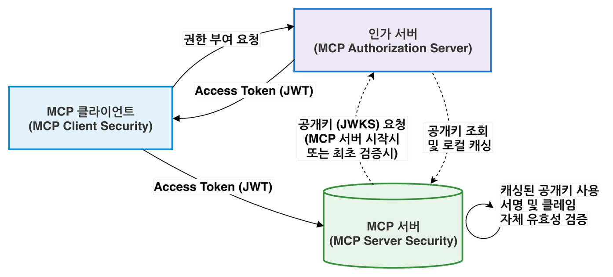
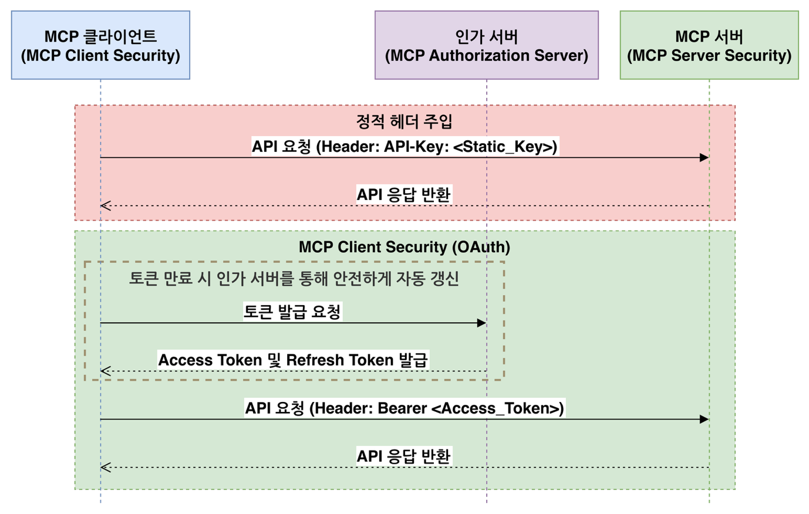
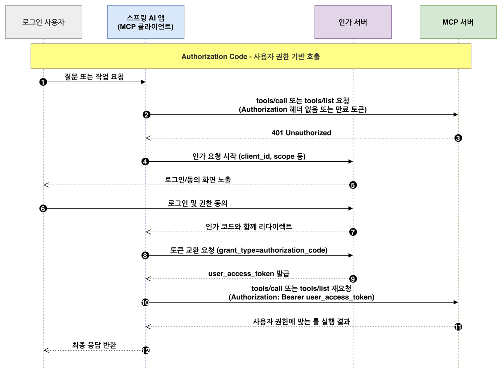
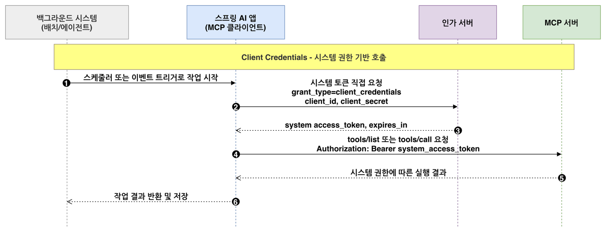
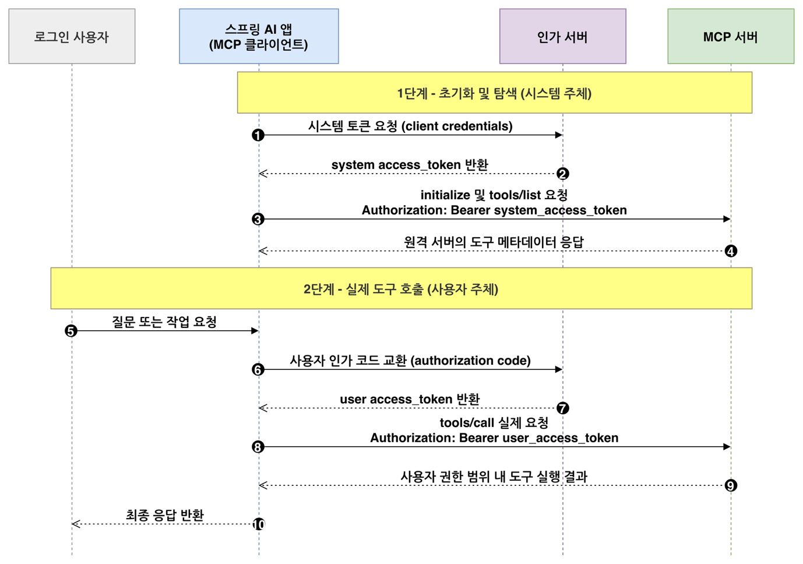
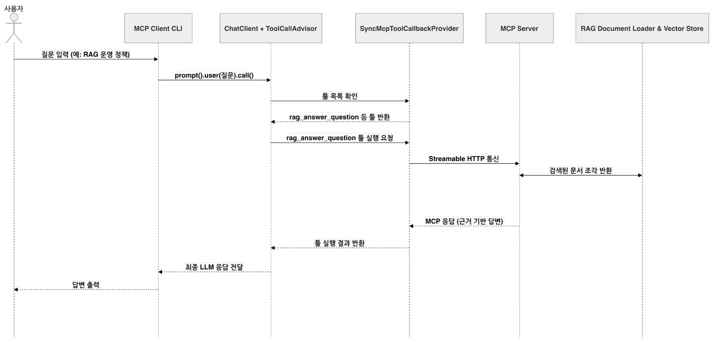

# MCP Security: Protecting MCP Clients and Servers with OAuth2 and JWT

<div class="post-meta" markdown>
<span class="tier-chip tx">Cross-cutting concerns</span> Book section 5.4, hands-on project 5.5 | Example [`chapter5`](https://github.com/JM-Lab/spring-ai-agent-book/tree/main/chapter5)
</div>

In the previous two articles, you connected to a remote server with an [MCP client](11-mcp-basics-and-spring-ai-mcp-client.md) and built your own [MCP server](12-building-an-mcp-server-with-spring-ai.md). Once you expose a server on the network, new questions come up: who sent the request, and does that caller have permission to run this tool?

Leaving tools such as payment approval or internal data lookup open without authentication leads straight to a security incident. On top of that, the tool to call is not picked by a person pressing a button. A model decides after receiving a natural language request. This article divides MCP security environments by who makes the call, then explains how to set up the client, the server, and the authorization server with the community project mcp-security.

## MCP security environments

The MCP authorization specification recommends an OAuth-based authorization process for HTTP-based transports. When a request needs authorization but has not yet presented it, the server responds with 401 Unauthorized, and the client takes this response as its cue to start authorization. The STDIO transport skips this process and gets credentials from the runtime environment instead.

If you look at the caller as well as the transport, you can divide MCP security environments into four types.

| Environment | Example | Caller | Security focus |
| --- | --- | --- | --- |
| Local app → local MCP server (STDIO) | Claude Code runs a file system server on your PC | Single user | Not subject to OAuth. Which server binaries to trust and run |
| Local app → remote MCP server | Claude Code connects to the GitHub MCP server | Single user | OAuth through which the remote server authenticates the user |
| Automated system → remote MCP server | Nightly batch jobs, CI/CD, long-running agents | System | M2M calls with no logged-in user |
| Enterprise service → remote MCP server | An internal AI chatbot calls the approval system's server | Acts on behalf of many users | On whose behalf the call is made, per-user authorization |

The last environment is especially tricky. If every request goes out under a single system account, the remote MCP server handles requests with broad system permissions without knowing the actual user. Prompt injection may also lead the model to try calling tools outside the user's permissions, against the user's intent. So from a zero trust perspective, the client does not trust the model, and the server does not trust the client. It is safer to carry the user's permissions all the way to the remote MCP server and have the server check the token's permissions in fine detail on every request.

That does not make system permissions unnecessary. When the application starts up, connects to the server, and fetches the tool list, no user has logged in yet. The core of enterprise MCP security is splitting the two: initialization, which the system is responsible for, runs with system permissions, and tool calls that a user requested run with that user's permissions.

## The structure of MCP Security in Spring AI

Just as Spring has long left security to a separate layer, Spring Security, Spring AI does not put MCP security into its core. The community project mcp-security, which the official reference documentation introduces, connects Spring Security's OAuth2 model to MCP communication, so you do not need to learn a new security system just for MCP. Its modules are split into three, following the roles in OAuth2.

| Module | Role | Underlying Spring Security feature |
| --- | --- | --- |
| `mcp-client-security` | Adds the right token to each request that calls a remote MCP server | OAuth2 Client |
| `mcp-server-security` | Validates JWTs or API keys in front of the MCP server | OAuth2 Resource Server |
| `mcp-authorization-server` | Issues tokens to MCP clients | Spring Authorization Server |

The Spring AI BOM does not manage these three modules, so you specify the version yourself, matching the Spring AI version you use (`0.1.13` in the book). Tokens can also be issued by an external identity provider (IdP) such as Okta or Keycloak instead of Spring Authorization Server.

<figure class="wide-figure" markdown>

<figcaption>JWT-based MCP Security structure of mcp-security</figcaption>
</figure>

When the MCP server starts up or first validates a token, it fetches the JSON Web Key Set (JWKS), the public keys for verifying JWT signatures, from the authorization server and caches it in memory. The client sends the JWT access token it received from the authorization server as a Bearer token. Instead of the opaque token approach, which asks the authorization server about the token on every request, the server verifies the signature and the main claims itself with the cached public keys and processes only the requests that are allowed.

## Client security configuration and implementation details

### OAuth instead of static headers

Putting a fixed token in the configuration file and sending it as a header is simple. But MCP communication is a flow: the client establishes a connection, goes through `initialize` and `tools/list`, and then moves on to `tools/call`. With a fixed header, it is hard to handle token expiration and reissuance, hard to carry the authentication context of a user request through to the MCP call, and hard to separate system permissions from user permissions. That is why the Spring AI community chose not to put fixed headers in the connection settings.

<figure class="wide-figure" markdown>

<figcaption>Static header injection compared with OAuth-based MCP client security</figcaption>
</figure>

As the lower part of the figure shows, client security obtains tokens through Spring Security's OAuth2 Client, adds them to each request, and gets a new one from the authorization server when a token expires. Fixed headers are fine for local testing or a quick connection check, but they fall short in production environments that keep exchanging requests with remote servers.

### Common configuration

`mcp-client-security` is for remote transports only, so it does not support STDIO. You can use it with both the HttpClient-based `spring-ai-starter-mcp-client` and the WebClient-based `spring-ai-starter-mcp-client-webflux`, but the only supported client is `McpSyncClient`. You choose the authorization flow by who makes the call: the authorization code flow when acting on behalf of a logged-in user, the client credentials flow for system-to-system calls with no user, and the hybrid flow when system calls at startup and later user calls both occur.

The Chapter 5 hands-on server is meant for local learning, so it is open without authentication, but the hands-on client configuration already contains two values that tie in with the security modules.

```yaml title="application.yml"
--8<-- "chapter5/src/main/resources/application.yml:10:24"
```
<span class="code-link">[View full code](https://github.com/JM-Lab/spring-ai-agent-book/blob/main/chapter5/src/main/resources/application.yml)</span>

`spring.ai.mcp.client.type` must be `SYNC`. `spring.ai.mcp.client.initialized` defaults to `true`, in which case the application calls `initialize` and `tools/list` first as it starts up. Because these calls go out before any user has logged in, this property is also a security setting that decides with which permissions startup MCP calls are sent. For the authorization code flow, it is safer to turn it off by setting it to `false`. The client credentials and hybrid flows handle initialization with system permissions, so they leave it at `true`.

On top of this, you add Spring Security's `spring.security.oauth2.client` settings: the `issuer-uri` in the authorization server details (`provider`) and the client registration details for each flow (`registration`). In the book's example, `authserver`, for user permissions, uses `authorization_code`, and `authserver-client-credentials`, for system permissions, uses `client_credentials`. Spring Security looks up the settings in `ClientRegistrationRepository` by this registration ID, so you also pass this ID when you create the implementations later. In code, you enable `oauth2Client()` on the `SecurityFilterChain` and register the `McpClientCustomizer` that every flow needs.

```java title="McpClientSecurityConfiguration.java (excerpt from the book)"
@Bean
McpClientCustomizer<McpClient.SyncSpec> syncClientCustomizer() {
  return (name, syncSpec) ->
      syncSpec.transportContextProvider(
          // 현재 스레드/요청의 인증을 추출해 MCP 전송 계층으로 넘김
          new AuthenticationMcpTransportContextProvider()
      );
}
```

The controller or service layer knows the current user, but that information does not automatically carry over to the transport layer that builds the remote MCP request. Only when `AuthenticationMcpTransportContextProvider` passes along the current authentication can the implementation that picks the token attach the right token to the header. For streaming calls, Reactor does not guarantee which thread runs the work, so the authentication can get lost. You therefore put the authentication context directly into the Reactor context with `contextWrite(AuthenticationMcpTransportContextProvider.writeToReactorContext())`.

### Three authorization flows

The extension point for attaching tokens is `McpSyncHttpClientRequestCustomizer` for HttpClient-based clients and `ExchangeFilterFunction` for WebClient-based clients. Each flow has its own class that implements these, and you declare it as a bean, passing in the registration ID from earlier.

The **authorization code flow** is for calls made on behalf of a logged-in user.

<figure class="wide-figure" markdown>

<figcaption>Sequence of the authorization code flow</figcaption>
</figure>

When the server returns 401 for a request with a missing or expired token (steps 2-3), the client starts authorization, and the user goes through login and consent (steps 4-6). The client exchanges the authorization code it received through the redirect for a token (steps 7-9) and then sends the original request again. `client_id` and `client_secret` are only the app's credentials, while the issued token represents the logged-in user. So even within the same app, the token's permissions differ from user to user. An agent that should access only the mailbox of the person making the request fits this flow.

The **client credentials flow** is for system-to-system calls with no user.

<figure class="wide-figure" markdown>

<figcaption>Sequence of the client credentials flow</figcaption>
</figure>

When a scheduler or an event starts a job, the app immediately requests a system token with its own `client_id` and `client_secret`. There is no authorization code and no consent screen. This flow fits jobs that need no per-user access control, such as an agent that periodically refreshes a vector database with public documents from an internal wiki.

The **hybrid flow** connects the two flows in successive stages.

<figure class="wide-figure" markdown>

<figcaption>Sequence of the hybrid flow</figcaption>
</figure>

In stage 1, the app starts up, gets a system token through the client credentials flow, and sends `initialize` and `tools/list`. In stage 2, when a user's question calls for `tools/call`, the app gets a user token through the authorization code flow and makes the call. For HttpClient-based clients, you pass both the user and the system registration IDs to `OAuth2HybridSyncHttpRequestCustomizer`. Because this flow lets you call tools with user permissions without turning off the startup discovery that auto-configuration performs, the book recommends it for enterprise services.

## Server security configuration

`mcp-server-security` builds on Spring Security to protect an MCP server as an OAuth2 resource server or with API keys. It currently supports only WebMVC-based servers, and in the OAuth2 setup it validates only JWTs. The public keys for verifying JWT signatures are usually fetched by discovering the authorization server's metadata through `spring.security.oauth2.resourceserver.jwt.issuer-uri`. A configuration that protects the entire server looks like this.

```java title="McpServerSecurityConfig.java (excerpt from the book)"
@Bean
SecurityFilterChain securityFilterChain(HttpSecurity http) throws Exception {
  return http
      .authorizeHttpRequests(auth -> auth.anyRequest().authenticated())
      .with(
          McpServerOAuth2Configurer.mcpServerOAuth2(),
          mcpAuthorization -> {
            mcpAuthorization.authorizationServer(issuerUri);
            // mcpAuthorization.validateAudienceClaim(true);
            // mcpAuthorization.sessionBinding(Customizer.withDefaults());
          }
      )
      .build();
}
```

This is a familiar Spring Security configuration with one MCP-specific configurer, `McpServerOAuth2Configurer`, added. `issuerUri` holds the `issuer-uri` value from earlier. This configuration requires a valid JWT on every request, from initialization to tool calls. The commented-out options make validation stricter. `validateAudienceClaim(true)` checks the token's `aud` claim to confirm that the token was issued for this server. Some authorization servers do not include this claim, so the check is off by default. However, the MCP authorization specification requires servers to accept only tokens issued for them, so in production it is safer to turn this validation on and make sure the authorization server issues the correct `aud`. `sessionBinding` binds a stateful MCP session to the same user or credentials to prevent the session from being reused. With the hybrid flow, though, the identity can change from stage to stage, so it is better to leave it off.

If it is acceptable for initialization and tool listing to be public, you can also leave access to `/mcp` open and protect only tool execution. In that case, you turn on `@EnableMethodSecurity` and add scope or role checks to `@McpTool` or `@Tool` methods with `@PreAuthorize`. Inside a tool, you can get the current user from `SecurityContextHolder` and look up only that person's documents. For simple server-to-server integration on an isolated network, API key authentication is also an option.

## MCP authorization server configuration

If you move user authentication and token issuance out of the MCP server into a dedicated authorization server, you can manage operational policies such as client registration and token expiration in one place. `mcp-authorization-server` uses `McpAuthorizationServerConfigurer` to configure Spring Authorization Server to meet the MCP specification, and it supports Dynamic Client Registration and Resource Indicators as defined in the MCP authorization specification. In the configuration, you set the following for each client under `spring.security.oauth2.authorizationserver.client.<client-name>`: `registration.authorization-grant-types` (the authorization flows to allow), `registration.redirect-uris` (the callback addresses to return to after authentication), and `token.access-token-time-to-live` (how long an access token is valid, 5 minutes by default). The book's example also includes the callback addresses for the MCP Inspector and Claude Code.

The authorization server runs as a separate Spring Boot application. After it starts, you can open `/.well-known/oauth-authorization-server` to see metadata such as the issuer, the token endpoint, and `jwks_uri`. `grant_types_supported` in this response lists what the server as a whole supports, so `refresh_token` appears there too, even though it is not in the client registration. The flows a client can actually use are limited by its registration settings.

## Where this fits in the 4-tier architecture

In the 4-tier architecture, security does not belong to a single tier. It is a cross-cutting concern that spans every tier. The setup in this article applies to the MCP boundary that divides the Capability tier (T3) into local and remote parts. The client carries user or system permissions across the boundary in a token, and the remote MCP server validates that token itself before allowing tool execution. Chapter 6 starts with the next article. [4-Tier Architecture for AI Agent Systems](../part6/14-four-tier-architecture-for-ai-agent-systems.md) defines the overall structure made up of Channel, Orchestration, Capability, Foundation, and cross-cutting concerns.

## Hands-on project for this chapter

!!! example "5.5 MCP-Based AI Chatbot CLI Project"
    The project moves the RAG features from Chapter 3 into an MCP server and exposes them as tools, resources, prompts, and completions. The MCP client CLI in the same project receives the remote tools as `ToolCallback` objects and uses them in conversation. The [appendix article](../appendix/22-openai-evaluation-and-external-agents.md) covers how to connect the same server to external AI agents such as Claude Code or Codex. For the full run-through, follow the README (in Korean) in [`chapter5/`](https://github.com/JM-Lab/spring-ai-agent-book/tree/main/chapter5) of the example repository.

    ```bash
    cd chapter5
    # Terminal 1: RAG MCP server (port 8085, endpoint /mcp)
    ./mvnw spring-boot:run -Dspring-boot.run.arguments="--spring.profiles.active=server --spring.ai.cli.step=ch5-server-step4"
    # Terminal 2: MCP client CLI (ch5-final)
    ./mvnw spring-boot:run
    ```

<figure class="wide-figure" markdown>

<figcaption>Processing sequence of the MCP-based AI chatbot CLI</figcaption>
</figure>

## More in the book

!!! book "Book section 5.4"
    - MCP security environments: the security issues in each environment and the zero trust perspective
    - Common MCP client security configuration: configuration properties, and which implementations to combine for each transport layer and authorization flow
    - MCP client security implementation details: registering beans for each flow, creating clients programmatically, and injecting custom headers
    - MCP server security configuration: how to configure public keys, examples of per-tool permission checks, and API key-based security
    - MCP authorization server configuration: configuration properties, public clients and PKCE, and the code to run it and its metadata response

    [About the book](../book.md){ .md-button } [Buy the book (Korean)](https://wikibook.co.kr/springai-agents/){ .md-button .md-button--primary }

## References

- [MCP Authorization specification](https://modelcontextprotocol.io/specification/2025-11-25/basic/authorization): the MCP specification that defines the OAuth authorization process for HTTP transports
- [Zero Trust Architecture (NIST SP 800-207)](https://doi.org/10.6028/NIST.SP.800-207): NIST's document on zero trust architecture
- [spring-ai-community/mcp-security](https://github.com/spring-ai-community/mcp-security): the repository of security modules for MCP clients, servers, and authorization servers
