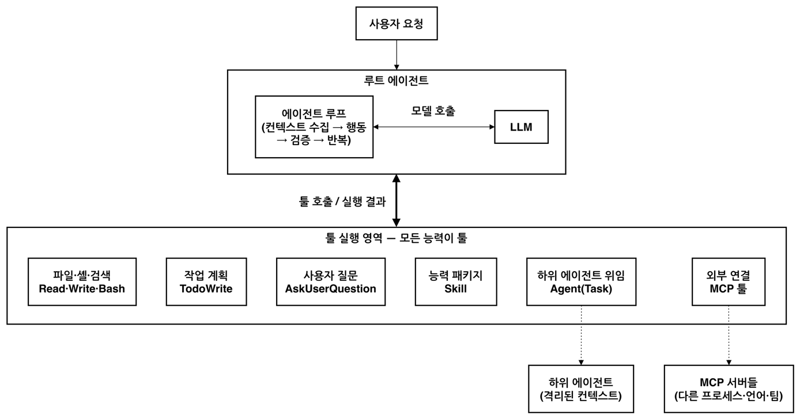
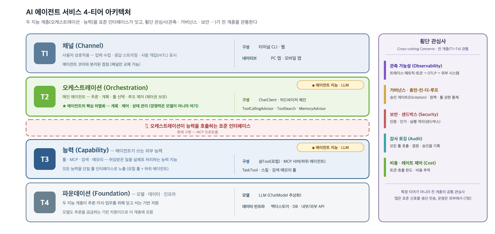
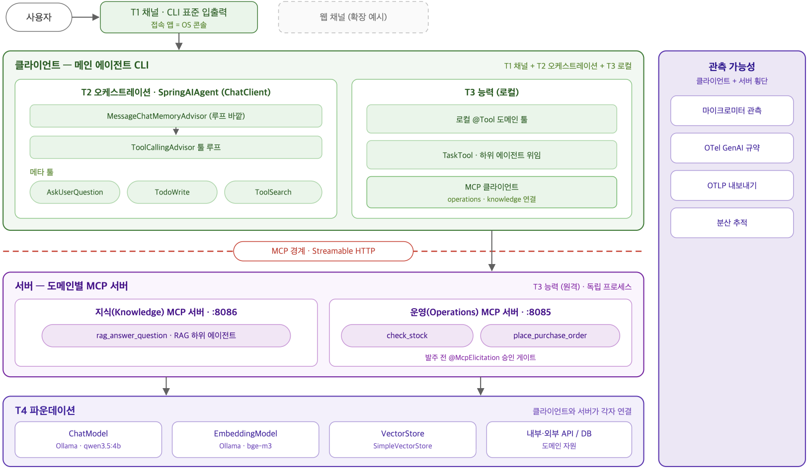

# AI 에이전트 서비스 4-티어 아키텍처

<div class="post-meta" markdown>
<span class="tier-chip all">4-티어 전체</span> 책 6.4.1~6.4.2, 6.6.1~6.6.2절 | 예제 [`chapter6`](https://github.com/JM-Lab/spring-ai-agent-book/tree/main/chapter6)
</div>

2장의 `ChatClient`와 어드바이저 체인, 3장의 RAG, 4장의 툴 호출, 5장의 MCP까지 익혔다면 AI 에이전트를 만들 부품은 거의 갖춘 셈입니다. 남은 일은 조립입니다. 여러 팀이 역할을 나눠 오래 운영할 시스템이라면, 코드를 쓰기 전에 어떤 계층으로 구성할지부터 정해 두는 편이 좋습니다.

이 글은 주요 AI 에이전트 서비스의 공통 구조에서 출발해, 책이 제안하는 4-티어 아키텍처와 이를 클라이언트와 서버로 배치한 설계, 그리고 6장 예제의 코드 구조까지 봅니다. 이 사이트의 모든 글은 자기 기술이 4-티어의 어디에 속하는지 밝히는데, 그 기준이 되는 지도가 바로 이 글입니다.

## 주요 AI 에이전트 서비스의 공통 구조

책은 상용 서비스인 클로드 코드와 코덱스, 오픈소스인 오픈코드와 오픈클로를 세 관점으로 분석합니다. 루프가 어디서 도는지, 능력을 무엇으로 연결하는지, 바깥으로 어떻게 확장하는지입니다.

- **클로드 코드**: 파일 편집과 셸 실행은 물론 작업 계획(TodoWrite), 사용자 질문(AskUserQuestion), 스킬, 하위 에이전트 위임(Task)까지 모두 툴입니다.
- **코덱스**: CLI, IDE 확장, 웹 버전이 같은 에이전트 루프 구현을 공유하고, 기본 툴 밖의 기능은 MCP로 연결합니다.
- **오픈코드**: 75개가 넘는 LLM 제공자를 지원하는 오픈소스 코딩 에이전트로, 툴 구성이 클로드 코드와 거의 겹칩니다.
- **오픈클로**: 메신저로 일을 맡기는 개인 AI 비서인데, 코딩 에이전트 Pi의 런타임을 내장해 같은 루프와 툴 구조로 동작합니다.

도메인도 공개 형태도 다르지만 공통된 뼈대는 세 가지입니다. 리액트(ReAct) 방식의 단일 에이전트 루프, 모든 행동이 지나는 단일 툴 인터페이스, 외부 확장을 맡는 MCP입니다.

<figure class="wide-figure" markdown>

<figcaption>주요 AI 에이전트 시스템의 공통 아키텍처 - 단일 루프와 툴 실행 영역</figcaption>
</figure>

책은 이 구조가 제품마다 되풀이되는 이유를 개방-폐쇄 원칙에서 찾습니다. 루프 코드는 닫아 두고 툴 목록만 열어 두니, 새 능력이 필요하면 루프를 건드리지 않고 툴 하나만 더하면 됩니다. 모든 행동이 한 관문을 지나므로 권한 통제나 사용자 승인 같은 운영 관심사도 그 자리에서 처리할 수 있습니다. 코덱스의 승인 모드와 샌드박스가 그 예입니다.

이 구조를 스프링 AI로 옮기면 `@Tool`과 `ToolCallback`이 툴 인터페이스를, MCP가 외부 확장을, `ToolCallingAdvisor`가 툴 루프 제어를 맡습니다. 계획, 질문, 스킬, 위임 같은 에이전트 전용 툴은 스프링 AI 커뮤니티가 지원합니다. 구현은 [스프링 AI 에이전트 아키텍처와 구현](../part6/17-spring-ai-agent-architecture-and-dynamic-tool-discovery.md) 글에서 자세히 다룹니다.

<figure class="wide-figure tall" markdown>

<figcaption>스프링 AI 에이전트 아키텍처</figcaption>
</figure>

## 멀티 에이전트와 에이전트 연결 표준

시스템이 커져 툴이 수십 개로 늘고 성격이 다른 업무의 컨텍스트가 한 대화에 섞이면, 모델이 툴을 잘못 고르거나 답의 품질이 떨어지기 쉽습니다. 이때 역할을 나눈 멀티 에이전트 구조가 필요합니다. 주요 제품과 프레임워크는 이를 새 인프라로 만들지 않고, 한 에이전트가 다른 에이전트를 툴로 부르는 에이전트-툴(agent as a tool) 패턴으로 구현합니다. 오픈AI Agents SDK의 `agent.as_tool()`, 구글 ADK의 `AgentTool`, 스프링 AI 커뮤니티의 `TaskTool`이 그 예입니다. 호출한 쪽이 제어권을 유지하고, 하위 에이전트는 격리된 컨텍스트에서 일한 뒤 결과 요약만 돌려줍니다. 툴 실행 영역에 LLM을 품은 툴이 하나 늘어난 것이니 단일 에이전트 구조의 연장으로 볼 수 있습니다.

툴 호출이 프로세스와 팀의 경계를 넘으면 통신 표준이 필요합니다. 대표적인 후보는 MCP와 A2A(Agent2Agent)입니다. MCP는 앤트로픽이 공개한 뒤 오픈AI, 구글, 마이크로소프트가 차례로 채택했고, 2025년 12월 리눅스 재단 산하 에이전틱 AI 재단으로 넘어갔습니다. 툴 실행 중에 사용자 확인을 받는 Elicitation도 표준에 들어 있습니다. A2A는 구글이 제안한 에이전트 간 협업 전용 프로토콜로, 2026년 3월에 1.0이 나왔지만 스프링 AI 통합은 아직 커뮤니티 인큐베이팅 단계입니다. 그래서 책은 스프링 AI 코어가 공식 지원하는 MCP로 에이전트를 툴처럼 연결하는 방식을 택합니다.

## 4-티어 아키텍처

책은 에이전트 시스템을 계층으로 나눈 기존 레퍼런스를 참고합니다. 언어 에이전트의 인지 아키텍처인 CoALA는 메모리, 행동 공간, 의사결정 절차라는 모듈로 에이전트를 구조화합니다. 베인앤컴퍼니는 오케스트레이션, 관측 가능성, 데이터 접근(거버넌스)을 에이전틱 AI 플랫폼의 핵심 계층으로 꼽았고, 마이크로소프트는 오케스트레이션, 에이전트, 툴, 관측 계층으로 나눈 멀티 에이전트 레퍼런스 아키텍처를 공개했습니다. 4-티어 아키텍처는 이들에 되풀이해 나타나는 계층 분리를 바탕으로, 계층마다 스프링 AI 컴포넌트가 1:1로 대응하도록 구체화한 모델입니다. 책에서는 AI 에이전트 시스템을 다음 그림처럼 네 계층과 횡단 관심사로 나누어 설계합니다.

<figure class="wide-figure" markdown>

<figcaption>AI 에이전트 서비스 4-티어 아키텍처</figcaption>
</figure>

중심에는 두 지능 계층이 있습니다. 일을 지휘하는 오케스트레이션(T2)과 맡은 일을 처리하는 능력(T3)이 표준 인터페이스를 사이에 두고 마주 봅니다.

### T1 채널

사용자와 에이전트의 접점입니다. 입력을 받고 응답을 스트리밍하며, 승인이나 명확화 질문 같은 사람의 개입을 처리합니다. 책의 프로젝트에서는 터미널 CLI가 이 자리를 맡습니다. 채널이 에이전트 코어와 분리돼 있으므로 코어는 그대로 두고 채널만 웹이나 모바일 앱으로 바꿀 수 있습니다.

### T2 오케스트레이션

무엇을 언제 어떤 순서로 할지 결정하는 지휘 계층입니다. 결정을 내리는 주체는 개발자가 짠 결정론적 코드가 아니라 LLM의 추론 루프입니다. 이 루프가 목표를 나누고, 부를 능력을 고르고, 결과를 종합하며 끝까지 제어권을 갖습니다. 책은 모델 성능이 빠르게 상향 평준화되는 만큼, 계획과 제어, 상태 관리를 설계하는 이 계층에서 제품의 경쟁력이 결정된다고 봅니다.

스프링 AI 구현의 중심은 `ChatClient`와 어드바이저 체인입니다. 툴 루프를 돌리는 `ToolCallingAdvisor`, 필요한 툴을 찾아 붙이는 `ToolSearchToolCallingAdvisor`, 대화를 기억하는 `MessageChatMemoryAdvisor`가 핵심입니다. 작업 계획(TodoWrite), 명확화 질문(AskUserQuestion) 같은 메타 툴도 책에서는 이 계층에 둡니다.

### 두 지능 계층을 잇는 표준 인터페이스

T2와 T3는 능력 호출 표준 인터페이스에서 만납니다. 무엇을 주고받을지 정한 명세와 이를 실어 나르는 프로토콜을 구분해 두면, 지금 쓰는 MCP를 나중에 다른 프로토콜로 바꾸더라도 두 지능 계층의 코드는 그대로 둘 수 있습니다.

### T3 능력

T2가 맡긴 일을 실제로 처리하는 계층입니다. 여기서 능력은 에이전트가 쓰는 툴의 묶음을 말합니다. 로컬 `@Tool` 메서드, MCP 서버의 기능, `TaskTool` 하위 에이전트, 검색과 메모리가 모두 단일 툴 인터페이스로 제공됩니다. 능력 안에 또 다른 에이전트가 들어갈 수 있으므로 T3도 스스로 추론할 수 있습니다. 능력이 표준 인터페이스 뒤에 캡슐화돼 있으니 새 툴이나 MCP 서버를 더해도 T2는 고칠 필요가 없습니다.

### T4 파운데이션

T2와 T3가 사용하는 기반 자원입니다. 모델(`ChatModel`)과, 지식과 업무 데이터를 담는 벡터 데이터베이스, 관계형 DB, 내부와 외부 API가 여기에 속합니다. 모델을 지능 계층이 아닌 이곳에 두는 것은 모델도 추론을 공급하는 기반 자원이기 때문입니다.

### 전 계층을 관통하는 횡단 관심사

횡단 관심사는 특정 티어에 속하지 않고 채널의 요청부터 모델 호출까지 모든 계층에 걸쳐 작동합니다.

- **관측 가능성**: 트레이스와 메트릭, 토큰 사용량을 표준 텔레메트리로 모아 외부로 보냅니다.
- **거버넌스와 사용자 개입**: 툴 권한과 정책을 적용하고, 위험한 작업은 승인 게이트(`@McpElicitation`)를 거치게 합니다.
- **보안과 샌드박스**: 인증과 인가를 처리하고 툴 실행 환경을 격리합니다.
- **감사 로깅**: 툴 호출, 에이전트의 결정, 사용자 승인을 기록합니다.
- **비용과 레이트 제어**: 토큰과 API 호출에 한도를 두고 비용을 추적합니다.

네 티어는 논리적인 구분입니다. 실제 배포에서는 채널과 오케스트레이션이 CLI 프로세스 하나에 함께 들어가기도 하므로, 물리적인 배치는 따로 설계합니다.

## 클라이언트와 서버로 배치하기

책의 마지막 프로젝트는 사용자가 설치한 CLI가 메인 에이전트가 되어, 회사 곳곳의 업무 능력을 MCP 서버로 불러 쓰는 멀티 에이전트 시스템입니다. 클라이언트는 루프를 돌리며 무엇을 부를지 판단하는 머리이고, 서버는 팀별로 운영하며 여러 곳에서 함께 쓰는 업무 능력을 제공하는 손발입니다.

### 툴 경계가 곧 시스템 경계

로컬 메서드도, 같은 JVM의 하위 에이전트도, MCP로 연결한 원격 서버도 메인 에이전트에게는 똑같은 툴입니다. 그래서 T3의 어디에 선을 긋느냐가 클라이언트와 서버를 나눕니다. 같은 프로세스에서 바로 실행할 능력은 클라이언트의 로컬 툴로 두고, 따로 운영할 능력은 MCP 서버로 떼어 냅니다.

이렇게 그은 선은 코드 밖의 경계와도 겹칩니다. 클라이언트와 서버는 다른 프로세스로 뜨고, 서버마다 담당 팀과 구현 언어가 달라도 되며, 부하가 몰리는 서버만 따로 늘릴 수 있습니다. 경계를 넘는 호출마다 추적 구간이 생기니 여러 프로세스에 걸친 실행도 따라가기 좋습니다. 새 부서의 능력이 필요하면 메인 에이전트는 그대로 두고 MCP 서버를 배포한 뒤 연결 정보만 더하면 됩니다. 에이전트 코어는 닫고 능력은 MCP로 여는 셈입니다.

<figure class="wide-figure" markdown>

<figcaption>4-티어를 클라이언트와 서버로 배치한 스프링 AI 에이전트 CLI 시스템 설계</figcaption>
</figure>

그림에서 MCP 경계는 T3를 가로지릅니다. T1, T2, 로컬 T3는 CLI 프로세스 하나에 들어가고, 원격 T3는 도메인별 MCP 서버로 나뉩니다. 예제에서는 두 서버가 원격 능력을 맡습니다. 지식 서버(8086)는 RAG 하위 에이전트를 `rag_answer_question` 툴로 제공하고, 운영 서버(8085)는 재고 조회(`check_stock`)와 발주(`place_purchase_order`) 툴을 제공하며, 발주 전에는 `@McpElicitation` 승인 게이트를 거칩니다. T4 자원에는 클라이언트와 서버가 각자 연결하고, 관측 가능성은 양쪽에 걸쳐 있습니다.

하위 에이전트도 위치에 따라 분리 수준이 다릅니다. 클라이언트의 `TaskTool`로 위임한 하위 에이전트는 같은 프로세스 안에서 컨텍스트만 격리하고, 지식 서버의 하위 에이전트는 별도 프로세스에서 돌기 때문에 배포와 확장도 따로 합니다. 어느 쪽이든 제어권은 메인 에이전트에 있습니다.

## 코드로 보는 4-티어

6장 예제는 패키지가 곧 계층입니다. `channel`은 T1, `orchestration`은 T2, `capability`는 T3에 대응합니다. T3는 다시 툴 경계 원칙에 따라 같은 프로세스의 `local`과 MCP 서버로 분리한 `remote`로 나뉩니다. `resources`에는 T4 자원에 연결하는 설정과 RAG 문서가 모입니다.

```text
chapter6/src/main/
├── java/kr/jmlab/spring/ai/agent/book/chapter6/
│   ├── Chapter6Application.java    # 프로파일로 클라이언트와 두 서버를 나눠 실행
│   ├── channel/                    # T1 채널: 단계별 CLI 러너
│   │   ├── Ch6Step1_SpringAIAgent.java ~ Ch6Step6_Orchestration.java
│   │   ├── Ch6EnhancedSpringAIAgentCli.java  # 최종 통합 CLI
│   │   └── ConsoleElicitationHandler.java    # 콘솔 승인 핸들러
│   ├── orchestration/              # T2 오케스트레이션
│   │   ├── SpringAIAgent.java      # 메인 에이전트
│   │   ├── AgentConfig.java        # 코어, 강화 에이전트 빈 구성
│   │   ├── AgentSafety.java        # 루프 안전 가드
│   │   ├── OrchestrationToolCallingAdvisor.java
│   │   └── ThinkTraceAdvisor.java, ToolCallTraceAdvisor.java,
│   │       ToolLoopMetricsAdvisor.java
│   └── capability/                 # T3 능력
│       ├── ToolNames.java
│       ├── local/                  # 같은 프로세스에서 실행하는 로컬 능력
│       │   ├── DateTimeTools.java, CalculatorTools.java,
│       │   │   InventoryTools.java
│       │   └── ChainWorkflow.java
│       └── remote/                 # MCP 서버로 분리한 원격 능력
│           ├── Ch6OpsMcpServer.java, OperationsMcpTools.java
│           └── Ch6KnowledgeMcpServer.java, KnowledgeMcpTools.java,
│               KnowledgeServerConfig.java, KnowledgeBase.java,
│               RagDocumentLoader.java, RagAnswerService.java
└── resources/                      # 설정과 데이터
    ├── application.yml             # 클라이언트(메인 에이전트)
    ├── application-ops.yml         # 운영 MCP 서버(8085)
    ├── application-knowledge.yml   # 지식 MCP 서버(8086)
    ├── agents/report-writer.md     # 선언형 하위 에이전트 정의
    ├── skills/restock-policy/SKILL.md
    └── data/                       # 지식 서버가 읽는 RAG 문서
```

클라이언트와 두 서버는 한 모듈에 있지만 프로파일별로 다른 프로세스로 뜨므로, 저장소는 같아도 배포 단위는 나뉩니다.

```java title="SpringAIAgent.java"
--8<-- "chapter6/src/main/java/kr/jmlab/spring/ai/agent/book/chapter6/orchestration/SpringAIAgent.java:19:52"
```
<span class="code-link">[전체 코드 보기](https://github.com/JM-Lab/spring-ai-agent-book/blob/main/chapter6/src/main/java/kr/jmlab/spring/ai/agent/book/chapter6/orchestration/SpringAIAgent.java)</span>

메인 에이전트 클래스는 `SpringAIAgent` 하나입니다. 생성자에서 시스템 프롬프트, 툴, 어드바이저로 `ChatClient`를 만들고, `run()`은 요청마다 새 툴 루프 어드바이저를 끼워 응답을 스트리밍합니다. 툴을 `List<ToolCallback>`으로 받기 때문에 로컬 툴이든 MCP 서버의 툴이든 T2에게는 같은 타입입니다. 코어 에이전트와 강화 에이전트도 같은 클래스에 프롬프트, 툴, 루프 어드바이저를 달리 넣어 만든 두 빈입니다.

```java title="AgentConfig.java"
--8<-- "chapter6/src/main/java/kr/jmlab/spring/ai/agent/book/chapter6/orchestration/AgentConfig.java:93:98"
```
<span class="code-link">[전체 코드 보기](https://github.com/JM-Lab/spring-ai-agent-book/blob/main/chapter6/src/main/java/kr/jmlab/spring/ai/agent/book/chapter6/orchestration/AgentConfig.java)</span>

`AgentConfig`의 코어 에이전트 빈은 로컬 `@Tool` 묶음에 MCP 서버의 툴 콜백을 이어 붙여 `SpringAIAgent`에 넘깁니다. 클라이언트와 서버의 경계가 이 코드에서는 리스트 합치기로만 드러납니다.

```yaml title="application.yml"
--8<-- "chapter6/src/main/resources/application.yml:38:47"
```
<span class="code-link">[전체 코드 보기](https://github.com/JM-Lab/spring-ai-agent-book/blob/main/chapter6/src/main/resources/application.yml)</span>

원격 서버는 `streamable-http.connections` 아래에 이름과 주소를 적어 연결하고, `toolcallback.enabled`로 그 서버의 툴을 메인 에이전트에 노출합니다. 파일에서 이 부분 바로 아래에는 지식 서버(8086) 연결이 주석으로 들어 있어, 주석만 풀면 자바 코드를 고치지 않고 서버 하나가 더 붙습니다.

## 4-티어 아키텍처에서의 위치

이 글은 한 계층이 아니라 4-티어 전체의 지도입니다. T4의 모델과 벡터 데이터베이스는 2~3장, T3의 툴과 MCP는 4~5장에서 이미 다뤘고, 6장의 나머지 글은 이 지도 위에서 에이전트를 완성해 갑니다.

- [에이전트 실행 루프와 컨텍스트 엔지니어링](../part6/15-agent-loop-and-context-engineering.md): T2의 루프와 컨텍스트
- [재귀적 어드바이저와 툴 루프 제어](../part6/16-recursive-advisor-and-tool-loop-control.md): T2의 툴 루프 제어
- [스프링 AI 에이전트 아키텍처와 구현](../part6/17-spring-ai-agent-architecture-and-dynamic-tool-discovery.md): T2와 T3를 잇는 에이전트 구현과 동적 툴 탐색
- [사용자 개입(HITL) 승인 게이트](../part6/18-human-in-the-loop-approval-gate-with-mcp-elicitation.md): 횡단 관심사의 거버넌스
- [에이전트 스킬](../part6/19-agent-skills-extending-capabilities.md): T3 능력 확장
- [엔터프라이즈 스프링 AI 에이전트 CLI](../part6/20-enterprise-spring-ai-agent-cli-multi-agent-and-meta-tools.md): 전 계층을 코드로 조립
- [AI 에이전트 관측 가능성](../part6/21-observability-for-ai-agents-micrometer-otel-otlp.md): 횡단 관심사의 관측

다음 글 [에이전트 실행 루프와 컨텍스트 엔지니어링](../part6/15-agent-loop-and-context-engineering.md)에서는 T2의 바탕인 에이전트 실행 루프부터 봅니다.

## 책에서 더 다루는 내용

!!! book "책 6.4.1~6.4.2, 6.6.1~6.6.2절"
    - 네 제품의 루프 정의와 확장 방식 비교
    - 프레임워크별 에이전트 툴 패턴과 핸드오프 방식
    - MCP와 A2A의 표준화 현황 비교
    - 4-티어의 물리 배치와 스프링 AI 구성 요소 대응표
    - 하위 에이전트 격리 방식과 웹 채널 확장
    - 표준 텔레메트리와 단계별 구현 로드맵

    [책 소개](../book.md){ .md-button } [온라인 구매](https://wikibook.co.kr/springai-agents/){ .md-button .md-button--primary }

## 참고 자료

- [Building agents with the Claude Agent SDK](https://claude.com/blog/building-agents-with-the-claude-agent-sdk): 앤트로픽의 에이전트 루프 설명
- [Unrolling the Codex agent loop](https://openai.com/index/unrolling-the-codex-agent-loop/): 코덱스의 에이전트 루프 해설
- [OpenCode Docs](https://opencode.ai/docs): 오픈코드 공식 문서
- [OpenClaw Docs](https://docs.openclaw.ai): 오픈클로 공식 문서
- [OpenAI Agents SDK: Agents as tools](https://openai.github.io/openai-agents-python/tools/): 에이전트를 툴로 부르는 패턴
- [Google ADK: Agent-as-a-Tool](https://google.github.io/adk-docs/tools-custom/function-tools/#agent-tool): ADK의 에이전트 툴
- [CoALA (arXiv:2309.02427)](https://arxiv.org/abs/2309.02427): 언어 에이전트 인지 아키텍처 논문
- [Multi-agent Reference Architecture](https://microsoft.github.io/multi-agent-reference-architecture/): 마이크로소프트의 레퍼런스 아키텍처
