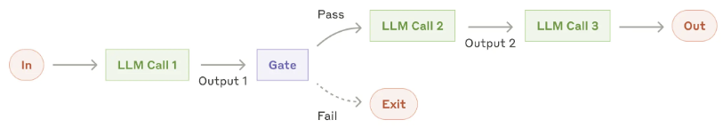
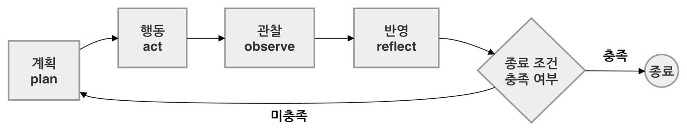
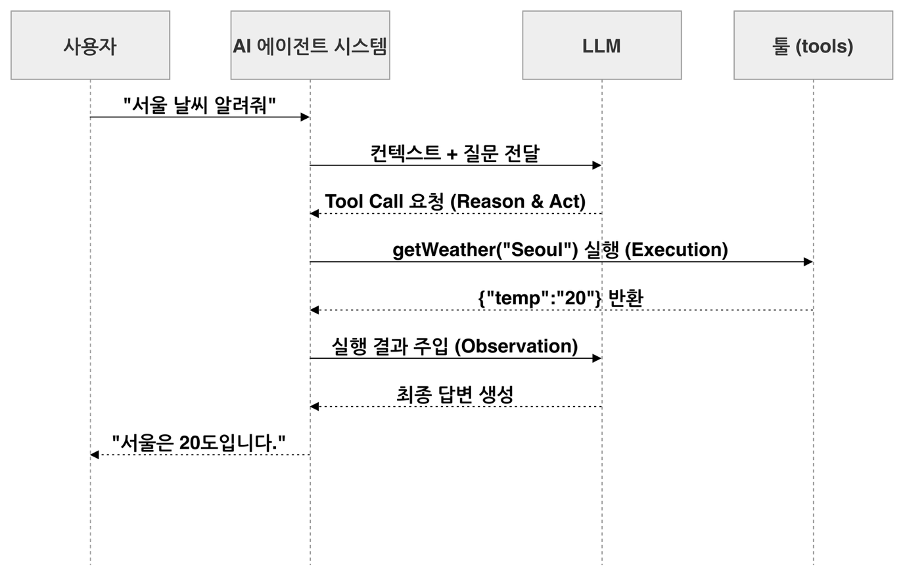
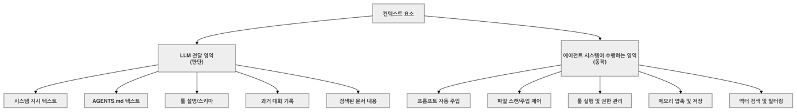

# 에이전트 실행 루프와 컨텍스트 엔지니어링

<div class="post-meta" markdown>
<span class="tier-chip t2">T2 오케스트레이션</span> 책 6.1~6.2절 | 예제 [`chapter6`](https://github.com/JM-Lab/spring-ai-agent-book/tree/main/chapter6)
</div>

AI 에이전트는 모델을 한 번 호출하고 끝나지 않습니다. 모델이 상황을 보고 다음 행동을 정하고, 툴로 실행하고, 결과를 읽은 뒤 다시 판단합니다. 이 반복이 에이전트 루프이고, 설계의 핵심 질문도 여기서 나옵니다. 루프는 언제 멈추는가, 매 반복에서 모델에게 무엇을 보여 줄 것인가.

[앞 글](../part6/14-four-tier-architecture-for-ai-agent-systems.md)의 4-티어 아키텍처에서 이 질문에 답하는 계층이 T2 오케스트레이션입니다. 이 글은 워크플로와 자율 에이전트를 구분하고, 루프의 네 단계가 스프링 AI의 어떤 부품과 맞물리는지 본 뒤, 루프에 넣을 정보를 설계하는 컨텍스트 엔지니어링과 리액트로 넘어갑니다.

## 워크플로와 자율 에이전트

앤트로픽은 2024년 12월에 공개한 'Building Effective Agents'에서 에이전틱 시스템을 자율성의 정도에 따라 둘로 나눕니다.

- **워크플로**: 개발자가 코드로 정한 경로를 따라 LLM과 툴이 움직입니다.
- **자율 에이전트**: 어떤 툴을 어떤 순서로 쓰고 언제 끝낼지 LLM이 정합니다.

LLM은 확률적으로 동작하지만 워크플로는 실행 경로가 코드에 고정돼 있어 흐름을 예측하고 디버깅하기 쉽습니다. 자율 에이전트는 제어권이 모델에 있어 같은 질문에도 고르는 툴과 순서가 달라질 수 있고, 루프를 끝낼 시점도 모델이 판단합니다. 책의 예제로 보면 늘 같은 순서로 검색하고 답하는 3장의 RAG CLI는 워크플로에 가깝습니다. 4장과 5장의 CLI도 툴 실행과 모델 재호출을 되풀이하지만 한 요청에 답하는 데서 멈춥니다. 6장은 이 루프를 중심에 두고 계획, 스킬, 위임, 승인, 관측을 더해 에이전트 시스템으로 넓힙니다.

절차로 풀기 어려운 개방형 요청이나 툴 호출 횟수를 미리 알 수 없는 일은 자율 에이전트에 맞습니다. 절차와 결과가 분명하거나, 지연 시간과 비용을 예측해야 하거나, 비결정성이 부담스러운 도메인이라면 워크플로로 충분합니다. 실제 시스템은 워크플로의 한 단계 안에 자율 에이전트를 두는 식으로 둘을 함께 씁니다.

## 워크플로 패턴 다섯 가지

앤트로픽이 소개한 워크플로 패턴은 다섯 가지이며, 스프링 AI로 구현한 전체 예제는 Agentic Patterns 저장소에 있습니다.

| 패턴 | 동작 방식 | 어울리는 작업 |
| --- | --- | --- |
| 프롬프트 체이닝 | 작업을 단계로 쪼개 앞 단계 출력을 다음 단계 입력으로 넘깁니다. 단계 사이에 검증 게이트를 둘 수 있습니다. | 마케팅 문구 작성 후 번역 |
| 라우팅 | 입력을 분류해 유형에 맞는 프롬프트, 툴, 모델로 보냅니다. | 문의 유형별 분배 |
| 병렬화 | 여러 LLM 호출을 동시에 돌려 결과를 코드로 모읍니다. 작업을 나누는 분할과 같은 작업을 여러 번 돌리는 투표가 있습니다. | 여러 보안 관점의 동시 코드 검토 |
| 오케스트레이터-워커 | 오케스트레이터 LLM이 하위 작업을 그때그때 나눠 워커 LLM에 맡기고 결과를 합칩니다. | 여러 파일을 고치는 코딩, 심층 검색 |
| 평가자-최적화 | 생성 LLM이 평가 LLM의 피드백을 받아 기준을 통과할 때까지 결과를 고칩니다. | 뉘앙스가 중요한 번역 |

병렬화는 하위 작업을 개발자가 코드에 고정하고, 오케스트레이터-워커는 LLM이 요청을 보고 정한다는 점이 다릅니다.

<figure class="wide-figure" markdown>

<figcaption>프롬프트 체이닝 워크플로 (출처: <a href="https://docs.spring.io/spring-ai/reference/api/effective-agents.html">Building Effective Agents</a>)</figcaption>
</figure>

예제 저장소에는 이 가운데 프롬프트 체이닝이 들어 있습니다.

```java title="ChainWorkflow.java"
--8<-- "chapter6/src/main/java/kr/jmlab/spring/ai/agent/book/chapter6/capability/local/ChainWorkflow.java:11:33"
```
<span class="code-link">[전체 코드 보기](https://github.com/JM-Lab/spring-ai-agent-book/blob/main/chapter6/src/main/java/kr/jmlab/spring/ai/agent/book/chapter6/capability/local/ChainWorkflow.java)</span>

시스템 프롬프트 배열을 for 문으로 돌며 각 단계의 응답을 다음 입력에 끼워 넣습니다. 단계의 수와 순서는 배열과 반복문이 정하고, 모델은 단계마다 글만 만들 뿐 다음 할 일을 고르지 않습니다. 이것이 워크플로의 결정론적 제어 흐름입니다.

## 자율 에이전트의 실행 루프

형태는 달라도 자율 에이전트는 네 단계를 반복합니다.

<figure class="wide-figure" markdown>

<figcaption>자율 에이전트의 동작 원리</figcaption>
</figure>

- **계획(plan)**: 요청과 메모리 같은 현재 컨텍스트를 보고 툴 호출, 추가 질문, 최종 답 중 다음 행동을 고릅니다.
- **행동(act)**: 툴을 호출하거나 메시지를 만듭니다. 다른 에이전트를 부르기도 합니다.
- **관찰(observe)**: 툴 실행 결과처럼 환경이 돌려준 응답을 모읍니다.
- **반영(reflect)**: 결과를 컨텍스트에 더하고 종료 조건을 확인해, 만족하면 멈추고 아니면 계획으로 돌아갑니다.

네 단계 중 모델이 맡는 단계가 많을수록 자율성이 높아지며, 실무 시스템은 대개 사람이 매번 지시하는 챗봇과 완전한 자율 에이전트 사이에 있습니다.

가장 쉽게 빠뜨리는 단계는 반영입니다. 툴 결과를 받는 대로 쌓으면 컨텍스트가 금방 불어나 모델이 중요한 정보를 가려내지 못합니다. 핵심만 남겨 압축하거나 필요한 정보를 뽑아 별도 메모리에 두는 처리가 필요합니다.

자율 에이전트의 기본은 모델의 추측이 아니라 환경이 돌려준 실제 결과를 근거로 툴을 거듭 쓰는 것입니다. 그래서 툴의 설명과 파라미터를 명확히 쓰는 일이 신뢰성의 출발점이 됩니다. 루프를 빠져나가는 길은 두 가지입니다. 작업이 끝나거나 최대 반복 횟수에 닿아 멈추는 길은 안전 가드로, 스스로 판단하기 어려운 지점에서 사람에게 묻는 길은 [사용자 개입(HITL)](../part6/18-human-in-the-loop-approval-gate-with-mcp-elicitation.md)으로 이어집니다.

## 스프링 AI로 조립하는 실행 루프

스프링 AI에는 루프의 각 단계를 맡을 구성 요소가 이미 있어서, 앞 장에서 익힌 부품을 루프 관점으로 다시 배치하면 됩니다.

| 단계 | 하는 일 | 스프링 AI 구성 요소 |
| --- | --- | --- |
| 계획 | 다음 행동 결정 | `ChatModel` |
| 행동 | 툴 실행 | `ToolCallback`, `@Tool`, `ToolCallingManager`, MCP 클라이언트 |
| 관찰 | 현재 컨텍스트 조립 | `ChatClient`, `Advisor`, `ChatMemory`, `VectorStore` |
| 반영 | 결과 가공과 종료 판단 | `Advisor`, `ToolCallingManager` |

`ToolCallingManager`로 루프를 직접 짜면 모델 호출(계획), 툴 호출이 남았는지 확인(반영), 툴 실행(행동), 결과가 담긴 대화 이력으로 프롬프트 갱신(관찰)을 반복하는 while 문이 됩니다. [툴 구현과 실행 제어](../part4/10-tool-implementation-and-execution-control.md)에서 다룬 사용자 제어 방식입니다. 보통은 이 반복을 `ToolCallingAdvisor`에 맡기며, 6장의 메인 에이전트도 그렇게 조립합니다.

```java title="SpringAIAgent.java"
--8<-- "chapter6/src/main/java/kr/jmlab/spring/ai/agent/book/chapter6/orchestration/SpringAIAgent.java:25:51"
```
<span class="code-link">[전체 코드 보기](https://github.com/JM-Lab/spring-ai-agent-book/blob/main/chapter6/src/main/java/kr/jmlab/spring/ai/agent/book/chapter6/orchestration/SpringAIAgent.java)</span>

`ChainWorkflow`와 달리 이 코드에는 반복문이 없습니다. `defaultSystem`으로 행동 규칙을, `defaultTools`로 툴을, `MessageChatMemoryAdvisor`로 대화 이력을 붙이고, 루프는 `run()`이 요청마다 끼우는 `ToolCallingAdvisor`가 돌립니다. 주석에 보이는 순서값(+200, +300)의 의미는 다음 글에서 다룹니다.

Step 1의 `Ch6Step1_SpringAIAgent`는 "지금 한국 시간을 알려주고, SKU-200 재고를 확인한 뒤 2개 예약해줘"라고 요청합니다. 시간 조회, 재고 조회, 예약 툴이 모두 필요하지만 어떤 툴을 어떤 순서로 부를지는 코드에 없고 모델이 정합니다. 같은 대화 ID로 보내는 두 번째 요청 "방금 예약한 상품 이름이 뭐였지?"는 대화 메모리가 이어지는지 확인합니다.

## 프롬프트 엔지니어링에서 컨텍스트 엔지니어링으로

프롬프트 엔지니어링은 페르소나, 퓨샷, 단계별 지시로 한 번의 질문을 잘 만드는 기술입니다. 에이전트는 툴을 계속 쓰고, 실패하면 다시 시도하고, 앞선 판단의 근거를 기억해야 하므로 질문 문구만으로는 부족합니다. 컨텍스트 엔지니어링은 이어지는 매 순간 모델이 좋은 판단을 내리도록 입력 정보의 구조, 순서, 제약, 툴 결과를 설계하고 관리하는 일입니다. 말을 거는 요령이 아니라 모델이 일하는 환경을 설계한다고 보면 됩니다.

| 구분 | 프롬프트 엔지니어링 | 컨텍스트 엔지니어링 |
| --- | --- | --- |
| 목표 | 한 번의 답변 품질 | 워크플로 전체와 상태 관리 |
| 주요 수단 | 문구 수정, 퓨샷, 페르소나 | 메모리, 툴 스키마, 어드바이저, 루프 |
| 스프링 AI | `PromptTemplate` | `ChatClient`, `Advisor`, `ToolCallback`, `ChatMemory` |

코어 에이전트의 시스템 프롬프트가 좋은 예입니다.

```yaml title="application.yml"
--8<-- "chapter6/src/main/resources/application.yml:10:16"
```
<span class="code-link">[전체 코드 보기](https://github.com/JM-Lab/spring-ai-agent-book/blob/main/chapter6/src/main/resources/application.yml)</span>

이 프롬프트는 특정 질문을 위한 요령이 아니라 매 호출에 붙는 행동 규칙입니다. 툴 결과를 확인하고 다음 행동을 정하라는 규칙은 루프를 도는 방식을, 확인하지 않은 사실을 단정하지 말라는 규칙은 판단의 근거를 정합니다. 이 값을 설정 파일에서 읽어 `SpringAIAgent`의 `defaultSystem`으로 넘기므로, 코드를 고치지 않고 에이전트의 성격을 조정할 수 있습니다.

## 생각의 사슬과 추론 모델

생각의 사슬(CoT)은 결론으로 건너뛰지 않고 단계별로 추론하게 하는 [프롬프트 엔지니어링 기법](../part2/03-chatmodel-chatclient-and-prompt-engineering.md)입니다. 에이전트에서는 "단계별로 생각하라"는 느슨한 지시에 그치지 않고, 툴을 부르기 전에 거칠 확인 절차를 시스템 메시지에 정책으로 넣습니다. 금융 데이터를 조회하는 에이전트라면 권한 등급, 조회 기간, 개인정보 포함 여부를 모두 확인한 뒤에만 툴을 호출하게 하는 식입니다.

이제는 큐원3(qwen 3), GPT-OSS 같은 오픈소스 모델도 답하기 전에 스스로 검증하고 계획하는 추론 능력을 갖췄습니다. 이런 모델에게는 생각하라고 따로 지시할 필요가 없습니다. 개발자의 일은 판단 기준을 알려 주고, 툴 명세를 정확히 쓰고, 실행 결과와 실패 이력을 엮어 다음 추론의 환경을 만드는 쪽으로 옮겨 갑니다. 모델은 데이터베이스나 API를 직접 호출하지 못하므로, 추론을 실행으로 옮기고 결과를 컨텍스트로 돌려주는 루프는 여전히 시스템의 책임입니다.

예제 저장소가 쓰는 qwen3 계열 모델도 답하기 전에 사고 단계를 거치며, `ThinkTraceAdvisor`가 이 사고를 CLI에 보여 줍니다.

```java title="ThinkTraceAdvisor.java"
--8<-- "chapter6/src/main/java/kr/jmlab/spring/ai/agent/book/chapter6/orchestration/ThinkTraceAdvisor.java:44:72"
```
<span class="code-link">[전체 코드 보기](https://github.com/JM-Lab/spring-ai-agent-book/blob/main/chapter6/src/main/java/kr/jmlab/spring/ai/agent/book/chapter6/orchestration/ThinkTraceAdvisor.java)</span>

`OllamaChatModel`은 사고 토큰을 스트리밍 청크 메타데이터의 `thinking` 키에 담습니다. 라운드 단위로 합친 응답에서는 이 값이 빠지므로, 이 어드바이저는 원시 스트림을 직접 들여다보며 사고 토큰을 출력합니다. 툴 루프 안에서 라운드마다 실행되어 CLI에는 사고, 툴 호출, 다시 사고, 답변이 번갈아 찍힙니다. 생각과 행동이 번갈아 나타나는 이 흐름이 다음에 볼 리액트입니다.

## 리액트: 생각을 행동으로 옮기는 방식

계획, 행동, 관찰, 반영의 루프는 2022년에 발표된 리액트(ReAct) 패턴을 따르고, 상용 에이전트 프레임워크 대부분이 이를 변형해 씁니다. 생각의 사슬이 추론을 다듬는 방법이라면, 리액트는 추론과 행동을 번갈아 이어 가는 실행 구조입니다.

<figure class="wide-figure" markdown>

<figcaption>에이전트의 행동 방식 리액트 시퀀스</figcaption>
</figure>

핵심은 모델과 시스템의 경계입니다. 모델은 날씨 정보가 필요하다고 판단해(reason) `getWeather("Seoul")` 호출 요청을 만들 뿐이고(act), 툴을 실행하고(execution) 결과 `{"temp":"20"}`을 컨텍스트에 넣는(observation) 일은 시스템이 합니다. 이 경계를 맡는 것이 스프링 AI의 `ToolCallingManager`와 어드바이저이므로, 개발자가 툴을 등록하면 그 툴을 쓸지, 어떤 인자로 부를지, 결과를 어떻게 풀어 답할지는 모델과 프레임워크가 처리합니다.

## 컨텍스트가 전달되는 두 영역

설계한 컨텍스트는 결국 시스템 메시지, 툴 스키마, 메시지 목록의 형태로 모델 호출에 실립니다. LLM은 호출 사이에 상태를 기억하지 못하므로 이전 대화를 넣는 일은 `ChatMemory`가, 문서를 찾아 넣는 일은 `VectorStore`와 어드바이저가 합니다. 안드레이 카파시의 비유로는 LLM이 CPU, 컨텍스트 윈도우가 RAM이고, 컨텍스트 엔지니어링은 무엇을 언제 메모리에 올릴지 정하는 운영체제입니다. 에이전트가 실패하는 원인도 모델의 지능보다 필요한 정보가 제때 컨텍스트에 오르지 못한 데 있는 경우가 많습니다.

컨텍스트 요소를 한 걸음 더 들여다보면 두 영역으로 나뉩니다. 하나는 텍스트 지시문과 툴 스키마로 모델의 판단에 영향을 주는 영역이고, 다른 하나는 어떤 툴을 노출할지, 어떤 파일을 언제 읽을지, 권한을 어떻게 제한할지 에이전트 시스템이 집행하는 영역입니다.

<figure class="wide-figure" markdown>

<figcaption>컨텍스트의 내용이 전달되어 사용되는 영역</figcaption>
</figure>

빌드 명령과 코드 규칙을 적은 AGENTS.md 같은 지침 파일이 좋은 예입니다. 파일 내용은 모델에게 전달되지만, 어느 파일을 어떤 우선순위로 찾아 언제 넣을지는 시스템이 정합니다. 툴도 두 영역에 걸칩니다. 이름, 설명, 스키마는 모델의 판단 근거가 되고, 노출 필터링과 실행, 권한 제한은 시스템이 합니다. 삭제 권한이 없는 사용자의 요청에서 삭제 툴의 스키마를 아예 빼면, 모델은 그 툴이 있는지 모르니 호출할 수도 없습니다. 프롬프트에 삭제하지 말라고 쓰는 것이 부탁이라면 스키마를 빼는 것은 차단입니다.

루프를 돌수록 컨텍스트가 쌓여 토큰 한도를 넘기거나, 긴 컨텍스트 가운데 놓인 정보를 모델이 활용하지 못하는 중간 손실(Lost in the Middle)이 생깁니다. 슬라이딩 윈도우, 오래된 대화 요약, 핵심 사실 저장 같은 전략은 `ChatMemory`와 어드바이저 조합으로 구현할 수 있습니다. 단, 툴 실행이 실패한 기록은 남겨 둬야 모델이 다른 방법을 시도합니다. 컨텍스트는 대화 기록을 넘어 에이전트가 지금 어떤 상태인지 알려 주는 정보입니다.

## 4-티어 아키텍처에서의 위치

이 글에서 다룬 실행 루프와 컨텍스트 설계는 T2 오케스트레이션의 바탕입니다. 무엇을 언제 어떤 순서로 실행할지는 LLM의 추론 루프가 정하고, 그 루프에 어떤 컨텍스트를 올릴지 설계하는 일이 T2의 몫입니다. 루프가 호출하는 툴은 T3 능력에, 계획을 내리는 모델은 T4 파운데이션에 속합니다. 스프링 AI가 이 루프를 어드바이저 체인 안에서 돌리는 원리는 다음 글 [재귀적 어드바이저와 툴 루프 제어](../part6/16-recursive-advisor-and-tool-loop-control.md)에서 봅니다.

## 책에서 더 다루는 내용

!!! book "책 6.1~6.2절"
    - 라우팅, 병렬화, 오케스트레이터-워커, 평가자-최적화 패턴의 스프링 AI 구현 코드
    - `ToolCallingManager`로 툴 루프를 직접 작성해 네 단계를 확인하는 예제
    - 클로드 코드, 오픈클로, 코덱스 CLI의 기능과 스프링 AI 코어, 커뮤니티 확장의 대응표
    - 추론 모델 전후로 달라진 개발자의 책임
    - AGENTS.md, SKILL.md 작성 예와 컨텍스트 두 영역의 스프링 AI 매핑표

    [책 소개](../book.md){ .md-button } [온라인 구매](https://wikibook.co.kr/springai-agents/){ .md-button .md-button--primary }

## 참고 자료

- [Building effective agents](https://www.anthropic.com/engineering/building-effective-agents): 워크플로와 자율 에이전트의 구분
- [Building Effective Agents](https://docs.spring.io/spring-ai/reference/api/effective-agents.html): 워크플로 패턴의 스프링 AI 구현 안내
- [Agentic Patterns](https://github.com/spring-projects/spring-ai-examples/tree/main/agentic-patterns): 워크플로 패턴 전체 예제 코드
- [ReAct: Synergizing Reasoning and Acting in Language Models](https://arxiv.org/abs/2210.03629): 리액트 패턴을 제안한 논문(2022)
- [Andrej Karpathy, context engineering](https://x.com/karpathy/status/1937902205765607626): LLM과 컨텍스트를 운영체제에 빗댄 글
