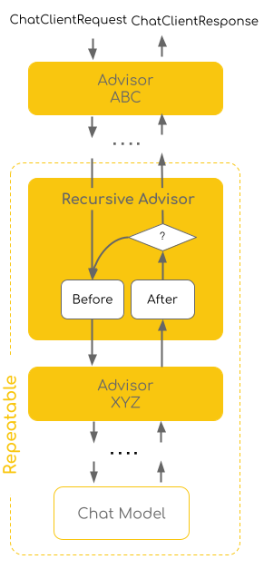
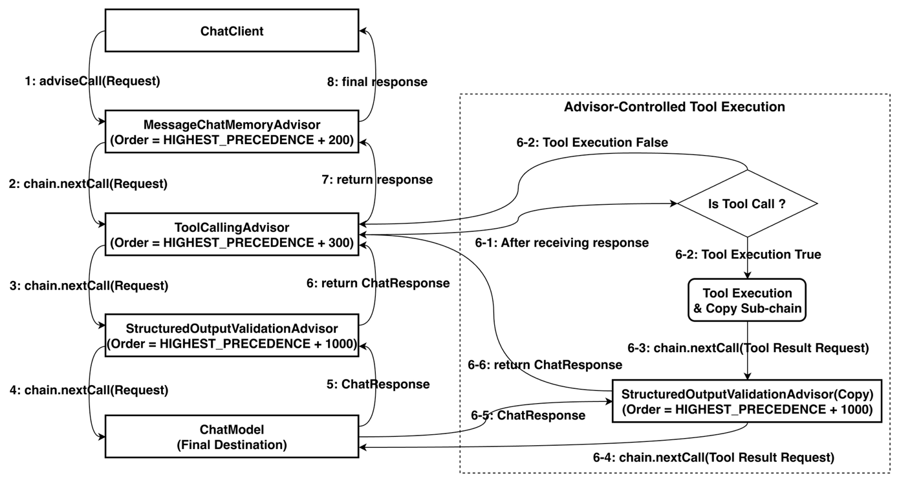
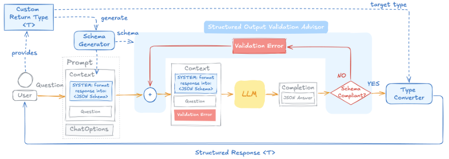

# 재귀적 어드바이저와 툴 루프 제어

<div class="post-meta" markdown>
<span class="tier-chip t2">T2 오케스트레이션</span> 책 6.3절 | 예제 [`chapter6`](https://github.com/JM-Lab/spring-ai-agent-book/tree/main/chapter6)
</div>

[앞 글](../part6/15-agent-loop-and-context-engineering.md)의 리액트 시퀀스를 떠올려 보면, 모델은 툴 호출을 요청할 뿐이고 툴을 실행해 결과를 컨텍스트에 다시 넣는 일은 시스템이 맡았습니다. 이 글은 그 시스템의 몫을 스프링 AI가 어디서 어떻게 처리하는지 다룹니다.

스프링 AI는 이 루프를 어드바이저 체인 안에서 돌립니다. 자기 뒤쪽 체인을 여러 번 다시 호출할 수 있는 재귀적 어드바이저가 그 역할을 맡으며, 구현체가 `ToolCallingAdvisor`입니다. 루프가 체인 안에 있으니 메모리, 로깅, 지표 어드바이저를 루프에 그대로 끼울 수 있습니다. 같은 패턴은 구조화한 출력이 틀렸을 때 모델이 스스로 고치게 하는 교정 루프에도 쓰입니다.

## 툴 루프의 두 가지 방식

툴 루프는 툴 호출, 실행, 결과 주입, 재호출이 이어지는 반복입니다. 새로운 기능이라기보다 [툴 구현과 실행 제어](../part4/10-tool-implementation-and-execution-control.md)에서 다룬 툴 실행 제어를 루프 형태로 확장한 것이라 구성 방법도 같습니다. 루프의 제어권이 어디에 있느냐에 따라 두 방식으로 나눕니다.

- **사용자-제어 수동 루프**: 개발자가 `ChatModel`을 호출하고, 응답에 툴 호출이 있으면 `ToolCallingManager`로 실행한 뒤 다시 호출하는 while 문을 직접 작성합니다. 툴 실행 전에 관리자 승인을 받는 것처럼 흐름을 완전히 통제해야 하는 특수한 경우에 씁니다.
- **프레임워크-제어 어드바이저 루프**: `ToolCallingAdvisor`를 어드바이저 체인에 넣어 루프 제어를 체인에 맡깁니다. 자율 에이전트를 만들 때 권장하는 방식입니다.

차이는 루프 중간에서 드러납니다. 수동 루프에서는 개별 툴 호출과 결과를 로그에 남기거나 메모리에 저장하는 코드를 모두 직접 써야 합니다. 어드바이저 루프에서는 대화 이력을 저장하거나 이벤트를 발행하는 기존 어드바이저가 루프에 그대로 참여합니다.

## 재귀적 어드바이저의 처리 흐름

일반 어드바이저는 요청이 들어갈 때 한 번, 응답이 나올 때 한 번 지나가는 인터셉터입니다. 재귀적 어드바이저는 조건을 만족할 때까지 자기 뒤쪽의 어드바이저와 모델을 반복해서 호출합니다. 이때 체인 전체를 다시 실행하지 않고, `CallAdvisorChain.copy(CallAdvisor after)`로 자기 뒤에 있는 어드바이저만 복제한 하위 체인을 씁니다.

<figure class="wide-figure" markdown>

<figcaption>재귀적 어드바이저 처리 흐름 (출처: <a href="https://docs.spring.io/spring-ai/reference/api/advisors-recursive.html">Recursive Advisors</a>)</figcaption>
</figure>

그림에서 Advisor ABC는 요청과 응답이 오갈 때 한 번씩만 지나갑니다. 점선으로 둘러싼 Repeatable 영역에서는 재귀적 어드바이저가 응답을 받을 때마다 그림의 물음표 자리에서 조건을 확인하고, 더 돌아야 하면 Before로 돌아가 뒤쪽의 Advisor XYZ와 모델을 다시 호출합니다. 이 구조 때문에 처리 흐름은 세 단계로 나뉩니다.

1. **루프 바깥**: 재귀적 어드바이저보다 앞에 있어 요청당 한 번만 실행됩니다. 대화 이력을 다루는 `MessageChatMemoryAdvisor`가 여기에 해당합니다.
2. **루프 안**: 복제한 하위 체인의 어드바이저와 모델이 조건을 만족할 때까지 반복 실행됩니다.
3. **종료와 반환**: 호출할 툴이 더 없거나 검증을 통과하면 루프를 나와 최종 응답을 앞쪽 어드바이저에 돌려줍니다.

만약 체인을 처음부터 다시 돌린다면 앞쪽의 메모리 어드바이저가 사용자의 첫 질문을 반복 횟수만큼 중복 저장할 것입니다. 재귀적 어드바이저는 한 번만 돌아야 할 어드바이저와 매번 돌아야 할 어드바이저를 루프 밖과 안으로 나눠 이런 중복 실행을 막습니다.

## ToolCallingAdvisor로 제어하는 툴 루프

`ToolCallingAdvisor`는 4장에서 툴 실행을 제어할 때 쓴 그 어드바이저이며, 재귀적 어드바이저 패턴의 구현체입니다. 기본 순서값은 `HIGHEST_PRECEDENCE + 300`입니다. 다음 그림은 `MessageChatMemoryAdvisor`(+200), `ToolCallingAdvisor`(+300), `StructuredOutputValidationAdvisor`(+1000)를 차례로 둔 체인의 흐름입니다.

<figure class="wide-figure" markdown>

<figcaption>어드바이저 체인 실행 흐름에서 ToolCallingAdvisor의 툴 루프</figcaption>
</figure>

툴 호출이 없는 응답은 1번부터 8번까지 한 번 지나갑니다. 응답에 툴 호출이 있으면 `ToolCallingAdvisor`가 툴을 실행하고, `chain.copy(this)`로 자기보다 안쪽에 있는 `StructuredOutputValidationAdvisor`만 복제해 모델을 다시 부릅니다(6-3~6-6). 모델이 툴을 더 부르지 않을 때까지 이를 반복합니다.

배치 규칙은 하나입니다. 순서값이 `ToolCallingAdvisor`보다 작으면 루프 바깥에서 한 번, 크면 루프 안에서 매 반복 실행됩니다.

- **메모리 어드바이저를 바깥에 둘 때(기본)**: 루프 전에 이전 대화를 한 번 불러오고, 루프가 끝난 뒤 사용자 메시지와 최종 답만 저장합니다. 한 턴 안의 툴 요청과 응답은 `ToolCallingAdvisor`의 내부 대화 기록이 관리합니다.
- **메모리 어드바이저를 안쪽에 둘 때**: 감사나 디버깅을 위해 툴 호출 이력까지 저장하려면 순서값을 +400처럼 크게 줍니다. 이때는 `ToolCallingAdvisor`의 내부 기록과 겹치지 않아야 합니다. 자동 등록된 어드바이저라면 `DefaultChatClient`가 안쪽의 메모리 어드바이저를 감지해 내부 기록을 끄고, 직접 구성했다면 `.disableInternalConversationHistory()`를 호출합니다.
- **`StructuredOutputValidationAdvisor`를 안쪽에 두는 이유**: 최종 JSON이 틀렸을 때 루프 안에서 모델만 다시 부릅니다. 바깥에 두면 툴 실행 결과를 잃고 툴 실행부터 다시 해야 해 토큰과 비용이 더 듭니다.

6장 메인 에이전트 `SpringAIAgent`도 이 규칙으로 어드바이저를 배치합니다(+N은 `HIGHEST_PRECEDENCE + N`).

| 어드바이저 | 순서값 | 위치 | 역할 |
| --- | --- | --- | --- |
| `MessageChatMemoryAdvisor` | +200 | 루프 바깥 | 대화 이력 로드와 저장 |
| `ToolCallingAdvisor` | +300 | 루프 제어 | 툴 실행과 모델 재호출 |
| `ToolCallTraceAdvisor` | +350 | 루프 안 | 툴 호출과 결과를 CLI에 표시 |
| `ThinkTraceAdvisor` | +360 | 루프 안 | 모델의 사고를 CLI에 표시 |
| `ToolLoopMetricsAdvisor` | +400 | 루프 안 | 루프 단위 지표 발행 |
| `SimpleLoggerAdvisor` | 0 | 루프 안 | 반복별 요청과 응답 로깅 |

루프 어드바이저 자체는 `AgentConfig`에서 만듭니다.

```java title="AgentConfig.java"
--8<-- "chapter6/src/main/java/kr/jmlab/spring/ai/agent/book/chapter6/orchestration/AgentConfig.java:174:192"
```
<span class="code-link">[전체 코드 보기](https://github.com/JM-Lab/spring-ai-agent-book/blob/main/chapter6/src/main/java/kr/jmlab/spring/ai/agent/book/chapter6/orchestration/AgentConfig.java)</span>

`withSafetyGuard`가 빌더에 순서값 `LOOP_ADVISOR_ORDER`(`HIGHEST_PRECEDENCE + 300`)와 `toolExecutionEligibilityChecker`를 넣습니다. 체커 `AgentSafety.maxToolRounds`는 응답에 툴 호출이 없으면 루프를 끝내고, 툴 실행 라운드가 `MAX_TOOL_ROUNDS`(10)를 넘어도 끝냅니다. 이 라운드 카운터를 요청끼리 공유하지 않도록 `Supplier`로 요청마다 새 어드바이저를 만듭니다. 툴이 많을 때 `ToolSearchToolCallingAdvisor`로 바꾸는 분기는 다음 글의 동적 툴 탐색에서 다룹니다.

## 툴 루프 관측

`ToolCallingAdvisor`는 루프를 체인 안에서 끝내고 호출자에게 최종 답만 돌려줍니다. 그래서 `.stream()`으로 받아도 툴을 부르고 결과를 넘기는 중간 과정은 보이지 않습니다. 운영에서는 요청 하나에 루프가 몇 번 돌았는지, 어떤 툴이 자주 불리는지, 반복이 늘 때 토큰이 얼마나 느는지 알아야 하므로 루프 안쪽에 관측용 어드바이저를 둡니다.

로깅은 내장 `SimpleLoggerAdvisor`면 됩니다. 기본 순서값이 0이라 루프 안에 놓여 반복마다 요청과 응답을 기록하고, `HIGHEST_PRECEDENCE + 250`처럼 바깥으로 빼면 최초 요청과 최종 응답만 한 번 남습니다. 예제 저장소의 `ToolCallTraceAdvisor`는 루프 한 바퀴에 무엇이 오가는지 CLI로 보여 줍니다.

```java title="ToolCallTraceAdvisor.java"
--8<-- "chapter6/src/main/java/kr/jmlab/spring/ai/agent/book/chapter6/orchestration/ToolCallTraceAdvisor.java:29:57"
```
<span class="code-link">[전체 코드 보기](https://github.com/JM-Lab/spring-ai-agent-book/blob/main/chapter6/src/main/java/kr/jmlab/spring/ai/agent/book/chapter6/orchestration/ToolCallTraceAdvisor.java)</span>

`after()`는 이번 라운드의 모델 응답에 담긴 툴 호출 이름과 인자를 출력합니다. 툴 실행 결과는 다음 라운드 요청의 메시지 목록에 `ToolResponseMessage`로 붙어 오므로, `before()`가 그 요청에서 가장 최근 결과를 꺼내 출력합니다. 루프 안에 있으니 한 요청 동안 툴 호출, 툴 결과, 다음 툴 호출이 차례로 찍힙니다.

지표는 `ToolLoopMetricsAdvisor`가 발행합니다.

```java title="ToolLoopMetricsAdvisor.java"
--8<-- "chapter6/src/main/java/kr/jmlab/spring/ai/agent/book/chapter6/orchestration/ToolLoopMetricsAdvisor.java:35:60"
```
<span class="code-link">[전체 코드 보기](https://github.com/JM-Lab/spring-ai-agent-book/blob/main/chapter6/src/main/java/kr/jmlab/spring/ai/agent/book/chapter6/orchestration/ToolLoopMetricsAdvisor.java)</span>

`BaseAdvisor`로 구현해 호출과 스트리밍 양쪽에서 동작하고, 순서값 +400으로 루프 안에 있어 반복마다 `after()`가 실행됩니다. 여기서 반복 수(`agent.tool.loop.iterations`), 툴별 호출 수(`agent.tool.calls`), 반복당 토큰(`agent.tool.loop.tokens`)을 `MeterRegistry`에 기록합니다. 스프링 AI가 LLM 호출마다 자동으로 남기는 `gen_ai.*` 계측에 루프 단위 지표를 보태는 셈이며, OTLP 익스포터를 거쳐 외부 관측 시스템으로 보낼 수 있습니다. 이 흐름은 [AI 에이전트 관측 가능성](../part6/21-observability-for-ai-agents-micrometer-otel-otlp.md)에서 이어집니다.

루프를 일찍 끝내는 경로도 있습니다. 한 라운드에서 실행한 툴이 모두 `returnDirect=true`이면 `ToolCallingAdvisor`는 결과를 모델에 넘기지 않고 그대로 반환하며 루프가 끝납니다. 하나라도 아니면 결과를 모두 모델에 보내고 루프를 계속합니다. 무한 반복을 막는 일은 이 옵션이 아니라 앞의 반복 상한이 맡습니다.

## 훅과 파라미터 증강

툴 루프는 모델이 툴을 더 부르지 않을 때 끝나는 것이 원칙이지만, 환각으로 같은 툴을 끝없이 부르는 장애도 생깁니다. `ToolCallingAdvisor`에는 루프의 단계마다 재정의할 수 있는 훅 메서드가 있어서, 하위 클래스에서 이런 안전 가드를 넣을 수 있습니다.

| 훅 메서드 | 호출 시점 | 활용 예 |
| --- | --- | --- |
| `doInitializeLoop` | 루프 진입 직전(1회) | 반복 카운터와 시작 시각 초기화 |
| `doBeforeCall` | 하위 체인 호출 직전(매 반복) | 반복 상한에 닿으면 예외로 중단 |
| `doAfterCall` | 하위 체인 호출 직후(매 반복) | 누적 토큰이나 비용이 예산을 넘으면 중단 |
| `doGetNextInstructionsForToolCall` | 툴 실행 후 다음 입력을 만들 때 | 방대한 툴 결과를 요약하거나 걸러 컨텍스트 절약 |
| `doFinalizeLoop` | 루프 종료 직후(1회) | 전체 수행 시간과 총비용 기록 |

예제 저장소는 반복 상한을 훅 대신 앞에서 본 체커로 구현했고, 훅은 강화 에이전트의 `OrchestrationToolCallingAdvisor`가 씁니다. 이 어드바이저는 `doBeforeCall`과 `doBeforeStream`을 재정의해 매 라운드 메타 툴을 툴 목록에 더하며, 자세한 내용은 [엔터프라이즈 스프링 AI 에이전트 CLI](../part6/20-enterprise-spring-ai-agent-cli-multi-agent-and-meta-tools.md)에서 다룹니다.

훅이 실행 흐름을 다룬다면 파라미터 증강은 모델의 생각을 꺼냅니다. 모델이 왜 이 툴을 골랐는지 남기고 싶을 때, 비즈니스 코드를 고치지 않고 `AugmentedToolCallbackProvider`로 기존 툴을 감쌉니다. 추론 과정(`innerThought`)이나 신뢰도(`confidence`) 같은 추가 파라미터를 레코드로 정의하면, 모델은 원래 파라미터에 이 필드가 더해진 스키마를 보고 값을 함께 보냅니다. `argumentConsumer`가 그 값을 받아 로그에 남기고, `removeExtraArgumentsAfterProcessing(true)`로 처리가 끝난 추가 인자를 지우면 원래 툴 메서드에는 처음 설계한 파라미터만 전달됩니다.

## 구조화한 출력 교정 루프

재귀적 어드바이저 패턴은 구조화한 출력에도 쓰입니다. 기존 `StructuredOutputConverter` 방식은 JSON 스키마를 요구하는 지시를 넣고 결과를 파싱만 합니다. 모델이 필드를 빠뜨리거나 형식을 어기면 예외가 나고, 애플리케이션이 이를 잡아 전체를 다시 실행해야 했습니다. 이제는 `validateSchema()`를 붙이면 프레임워크가 `StructuredOutputValidationAdvisor`를 자동 등록해 교정 루프를 돌립니다.

<figure class="wide-figure" markdown>

<figcaption>StructuredOutputValidationAdvisor의 구조화한 출력 교정 루프 (출처: <a href="https://spring.io/blog/2026/06/23/spring-ai-self-correcting-structured-output">Self-Correcting Structured Output in Spring AI 2.0</a>)</figcaption>
</figure>

대상 타입에서 만든 JSON 스키마가 프롬프트에 들어가고, 어드바이저는 응답을 그 스키마로 검증합니다. 통과하면 타입 컨버터가 객체로 바꾸고, 실패하면 검증 오류 메시지를 프롬프트에 덧붙여 하위 체인을 다시 호출합니다. 모델이 무엇을 틀렸는지 보고 고치므로 같은 요청을 되풀이하는 재시도와 다릅니다. 기본 재시도 횟수는 3회이고, 바꾸려면 `StructuredOutputValidationAdvisor.builder()`에 `maxRepeatAttempts`를 지정해 직접 등록합니다. 예제 저장소에서는 [토큰과 구조화한 출력](../part2/04-tokens-and-structured-output.md)에서 다룬 2장 예제가 네이티브 구조화한 출력과 함께 이 방식을 씁니다.

```java title="Ch2Step3_StructuredOutput.java"
--8<-- "chapter2/src/main/java/kr/jmlab/spring/ai/agent/book/chapter2/Ch2Step3_StructuredOutput.java:50:54"
```
<span class="code-link">[전체 코드 보기](https://github.com/JM-Lab/spring-ai-agent-book/blob/main/chapter2/src/main/java/kr/jmlab/spring/ai/agent/book/chapter2/Ch2Step3_StructuredOutput.java)</span>

제약도 있습니다. JSON은 응답이 모두 조립돼야 검증할 수 있어서, 이 어드바이저는 `.stream()`에서 `UnsupportedOperationException`을 던지고 `.entity()`도 `.call()` 뒤에만 이어 쓸 수 있습니다. 그래서 실시간 타이핑 효과가 필요한 채팅 UI보다 배치성 에이전트나 REST API처럼 응답을 한 번에 돌려주는 곳에 어울립니다.

## 4-티어 아키텍처에서의 위치

`ToolCallingAdvisor`는 T2 오케스트레이션의 루프를 실제로 돌리는 부품입니다. 어드바이저 체인 안에서 계획, 행동, 관찰, 반영을 반복하고, 순서값에 따라 메모리는 루프 바깥에, 관측과 검증은 루프 안에 놓입니다. 루프 안에서 발행한 지표는 횡단 관심사인 관측 가능성으로 이어집니다. 다음 글 [스프링 AI 에이전트 아키텍처와 구현, 그리고 동적 툴 탐색](../part6/17-spring-ai-agent-architecture-and-dynamic-tool-discovery.md)에서는 이 부품들을 에이전트 아키텍처로 묶고, 툴이 많아졌을 때 필요한 툴만 찾아 쓰는 방법을 봅니다.

## 책에서 더 다루는 내용

!!! book "책 6.3절"
    - 메모리, 툴 호출, 구조화한 출력 검증 어드바이저를 한 체인에 조립하는 예제와 흐름도 단계별 해설
    - 메모리 어드바이저를 루프 안쪽에 둘 때 저장소에 기록되는 메시지 흐름
    - `AugmentedToolCallbackProvider`로 툴 호출 추론을 추출하는 전체 코드
    - `StructuredOutputValidationAdvisor`를 직접 등록해 재시도 횟수를 바꾸는 예제
    - 어드바이저 루프가 주는 이점: 관측 가능성, 메모리 통합, 이벤트 기반 중간 개입

    [책 소개](../book.md){ .md-button } [온라인 구매](https://wikibook.co.kr/springai-agents/){ .md-button .md-button--primary }

## 참고 자료

- [Recursive Advisors](https://docs.spring.io/spring-ai/reference/api/advisors-recursive.html): 재귀적 어드바이저 레퍼런스 문서
- [Tool Calling in Spring AI 2.0: A Composable, Agentic Architecture](https://spring.io/blog/2026/06/15/spring-ai-composable-tool-calling): 툴 루프와 메모리 어드바이저 배치
- [Self-Correcting Structured Output in Spring AI 2.0](https://spring.io/blog/2026/06/23/spring-ai-self-correcting-structured-output): 구조화한 출력 교정 루프
