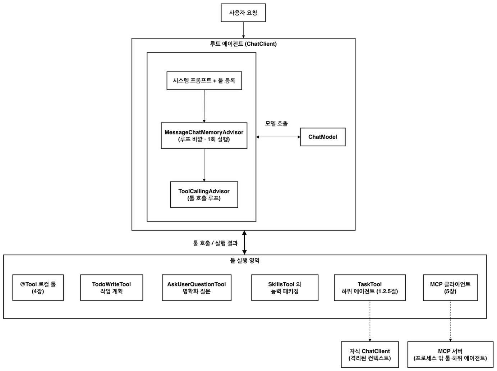

# Spring AI Agent Architecture, Implementation, and Dynamic Tool Discovery

<div class="post-meta" markdown>
<span class="tier-chip t2">T2 Orchestration</span><span class="tier-chip t3">T3 Capability</span> Book sections 6.4.3, 6.4.5 | Example [`chapter6`](https://github.com/JM-Lab/spring-ai-agent-book/tree/main/chapter6)
</div>

The previous articles covered how an agent is driven by an agent loop, context engineering, which designs the context passed to the model on each turn of the loop, and [how to control the tool loop with recursive advisors](../part6/16-recursive-advisor-and-tool-loop-control.md). This article puts these parts together to build an agent that actually works.

You do not have to design everything from scratch. Widely used agent products such as Claude Code describe their internal structure in public documentation, and several agents publish their code as open source. The book presents a "Spring AI agent architecture" that maps the structure these products share onto Spring AI modules, and the example repository implements it as the `SpringAIAgent` class.

The second half of the article deals with the problem that arises as the number of tools grows. The approach there is dynamic tool discovery, which searches for only the tools that are needed and passes those to the model instead of sending every registered tool definition each time.

## Spring AI agent architecture

The agent products that lead the market have three things in common. They have a single agent loop, every capability connects through a single tool interface, and external connections are standardized on MCP. Spring AI already has the parts that fit this structure. The work is less about learning a new framework and more about rearranging the parts you have learned so far from an agent's point of view.

- **Root agent**: `ChatClient` and the advisor chain form the center, and `ToolCallingAdvisor`, a recursive advisor, controls the tool loop. The `ChatModel` abstraction handles model calls, so you are not tied to a particular vendor.
- **Context and memory**: The persona and behavioral guidelines go in the system prompt, and `MessageChatMemoryAdvisor` manages the conversation history.
- **Tool execution area**: `@Tool` and `ToolCallback` are the single tool interface. Whether it is a simple lookup or complex business logic, it is registered with the agent in the same shape.
- **External extension**: The MCP client makes the tools of external servers visible to the model. It is the path for connecting external agents, and the mechanism for getting human approval during tool execution also runs on MCP Elicitation.
- **Specialized agent tools**: Tools for planning, asking questions, skills, and delegation come from `spring-ai-agent-utils`, a community library. The library brings implementation patterns inspired by Claude Code to Spring AI.

<figure class="wide-figure" markdown>

<figcaption>Spring AI agent architecture</figcaption>
</figure>

The components in the figure fall into two groups by where they come from. Loop control, the tool interface, and MCP communication are in Spring AI core. Elicitation for human approval (`@McpElicitation`) and `ToolSearchToolCallingAdvisor`, which you use when there are many tools, also belong to core. By contrast, `TodoWriteTool` (task planning), `AskUserQuestionTool` (clarifying questions), `SkillsTool` (skills), and `TaskTool` (delegating to subagents) live in a community-led incubating library.

## Implementing SpringAIAgent: ChatClient and the advisor chain

You can build a single agent with the core parts alone. `ChatClient`, `ToolCallingAdvisor`, `@Tool`, the MCP client, and chat memory all come with the basic starters used in Chapters 2 through 5, so there is no need to add more libraries. No new tools are needed either. The example reuses `DateTimeTools`, `CalculatorTools`, and `InventoryTools`, built in Chapter 4.

The example repository builds both this core agent and the enhanced agent, which later adds community tools, from a single `SpringAIAgent` class. The only differences between the two are the system prompt, the tool list, and the tool loop advisor, so the constructor takes these three.

```java title="SpringAIAgent.java"
--8<-- "chapter6/src/main/java/kr/jmlab/spring/ai/agent/book/chapter6/orchestration/SpringAIAgent.java:19:52"
```
<span class="code-link">[View full code](https://github.com/JM-Lab/spring-ai-agent-book/blob/main/chapter6/src/main/java/kr/jmlab/spring/ai/agent/book/chapter6/orchestration/SpringAIAgent.java)</span>

There is no `while` or `for` loop anywhere in the code. When the model requests a tool call, `ToolCallingAdvisor` runs the tool inside the advisor chain, adds the result to the conversation, and calls the model again. This repeats until the model produces a final answer. Spring AI 2.0 runs the tool loop internally on its own. Even so, the example registers the loop advisor explicitly, to make its execution order relative to the memory advisor visible in the code and to set up a safety guard that limits the number of tool execution rounds. The loop advisor comes in as a `Supplier` and is created anew for every request, so the guard's counter does not carry over from one request to another.

The order values reveal the structure. `MessageChatMemoryAdvisor`, at `HIGHEST_PRECEDENCE + 200`, sits outside the loop and runs once per request, while the loop advisor attached in `run()`, at `+300`, sits downstream of it. `ThinkTraceAdvisor` and `ToolCallTraceAdvisor` run inside the loop and show the model's thinking and the tools it called on the console at each iteration. If you also want to keep the tool call history in the chat memory repository, you can move the memory advisor inside the loop and turn off the internal conversation history of `ToolCallingAdvisor`. The memory advisor then handles history management in one place.

On the channel side, the code only needs to pass the user message and a conversation ID to `run()`.

```java title="Ch6Step1_SpringAIAgent.java"
--8<-- "chapter6/src/main/java/kr/jmlab/spring/ai/agent/book/chapter6/channel/Ch6Step1_SpringAIAgent.java:24:41"
```
<span class="code-link">[View full code](https://github.com/JM-Lab/spring-ai-agent-book/blob/main/chapter6/src/main/java/kr/jmlab/spring/ai/agent/book/chapter6/channel/Ch6Step1_SpringAIAgent.java)</span>

The Step 1 runner gets the `coreAgent` bean injected and asks two questions with the same conversation ID. The first request asks for the current time, a stock check, and a reservation all at once. The second asks for the name of the product just reserved, to confirm that chat memory works. To run it without an MCP server, pass the arguments `--spring.ai.cli.step=ch6-step1 --spring.ai.mcp.client.enabled=false`.

## A single tool interface: local, community, and remote

Wherever a capability comes from, it becomes a `ToolCallback` when it enters the agent. The `coreAgent` bean in `AgentConfig` handles this assembly.

```java title="AgentConfig.java"
--8<-- "chapter6/src/main/java/kr/jmlab/spring/ai/agent/book/chapter6/orchestration/AgentConfig.java:70:99"
```
<span class="code-link">[View full code](https://github.com/JM-Lab/spring-ai-agent-book/blob/main/chapter6/src/main/java/kr/jmlab/spring/ai/agent/book/chapter6/orchestration/AgentConfig.java)</span>

The local tools are a `List<ToolCallback>` that the `localTools` bean builds by converting three tool objects with `ToolCallbacks.from()`. The MCP servers' tools come from `SyncMcpToolCallbackProvider`, and once expanded with `getToolCallbacks()`, they join the same list as the local tools. If the MCP client is turned off and this bean does not exist, `getIfAvailable()` returns `null`, and the agent is built with local tools only. Whether it is a method inside the JVM or a server across the network, to the model it is the same tool call.

Community tools come in the same way. For `SkillsTool` and `TaskTool`, the builder produces a `ToolCallback` directly. `TodoWriteTool` and `AskUserQuestionTool` are `@Tool` objects, so they are converted with `ToolCallbacks.from()` and added to the list. Adding capabilities does not change `SpringAIAgent`. Only the list that the configuration class passes in changes.

## Dynamic tool discovery: a tool that finds tools

Adding tools comes at a cost. The name, description, and JSON schema of every registered tool are sent to the model with each request and take up context. According to a source the book cites, in a common setup with several MCP servers connected, the definitions of more than 50 tools alone can consume over 55,000 tokens before the conversation really gets going. As tools with similar names and functions multiply, the model's accuracy in picking the right tool also drops noticeably.

The tool search pattern solves this problem with search. At first, the model sees only one tool, a tool that finds tools (Tool Search Tool, TST). When the model needs some capability during a task, it passes a search query to this tool, and only the definitions of the tools that match are added to the context. Since even the job of managing tools is handled through a tool call, the pattern stays true to the principle that "every capability is connected as a tool."

Anthropic first introduced this pattern as a Claude-specific feature, and Spring AI implemented the same idea as a recursive advisor. The implementation is `ToolSearchToolCallingAdvisor`, a subclass of `ToolCallingAdvisor`. Because it intercepts the tool loop at the framework level, it works the same way with any model, whether OpenAI, Anthropic, Gemini, or Ollama.

<figure class="wide-figure" markdown>

<figcaption>A tool that finds tools (Source: <a href="https://spring.io/blog/2025/12/11/spring-ai-tool-search-tools-tzolov">Smart Tool Selection: Achieving 34-64% Token Savings with Spring AI's Dynamic Tool Discovery</a>)</figcaption>
</figure>

Following the numbers in the figure, the flow has seven steps.

1. All registered tools are indexed in `ToolIndex`.
2. The first request carries only the search tool's definition instead of every tool.
3. When the model decides it needs a capability, it calls the search tool with a search query.
4. `ToolIndex` finds the tools that match the query and adds their definitions to the context of the next request.
5. The model calls the actual tool that has just become visible to it.
6. The application runs that tool and returns the result to the model.
7. Once it has gathered the information it needs, the model gives the user a final answer.

The search method is abstracted behind the `ToolIndex` interface. You can choose among the keyword-based `LuceneToolIndex`, `VectorToolIndex`, which compares meaning through embeddings, and the regex-based `RegexToolIndex`, or plug in your own implementation. The dependency is `spring-ai-starter-tool-search-advisor`. This advisor accumulates the tool definitions found through search per session, so it needs a conversation ID when called. `SpringAIAgent.run()` passes this value with every request, so there is nothing extra to take care of.

The example's core agent picks one of two advisors based on the number of tools. In the `coreAgent` code above, it turns on dynamic tool discovery when the local and remote tools together number at least `spring.ai.cli.tool-search.min-tools` (10 if not set) and a vector store is available. The part that creates the advisor looks like this.

```java title="AgentConfig.java"
--8<-- "chapter6/src/main/java/kr/jmlab/spring/ai/agent/book/chapter6/orchestration/AgentConfig.java:174:192"
```
<span class="code-link">[View full code](https://github.com/JM-Lab/spring-ai-agent-book/blob/main/chapter6/src/main/java/kr/jmlab/spring/ai/agent/book/chapter6/orchestration/AgentConfig.java)</span>

With dynamic tool discovery on, `VectorToolIndex` is created only once, and the `ToolSearchToolCallingAdvisor` that is created fresh for each request shares that index. The index tracks per-session embeddings and cleans them up, so creating a new index for every request would pile up duplicates in the vector store. `maxResults` is set to 5. The store the index uses is the `SimpleVectorStore` from the `toolVectorStore` bean, and the embedding model is `bge-m3`, set in `spring.ai.ollama.embedding.model` in `application.yml`.

Counting the tools shows when the switch happens. There are 7 local tools in total: 2 for dates, 2 for calculation, and 3 for inventory. Adding the 2 tools of the operations MCP server still makes only 9, so every tool is sent as is. Search takes over only once there are 10 or more tools. The enhanced agent, used from Step 4 on, does not follow this rule. Instead, it uses `OrchestrationToolCallingAdvisor`, which always shows the meta-tools and searches only the domain tools. The [enterprise agent CLI article](../part6/20-enterprise-spring-ai-agent-cli-multi-agent-and-meta-tools.md) covers this setup.

Published preliminary measurements give a sense of the effect. In a test that had models solve the same task with 28 tools, 3 relevant and 25 unrelated, applying Lucene search reduced total token usage by 60% for Gemini, 34% for OpenAI, and 64% for Anthropic. Most of the savings come from the tool definitions that used to be sent with every request, and because a search step is added, LLM calls went up by one or two on average. Vector search brought similar reductions of 47-63%. Just as RAG searches for documents and adds them to the prompt, this pattern searches for tool definitions and supplies only the capabilities that are needed, so you can think of it as "RAG for tools."

## Where this fits in the 4-tier architecture

`SpringAIAgent` and the advisor chain belong to T2 Orchestration. As this tier runs the loop, it calls tools in the T3 Capability tier and hands model calls to `ChatModel` in T4 Foundation. The package names in the example, `channel`, `orchestration`, and `capability`, also follow the tiers. Dynamic tool discovery works at the boundary between T2 and T3, because the Orchestration tier uses search to decide which capabilities to show the model in each round. Now that the agent can call remote tools as well, the next article looks at how to get human approval before operations that cannot be undone: [Human-in-the-Loop (HITL): An Approval Gate with MCP Elicitation](../part6/18-human-in-the-loop-approval-gate-with-mcp-elicitation.md)

## More in the book

!!! book "Book sections 6.4.3, 6.4.5"
    - Table 6.12, the Spring AI agent development stack: the role of each component, the split between core and community, and module artifacts
    - Example 6.17, a basic agent built with Spring AI core alone: a setup that places the memory advisor inside the loop and turns off the internal conversation history
    - A registration example that picks one of `LuceneToolIndex`, `VectorToolIndex`, and `RegexToolIndex` and plugs it into `ToolSearchToolCallingAdvisor`
    - Table 6.13, token usage per model before and after applying Tool Search

    [About the book](../book.md){ .md-button } [Buy the book (Korean)](https://wikibook.co.kr/springai-agents/){ .md-button .md-button--primary }

## References

- [Smart Tool Selection: Achieving 34-64% Token Savings with Spring AI's Dynamic Tool Discovery](https://spring.io/blog/2025/12/11/spring-ai-tool-search-tools-tzolov): how `ToolSearchToolCallingAdvisor` works and the measured token savings for each model
- [Introducing advanced tool use on the Claude Developer Platform](http://www.anthropic.com/engineering/advanced-tool-use): Anthropic's dynamic tool discovery, introduced as a Claude-specific feature
