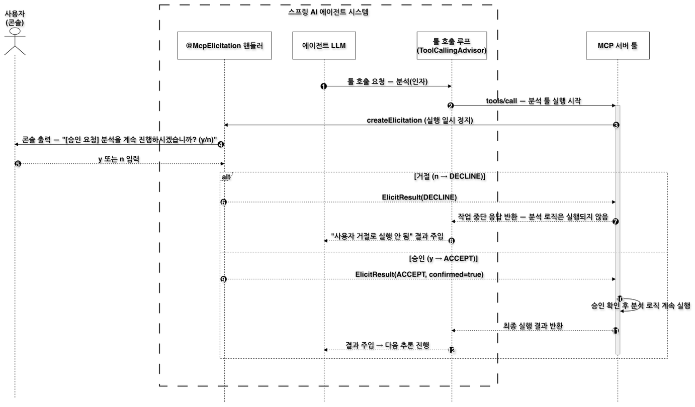

# Human-in-the-Loop (HITL): An Approval Gate with MCP Elicitation

<div class="post-meta" markdown>
<span class="tier-chip tx">Cross-cutting: governance</span> Book sections 6.4.4, 5.3.6, 6.6.4 | Example [`chapter6`](https://github.com/JM-Lab/spring-ai-agent-book/tree/main/chapter6)
</div>

The agent built in the [previous article](../part6/17-spring-ai-agent-architecture-and-dynamic-tool-discovery.md) calls local tools and remote tools on MCP servers in the same way. Once the model picks a tool, the tool runs right away. That is fine for lookups, but operations that are hard to undo, such as changing system settings, making payments, or sending messages externally, cannot be left to the model's judgment alone.

Before operations like these, the agent should stop, wait for human input, and continue only after receiving explicit approval. The book calls this pattern a human-in-the-loop (HITL) workflow. This article builds an approval gate with MCP Elicitation and applies it to the purchase order tool in the example repository.

## Why the approval gate belongs on the agent side

The MCP server example in Chapter 5 of the book (Section 5.3.6) also covered this feature. The analysis tool in that section (the article on [building an MCP server](../part5/12-building-an-mcp-server-with-spring-ai.md) mentions it only in a callout box) used `exchange.createElicitation(...)` during execution to ask whether to continue the analysis, and the client's `@McpElicitation` handler answered. That handler, however, was only meant to check the protocol behavior, so it was an auto-reply stub that returned approval (`ACCEPT`) right away without asking anyone.

When you build an agent, this very handler becomes important. That is because the agent you are building is the MCP host and connects to servers through the MCP client inside it. Tools on external MCP servers may be built by other teams or by the wider ecosystem, so their code is hard to change. The handler that answers the approval requests those tools send, however, is entirely agent-side code. All you need to do is turn this handler into an approval gate that asks a real person and can also decline. Because an approval request arrives right before the operation's code runs, this is a natural place to intervene. The gate reaches only tools that ask, though; for a server that never asks, the host has to apply its own policy before sending `tools/call`.

## An approval gate inside the tool loop

<figure class="wide-figure" markdown>

<figcaption>Approval gate inside the Spring AI agent tool loop</figcaption>
</figure>

The figure shows the flow using the Chapter 5 analysis tool as an example. When the model requests a tool call, the tool loop (`ToolCallingAdvisor`) sends `tools/call` to the MCP server. Before running its logic, the server tool calls `createElicitation` and pauses until a response arrives. The `@McpElicitation` handler that receives the request prints an approval request to the console and waits for the user to enter y or n.

If the user enters n, the handler returns `DECLINE`, and the server tool returns a response saying the operation was stopped, without running the analysis logic. The tool loop passes the model a result saying that the tool did not run because it was declined. If the user enters y, `ACCEPT` is sent along with `confirmed=true`, and the server runs the rest of its logic and returns the final result. Either way, the model receives the tool result and moves on to its next reasoning step. In this structure, the agent serves as the call approval gate between the user and external tools.

## The MCP Elicitation primitive

An MCP server does not stop at exposing its own features. It can also rely on features of the client it is connected to. The features used while handling a tool call fall into two kinds. Logging, progress notifications, and ping are notification-style features that report the server's status, while sampling and elicitation are interactive features in which the server calls on the client's features. Elicitation is the feature for getting input from the user on the client side during tool execution.

Along with a message, a request from the server carries the format of the input it wants, as a JSON schema (`requestedSchema`). A request that sends a form like this is an `ElicitFormRequest`, one kind of `ElicitRequest`. The client answers with an `ElicitResult`. There are three actions: accept (`ACCEPT`), decline (`DECLINE`), and cancel (`CANCEL`). If the schema has input fields, the client sends back values in that format in the `content` map. The server tool looks at the returned action and decides whether to continue or stop.

This feature assumes two-way communication. Even if the server sends a request, the feature does not work unless the client is ready to receive it. Also, a stateless MCP server in Spring AI (`protocol=STATELESS`) does not keep a connection open, so it cannot send requests to the client. The example's operations server runs with the `STREAMABLE` protocol under the `ops` profile.

```yaml title="application-ops.yml"
--8<-- "chapter6/src/main/resources/application-ops.yml:1:18"
```
<span class="code-link">[View full code](https://github.com/JM-Lab/spring-ai-agent-book/blob/main/chapter6/src/main/resources/application-ops.yml)</span>

The operations server is a servlet web application on port 8085, and this profile turns off the MCP client and turns on only the server. The MCP endpoint is `/mcp`.

## Server-side implementation: requesting approval right before execution

`OperationsMcpTools` in the operations server exposes two tools with `@McpTool`: `check_stock`, which looks up stock, and `place_purchase_order`, which places a purchase order. `place_purchase_order` is a mock tool that imitates a real purchase order, and it is an example of an operation that would cause trouble if it ran just because the model picked it.

```java title="OperationsMcpTools.java"
--8<-- "chapter6/src/main/java/kr/jmlab/spring/ai/agent/book/chapter6/capability/remote/OperationsMcpTools.java:40:58"
```
<span class="code-link">[View full code](https://github.com/JM-Lab/spring-ai-agent-book/blob/main/chapter6/src/main/java/kr/jmlab/spring/ai/agent/book/chapter6/capability/remote/OperationsMcpTools.java)</span>

The method calls `createElicitation()` on the `McpSyncServerExchange` it receives as a parameter. The request message states which SKU to order and how many units, and the schema is left as an empty object with no properties, because this time only a yes or no is needed. The tool waits until a response arrives, and if the action is not `ACCEPT`, it returns a cancellation message without touching the stock. Only when the order is approved does it increase the stock and return a completion message. The user steps in not while the model is producing its answer but right before the actual operation runs.

## Client-side implementation: the @McpElicitation handler

The approval request sent by the server travels back up across the MCP boundary to the agent side. On the client, a single method annotated with `@McpElicitation` receives this request.

```java title="ConsoleElicitationHandler.java"
--8<-- "chapter6/src/main/java/kr/jmlab/spring/ai/agent/book/chapter6/channel/ConsoleElicitationHandler.java:23:43"
```
<span class="code-link">[View full code](https://github.com/JM-Lab/spring-ai-agent-book/blob/main/chapter6/src/main/java/kr/jmlab/spring/ai/agent/book/chapter6/channel/ConsoleElicitationHandler.java)</span>

The handler shows the server's message on the console and reads the user's input. It returns `ACCEPT` only for y, and treats any other input, or no input at all, as `DECLINE`. Because the default is to decline, a risky operation runs only when the user explicitly approves it. `Scanner` is shared as a single field because creating a new one on every call would lose console input. `@Profile("!ops & !knowledge")` makes sure this handler is registered only when running the client, not a server.

`operations` in `clients = "operations"` is the name of the operations server connection registered under `spring.ai.mcp.client.streamable-http.connections` in the client's `application.yml`. With this setting, the handler processes only requests that come from the operations server connection, and even if you attach more MCP servers, you can scope approval handling by connection name. Even as the number of servers grows, the approval policy stays in one place: the handler on the agent side. For a web service, you can extend the handler to show an approval dialog in the frontend over SSE or WebSocket instead of the console, and to wait for the response asynchronously.

## Example run: approval before a purchase order

The Step 3 runner (`Ch6Step3_ApprovalGate`) sends the core agent the request "Order 10 units of SKU-300." Start the operations server first, then run the client in another terminal.

```bash
# Terminal 1: operations MCP server
./mvnw spring-boot:run -Dspring-boot.run.arguments="--spring.profiles.active=ops"
# Terminal 2: client
./mvnw spring-boot:run -Dspring-boot.run.arguments="--spring.ai.cli.step=ch6-step3"
```

Here is a summary of the run output shown in the book. The model calls `place_purchase_order` with SKU-300 and a quantity of 10. Before the tool result comes back, the console first shows `[승인 요청] place_purchase_order 툴로 SKU-300 10개를 실제로 발주합니다. 진행할까요? (y/n)` ("[Approval request] This will actually order 10 units of SKU-300 with the place_purchase_order tool. Proceed? (y/n)"). When you enter y, the tool result "Ordered 10 units of SKU-300. (Approved)" comes back, and the model summarizes the work based on it. If you enter n instead, the server cancels the order and leaves the stock unchanged.

In this flow, the model only decides what to do, and the authority to actually carry it out rests with the MCP server and the user's approval together. Human approval now forms a boundary between the tool call and the state change. The core agent's tool loop also has a safety guard that limits tool execution to 10 rounds per request, which keeps a loop that handles operations such as purchase orders from running endlessly. The model writes the final summary from scratch each time, so its wording can vary from run to run, and with a small local model, the SKU notation or Korean grammatical particles can also be inconsistent. What to check is not the wording but the flow in which execution passes through approval.

## Where this fits in the 4-tier architecture

The approval gate does not belong to a single tier. It is a cross-cutting concern that spans several tiers, and within cross-cutting concerns it falls under governance. An approval request starts from an MCP server tool in the T3 Capability tier and reaches the user in the T1 Channel while the tool loop in T2 Orchestration waits for the result. In the example, too, `OperationsMcpTools`, which sends the request, is in the `capability/remote` package, and `ConsoleElicitationHandler`, which answers it, is in the `channel` package. As a first step in extending the agent's capabilities with a community library, the next article looks at Agent Skills: [Agent Skills: Extending Agent Capabilities with Reusable Skills](../part6/19-agent-skills-extending-capabilities.md)

## More in the book

!!! book "Book sections 6.4.4, 5.3.6, 6.6.4"
    - The process of turning the auto-reply handler for the Chapter 5 analysis tool into a console approval gate, and cases where form input comes back through `requestedSchema`
    - An overview of MCP server features that depend on the client: watching for root changes, logging, progress notifications, ping, and sampling
    - How to get the exchange in a programmatic tool with `McpToolUtils.getMcpExchange()` and check whether the client supports a feature
    - Configuration that separates the operations server and the knowledge server by profile, and the Step 2 run output in which remote tools join the core agent
    - The gaps that remain when an agent built only with core features is compared with commercial agent products, and how that leads to community tools

    [About the book](../book.md){ .md-button } [Buy the book (Korean)](https://wikibook.co.kr/springai-agents/){ .md-button .md-button--primary }
