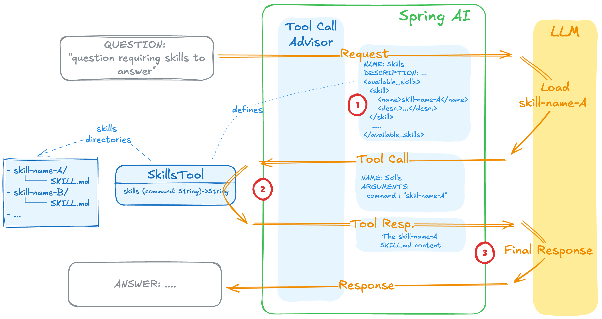
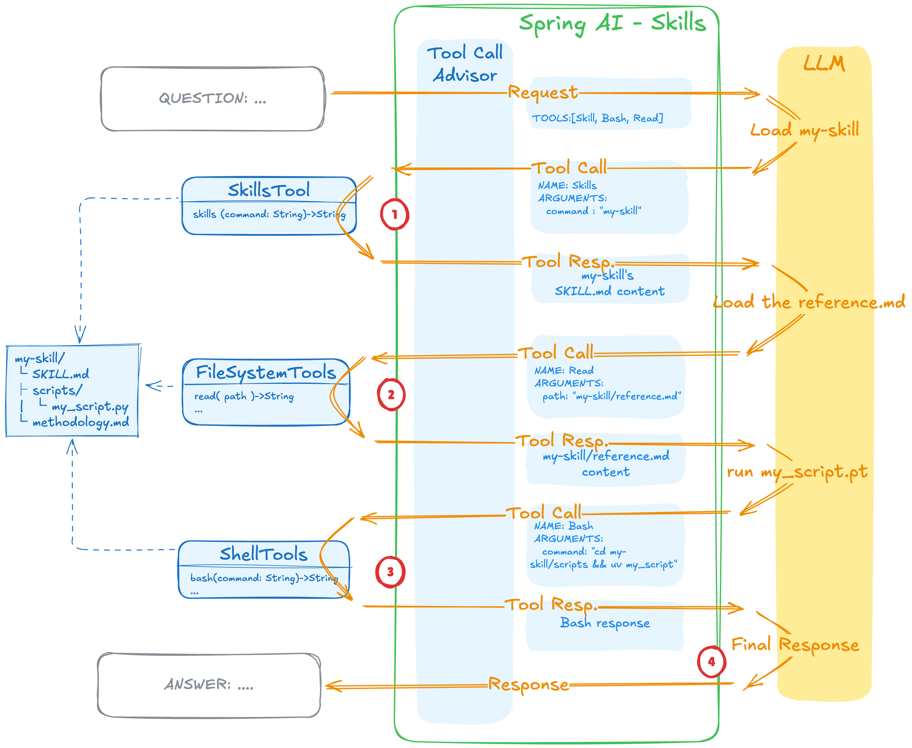

# 에이전트 스킬: 범용 스킬로 에이전트의 능력을 확장하기

<div class="post-meta" markdown>
<span class="tier-chip t3">T3 능력</span> 책 6.5절, 6.5.1절, 6.6.5절 | 예제 [`chapter6`](https://github.com/JM-Lab/spring-ai-agent-book/tree/main/chapter6)
</div>

[앞 글](../part6/18-human-in-the-loop-approval-gate-with-mcp-elicitation.md)까지 만든 에이전트는 스프링 AI 코어만으로 동작합니다. 대화 메모리, 로컬 툴과 MCP 툴, 동적 툴 탐색, 승인 게이트가 모두 코어 기능입니다. 이제 여기에 에이전트에 특화된 능력을 더할 차례입니다.

스프링 AI 커뮤니티는 코어 밖에서 예제, 보안, 플레이그라운드 같은 여러 인큐베이팅 프로젝트를 지원합니다. 그중 `spring-ai-agent-utils`는 능력을 묶는 스킬, 모호한 요청에 되묻는 명확화 질문, 작업 계획 관리, 하위 에이전트 위임을 툴로 제공합니다. 이 글은 이 가운데 범용 에이전트 스킬을 먼저 다룹니다. 스킬이 툴과 어떻게 다른지, 에이전트가 스킬을 어떻게 찾아 불러오는지, 실행할 때 툴 호출이 어떻게 이어지는지 보고, 예제 저장소의 재발주 절차 스킬을 살펴봅니다.

## 스킬이란: 툴과의 차이

에이전트에게 새 능력을 줄 때 익숙한 방법은 툴 클래스를 작성해 빈으로 등록하는 것입니다. 범용 에이전트 스킬은 출발점이 다릅니다. 능력은 `SKILL.md`라는 마크다운 파일에 적고, 필요하면 같은 폴더에 보조 스크립트와 참고 자료를 둡니다. 에이전트는 시작할 때 지정한 디렉터리를 훑어서 사용할 수 있는 스킬을 찾아 두고, 요청의 문맥에 맞는 스킬을 골라 그때 불러옵니다.

[컨텍스트 엔지니어링 글](../part6/15-agent-loop-and-context-engineering.md)에서 본 '마크다운으로 외부화한 컨텍스트'를 실제로 구현한 것이 이 스킬 파일입니다. 스킬 폴더에는 절차에 관한 지식과 조직이나 사용자마다 다른 컨텍스트가 담기고, 폴더째 옮기거나 버전을 관리하기도 쉽습니다. 에이전트는 작업에 필요할 때만 이 폴더를 꺼내 씁니다. 그래서 스킬은 컨텍스트 엔지니어링을 패키징한 결과물로 볼 수 있습니다.

두 방식을 나란히 놓으면 차이가 분명합니다.

| 구분 | 코드로 구현한 툴 | 범용 에이전트 스킬 |
| --- | --- | --- |
| 형태 | 클래스를 작성하고 빈으로 등록 | `SKILL.md`와 보조 파일 |
| 수정 | 소스를 고치고 다시 컴파일 | 파일을 더한 뒤 재시작하거나 동적으로 로드 |
| 작성자 | 개발자 | 도메인 전문가, 개발자가 아닌 사용자도 가능 |
| 재사용 | 스프링 프레임워크 안에서만 | 여러 AI 에이전트와 IDE에서 재사용 |
| 컨텍스트 효율 | 낮음 | 높음 |

가장 큰 장점은 컴파일 없이 능력을 더하거나 고칠 수 있다는 점입니다. 디렉터리에 스킬 폴더를 하나 넣으면 에이전트는 다음 실행부터 새 능력을 알아봅니다. 개발자가 아니어도 도메인 전문가가 에이전트의 행동 지침을 직접 쓰고 다듬을 수 있습니다. 스킬 포맷은 여러 에이전트 제품에서 비슷한 모양으로 퍼지고 있어서 특정 플랫폼에 묶이지도 않습니다.

## 스킬의 발견과 등록

스킬이 컨텍스트를 아끼는 방법은 필요한 만큼만 단계적으로 드러내는 것입니다. 시작할 때는 스킬마다 이름과 설명 같은 메타데이터만 모델에 보여 줍니다. 본문은 작업에 그 스킬이 필요해졌을 때 읽고, 보조 파일은 실행하다가 필요한 것만 읽습니다. 점진적 공개(progressive disclosure)라는 이름이 붙은 이 방식 덕분에, 스킬을 수백 개 등록해도 토큰 사용량을 가볍게 유지할 수 있습니다.

이 구조는 세 가지 기본 툴로 이루어집니다.

- `SkillsTool`: 지정한 디렉터리에서 `SKILL.md`를 찾아 등록하고, 스킬 이름과 설명을 자기 툴 설명에 넣어 모델에 알립니다.
- `FileSystemTools`: 스킬 본문과 스킬이 가리키는 참고 문서를 모델이 읽게 합니다.
- `ShellTools`: 스킬 폴더에 든 셸이나 파이썬 같은 보조 스크립트를 실행합니다.

기존 툴 명세를 그대로 따르는 구조라서, 이미 작성해 둔 스킬 폴더도 대부분 스프링 AI에서 다시 쓸 수 있습니다.

<figure class="wide-figure" markdown>

<figcaption>스킬의 발견과 등록 (출처: <a href="https://spring.io/blog/2026/01/13/spring-ai-generic-agent-skills">Spring AI Agentic Patterns (Part 1): Agent Skills</a>)</figcaption>
</figure>

그림의 1번처럼 `SkillsTool`의 설명에는 사용할 수 있는 스킬 목록이 이름과 설명으로 들어 있습니다. 질문에 맞는 스킬이 있으면 모델은 2번처럼 스킬 이름을 인자로 이 툴을 호출하고, 툴은 그 스킬의 `SKILL.md` 내용을 돌려줍니다. 모델은 이 내용을 바탕으로 3번에서 최종 답을 만듭니다. 모델이 어떤 스킬을 부를지는 이 설명을 보고 정하므로, 프런트매터의 `description`에는 스킬이 하는 일과 함께 언제 써야 하는지를 분명하게 적습니다.

예제 저장소는 먼저 커뮤니티 라이브러리 의존성을 추가합니다.

```xml title="pom.xml"
--8<-- "chapter6/pom.xml:45:49"
```
<span class="code-link">[전체 코드 보기](https://github.com/JM-Lab/spring-ai-agent-book/blob/main/chapter6/pom.xml)</span>

인큐베이팅 단계의 라이브러리라서 버전에 따라 빌더 메서드 이름이나 시그니처가 달라질 수 있습니다. 예제는 0.10.0 기준이므로 실제 프로젝트에서는 공식 문서에서 최신 버전을 확인하는 것이 좋습니다. 스프링 AI 코어 모듈의 버전은 `spring-ai-bom`이 관리하므로, 이 라이브러리가 더 낮은 코어 버전을 끌고 와도 의존성 해석은 BOM 기준으로 맞춰집니다.

스킬 툴은 `AgentConfig`의 `metaTools` 빈에서 만듭니다.

```java title="AgentConfig.java"
--8<-- "chapter6/src/main/java/kr/jmlab/spring/ai/agent/book/chapter6/orchestration/AgentConfig.java:124:141"
```
<span class="code-link">[전체 코드 보기](https://github.com/JM-Lab/spring-ai-agent-book/blob/main/chapter6/src/main/java/kr/jmlab/spring/ai/agent/book/chapter6/orchestration/AgentConfig.java)</span>

`SkillsTool.builder()`에 스킬 디렉터리를 넘기고 `build()`하면 곧바로 `ToolCallback`이 나옵니다. 이 경로는 클래스패스가 아니라 파일 시스템 기준이라서 `classpath:/skills`가 아닌 `src/main/resources/skills`처럼 프로젝트 기준 상대 경로로 적습니다. 위쪽의 `TaskTool`은 하위 에이전트 위임 툴인데, `ClaudeSubagentType` 빌더에서 주석 처리된 `skillsDirectories(...)`를 풀면 하위 에이전트에도 스킬을 줄 수 있습니다. 이렇게 만든 `SkillsTool`은 위임, 계획, 질문 툴과 함께 `List<ToolCallback>` 하나로 묶여 강화 에이전트에 들어갑니다.

강화 에이전트는 이 메타 툴 묶음을 동적 툴 탐색의 검색 대상에 넣지 않고 매 라운드 항상 노출합니다. '스킬을 불러온다'는 식의 설명은 사용자의 도메인 질문과 의미가 멀어서 검색 결과 위쪽에 오지 않을 수 있기 때문입니다. 예를 들어 "재발주 절차를 진행해줘"라는 요청에는 `SkillsTool`이 먼저 필요한데, 검색 뒤에 숨겨 두면 모델이 그 툴을 놓치기 쉽습니다.

## 스킬 실행 시 툴 호출의 연쇄

스킬 하나를 실행하는 과정도 툴 호출이 여러 번 이어지는 흐름입니다. 모델은 스킬 툴로 `SKILL.md` 본문부터 확인합니다. 참고 문서가 더 필요하면 읽기 툴을 부르고, 실행할 스크립트가 있으면 실행 툴로 돌립니다.

<figure class="wide-figure" markdown>

<figcaption>스킬 실행 시 툴 호출의 연쇄 작용 (출처: <a href="https://spring.io/blog/2026/01/13/spring-ai-generic-agent-skills">Spring AI Agentic Patterns (Part 1): Agent Skills</a>)</figcaption>
</figure>

그림에서 모델이 처음 받는 요청에는 `Skill`, `Bash`, `Read` 세 툴만 있습니다. 모델은 1번에서 `my-skill`의 `SKILL.md`를 불러오고, 2번에서 절차서가 가리키는 참고 문서를 읽고, 3번에서 스크립트를 실행한 뒤 4번에서 최종 답을 냅니다. 읽기 툴과 실행 툴은 절차서가 그 단계를 요구할 때만 호출됩니다. 각 호출의 결과는 텍스트로 컨텍스트에 쌓이므로, 연쇄가 길어져도 모델이 받는 것은 절차서와 실행 결과뿐입니다.

눈여겨볼 점은 스크립트의 소스 코드가 컨텍스트 윈도우에 들어가지 않는다는 것입니다. 프롬프트에 붙는 것은 실행 결과뿐이므로, 긴 파이썬 스크립트를 통째로 프롬프트에 넣는 방식보다 토큰을 훨씬 적게 씁니다. 점진적 공개가 스킬을 찾는 단계를 넘어 실행하는 단계에도 똑같이 적용되는 셈입니다.

## 예제 스킬 작성: 재발주 절차

예제 저장소의 `src/main/resources/skills`에는 `restock-policy` 스킬이 하나 있습니다. 재고가 부족한 품목의 재발주 수량을 사내 기준으로 산정하고 발주까지 진행하는 절차입니다.

```markdown title="skills/restock-policy/SKILL.md"
--8<-- "chapter6/src/main/resources/skills/restock-policy/SKILL.md:1:10"
```
<span class="code-link">[전체 코드 보기](https://github.com/JM-Lab/spring-ai-agent-book/blob/main/chapter6/src/main/resources/skills/restock-policy/SKILL.md)</span>

프런트매터의 `name`은 모델이 스킬 툴을 부를 때 넘기는 이름이고, `description`에는 무엇을 하는 절차인지와 언제 쓰는지를 함께 적었습니다. 본문은 네 단계입니다. `check_stock`으로 재고를 조회하고, 안전재고 50개에서 모자란 만큼을 발주 수량으로 정한 뒤, `place_purchase_order`로 발주하고 결과를 보고합니다.

이 스킬은 새 툴을 만들지 않습니다. `check_stock`과 `place_purchase_order`는 운영 MCP 서버가 이미 노출하고 있는 원격 툴이고, 스킬은 그 툴을 어떤 순서로 쓸지 알려 줄 뿐입니다. 실제 호출은 에이전트의 툴 루프가 합니다. 3단계는 발주 전에 사용자에게 되묻지 말라고 지시하고, 실행 승인은 시스템이 처리한다고 적어 둡니다. 실제로 `place_purchase_order`는 실행 직전에 [앞 글](../part6/18-human-in-the-loop-approval-gate-with-mcp-elicitation.md)의 승인 게이트를 거칩니다. 또 이 스킬은 보조 스크립트나 참고 문서 없이 `SKILL.md` 하나로 되어 있고, `metaTools` 빈도 `FileSystemTools`와 `ShellTools` 없이 `SkillsTool`만 등록합니다.

강화 에이전트의 시스템 프롬프트(`spring.ai.cli.agent.enhanced.system-prompt`)에도 스킬을 쓰는 규칙이 들어 있습니다.

```yaml title="application.yml"
--8<-- "chapter6/src/main/resources/application.yml:17:27"
```
<span class="code-link">[전체 코드 보기](https://github.com/JM-Lab/spring-ai-agent-book/blob/main/chapter6/src/main/resources/application.yml)</span>

첫 항목은 재발주나 재고 산정처럼 사내 절차나 정책에 관한 일이면 `SkillsTool`로 관련 스킬부터 불러와 따르고, 절차서에 기준 수치가 있으면 사용자에게 되묻지 말라고 지시합니다. 명확화 질문은 원하는 것 자체가 불분명할 때만 던지도록 범위를 좁혀서, 따를 절차가 스킬에 있는 일은 질문 없이 진행하게 합니다.

이 스킬을 쓰는 실행 단계는 `ch6-step6`입니다. 운영 MCP 서버를 먼저 띄운 뒤 `--spring.ai.cli.step=ch6-step6`으로 클라이언트를 실행하면, `Ch6Step6_Orchestration` 러너가 SKU-100, SKU-200, SKU-300 중 하나의 재고를 점검하고 사내 재발주 정책에 따라 필요하면 발주까지 진행해 달라고 요청합니다. 스킬과 명확화 질문, 승인 게이트가 한 요청 안에서 맞물리는 과정은 다음 글에서 실행 결과와 함께 봅니다.

## 운영 환경에서 주의할 점

스킬은 코드를 고치지 않고 마크다운과 스크립트만으로 에이전트의 능력을 넓힐 수 있어 자유도가 큽니다. 엔터프라이즈 운영 환경에서는 바로 그 자유도가 엄격히 통제해야 할 위험이 됩니다. 모델이 스스로 판단해 `ShellTools`로 아무 셸 명령이나 실행하게 두면 예측하기 어려운 보안 사고로 이어질 수 있기 때문입니다.

그래서 스크립트는 메인 서비스와 격리한 샌드박스에서 실행하고, 파일과 네트워크 접근 권한은 최소로 줄이는 것이 좋습니다. 커뮤니티 라이브러리는 툴을 실행하기 전에 사용자 승인을 받는 안전장치를 기본으로 제공하지 않습니다. 데이터나 시스템 상태를 바꾸는 작업이라면 사용자 개입 워크플로를 결합해 사람의 승인을 거치도록 설계합니다. 조직의 보안 정책에 따라 특정 툴의 실행 자체를 막는 정책 기반 제어나, 수많은 스킬 가운데 엉뚱한 작업이 실행되지 않도록 툴 노출을 조절하는 거버넌스도 함께 고민할 부분입니다.

## 4-티어 아키텍처에서의 위치

스킬은 T3 능력 계층에 속합니다. `SKILL.md` 폴더는 코드 밖에 놓인 능력 묶음이고, `SkillsTool`은 그 묶음을 에이전트가 호출할 수 있는 툴로 연결합니다. T2 오케스트레이션의 강화 에이전트는 `SkillsTool`을 메타 툴로 늘 노출하고, 스킬이 알려 준 절차대로 도메인 툴을 호출합니다. 다음 글에서는 스킬과 함께 명확화 질문, 작업 계획, 하위 에이전트 위임을 메타 툴로 묶어 에이전트 CLI를 완성합니다: [엔터프라이즈 스프링 AI 에이전트 CLI: 멀티 에이전트와 메타 툴 오케스트레이션](../part6/20-enterprise-spring-ai-agent-cli-multi-agent-and-meta-tools.md)

## 책에서 더 다루는 내용

!!! book "책 6.5절, 6.5.1절, 6.6.5절"
    - `code-reviewer` 스킬의 `SKILL.md` 작성 예와 `SkillsTool`, `FileSystemTools`, `ShellTools`를 `ChatClient`에 함께 등록하는 코드
    - 지식 MCP 서버의 RAG 하위 에이전트를 툴 하나로 연결하는 Step 4와 그 실행 결과
    - `TaskTool`과 `report-writer` 정의 파일로 보고서 작성을 하위 에이전트에 맡기는 Step 5
    - 메타 툴은 늘 노출하고 도메인 툴만 검색하는 `OrchestrationToolCallingAdvisor`의 구현과, 시스템 프롬프트 접미사를 덮어쓰는 이유

    [책 소개](../book.md){ .md-button } [온라인 구매](https://wikibook.co.kr/springai-agents/){ .md-button .md-button--primary }

## 참고 자료

- [Spring AI Agentic Patterns (Part 1): Agent Skills](https://spring.io/blog/2026/01/13/spring-ai-generic-agent-skills): `SkillsTool`, `FileSystemTools`, `ShellTools`를 조합해 범용 에이전트 스킬을 구성하는 방법
