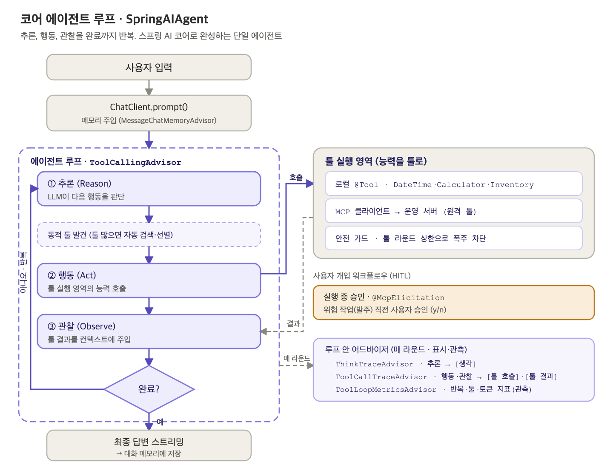
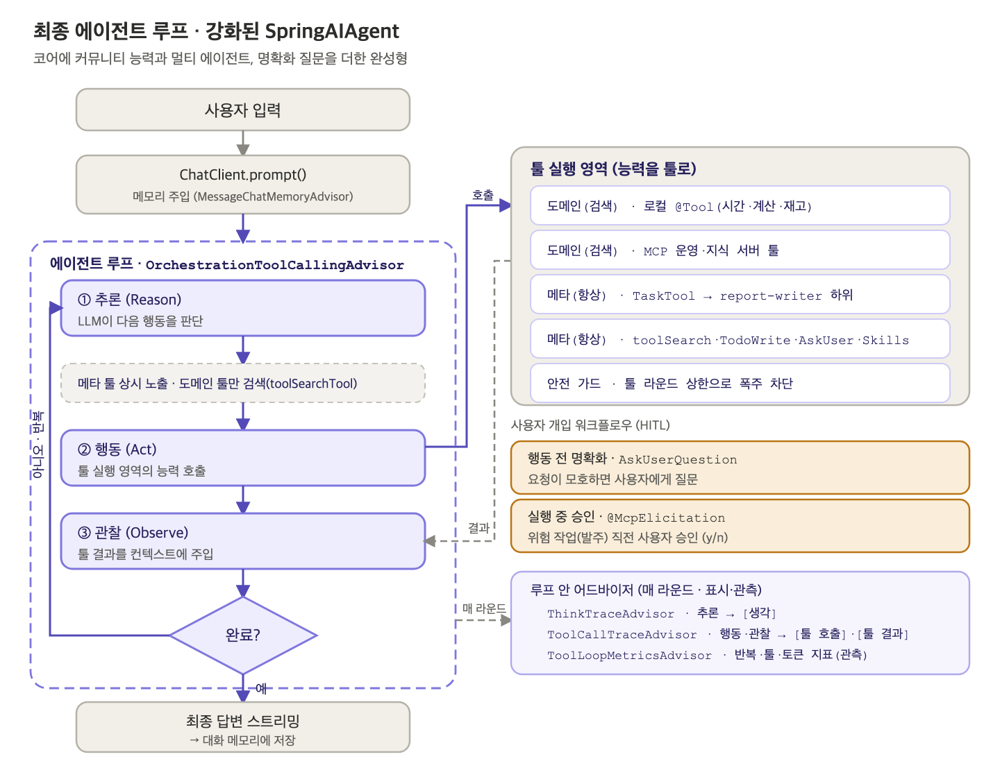

# An Enterprise Spring AI Agent CLI: Multi-Agent and Meta-Tool Orchestration

<div class="post-meta" markdown>
<span class="tier-chip t2">T2 Orchestration</span><span class="tier-chip t3">T3 Capability</span> Book sections 6.5.2-6.5.4, 6.6.3-6.6.6 | Example [`chapter6`](https://github.com/JM-Lab/spring-ai-agent-book/tree/main/chapter6)
</div>

The final hands-on project in Chapter 6 brings ChatClient and the advisor chain, RAG, tool calling, and MCP from the earlier chapters together into a single agent system. The goal is not a demo that checks one feature but an enterprise agent CLI whose capabilities several teams can divide among themselves and operate together.

This article follows the order of assembly. It builds a core agent from Spring AI modules alone, connects the operations server and the knowledge server over MCP, sets up a multi-agent system with subagents, and then completes the enhanced agent by extending orchestration with meta-tools, the tools that manage how the agent itself works. You choose which step to run with the `spring.ai.cli.step` value (`ch6-step1` through `ch6-step6`, and `ch6-final`).

The agent structure and dynamic tool discovery were covered in the [Spring AI agent architecture article](../part6/17-spring-ai-agent-architecture-and-dynamic-tool-discovery.md), the approval gate in the [human-in-the-loop (HITL) article](../part6/18-human-in-the-loop-approval-gate-with-mcp-elicitation.md), and skills in the [Agent Skills article](../part6/19-agent-skills-extending-capabilities.md). Here, the focus is on how those parts fit together.

## The core agent and the agent loop

The Step 1 core agent, `SpringAIAgent`, is built from Spring AI modules alone, without community libraries or backend servers. It is the smallest complete agent, carrying a request through to the end with seven local tools for tasks such as checking the time, calculating, and looking up and reserving stock. Its constructor takes a system prompt, a tool list (`List<ToolCallback>`), and a tool loop advisor factory, so the class needs no changes even as tools and servers are added later.

<figure class="wide-figure" markdown>

<figcaption>Agent loop of the core agent</figcaption>
</figure>

The model reasons about its next action, calls a tool, and observes the result, repeating this until there are no more tools to call. Developers do not implement this repetition themselves. `ToolCallingAdvisor` in the advisor chain takes care of it. `MessageChatMemoryAdvisor`, which handles chat memory, runs only once per request on each side of the loop: before entering it and after leaving it. The tool call history that builds up inside the loop is managed by `ToolCallingAdvisor`.

There is also a safety guard. `AgentSafety` uses `ToolExecutionEligibilityChecker` to count the tool execution rounds within a request and stops the loop when they exceed the limit (10). This is also why the loop advisor is created anew for each request: so that requests do not share this counter. When the number of tools grows to the threshold (10 by default), the loop advisor is switched to `ToolSearchToolCallingAdvisor`, which searches for only the tools that are needed and shows them to the model.

## Extending capabilities with MCP servers

The same project is split by profile to start two MCP servers. The operations server (`ops`, port 8085) exposes `check_stock` for stock lookups and `place_purchase_order` for purchase orders, and the knowledge server (`knowledge`, port 8086) exposes `rag_answer_question`, which answers questions about internal documents.

The client defines named connections such as `operations` and `knowledge` under `spring.ai.mcp.client.streamable-http.connections` and turns on `toolcallback.enabled`. The server tools then come in through `SyncMcpToolCallbackProvider`, and the agent configuration receives that provider through `ObjectProvider` and merges its tools with the local tools into a single list. With the MCP client turned off, the agent runs on local tools alone. With a connection turned on, that server has to be running first for its remote tools to join through the same interface. In Step 2, which connects the operations server, the agent code stays the same, but the tools grow to nine: seven local and two remote. Step 3, which gets human approval right before a purchase order is placed, is explained in the [approval gate article](../part6/18-human-in-the-loop-approval-gate-with-mcp-elicitation.md).

The knowledge server's tool is not a simple function.

```java title="KnowledgeMcpTools.java"
--8<-- "chapter6/src/main/java/kr/jmlab/spring/ai/agent/book/chapter6/capability/remote/KnowledgeMcpTools.java:33:53"
```
<span class="code-link">[View full code](https://github.com/JM-Lab/spring-ai-agent-book/blob/main/chapter6/src/main/java/kr/jmlab/spring/ai/agent/book/chapter6/capability/remote/KnowledgeMcpTools.java)</span>

The tool method only passes the question to `RagAnswerService`. The service finds documents in the server's vector store, and a `ChatClient` inside the server completes an answer grounded only in the documents it found and returns it. The main agent has made just one tool call, but beyond the MCP boundary a separate agent searches and writes the answer. Offering an agent as a tool like this is the first path to a multi-agent system (Step 4).

## Growing into a multi-agent system with subagents

From Step 4 on, the client switches to the enhanced agent (the `enhancedAgent` bean), which adds community capabilities to the same `SpringAIAgent` class. The second path to a multi-agent system is subagents declared on the client side (Step 5).

You can build a subagent yourself by wrapping a `ChatClient` in a `@Tool` method. But then every new agent means writing code and recompiling, and you also have to handle context isolation, model routing, preventing infinite delegation, and asynchronous execution by hand. `TaskTool` in `spring-ai-agent-utils`, a Spring AI Community library, standardizes this repetitive work. It exposes subagent calls as a single tool called `Task`, and agents are defined in Markdown files.

```markdown title="report-writer.md"
--8<-- "chapter6/src/main/resources/agents/report-writer.md:1:13"
```
<span class="code-link">[View full code](https://github.com/JM-Lab/spring-ai-agent-book/blob/main/chapter6/src/main/resources/agents/report-writer.md)</span>

In the front matter, `name` and `description` are required, and you can also specify which tools and model to use with `tools` and `model`. The body below serves as the system prompt given to the subagent. The definition files go into the `Task` tool's description as a list of available agents, and the model picks one through the value of the `subagent_type` parameter. That is why only one tool, `Task`, is registered even when there are several subagents. The definition directory is passed as a file system path such as `src/main/resources/agents`, not as a classpath location.

A subagent works in an isolated context and returns only the key results, so the main agent's conversation history does not bloat. `TaskTool` keeps the hierarchy to two levels by not letting subagents delegate again, and it also supports running long delegations in the background and retrieving the results later with `TaskOutputTool`. In Step 5, the main agent does not write the report itself. It hands the job to `report-writer` and passes along the result it receives.

## Meta-tools: a tool for asking questions and a tool for task planning

The enhanced agent's tools come in two sets. Domain tools handle business work directly, such as checking stock or querying knowledge, and meta-tools deal with how the work is done, such as tool search, delegation, planning, and asking questions. Along with `toolSearchTool`, `TaskTool`, and `SkillsTool`, the following two tools are meta-tools.

`AskUserQuestionTool` is a community tool that brings Claude Code's AskUserQuestion to Spring AI. When a request is ambiguous, the model decides on its own to call this tool and, instead of making arbitrary assumptions, sends the user a question with options. A question consists of the question text, a short header, options with descriptions, and whether multiple selection is allowed, and a `QuestionHandler` implementation takes care of displaying it. For a console, `CommandLineQuestionHandler` is enough. For the web, you implement a handler that sends the question over SSE or WebSocket and waits for the answer asynchronously. The tool is lightweight because it runs inside the same JVM without MCP. You can use the two together: MCP Elicitation for approving risky operations, which have to be exchanged with heterogeneous clients in a standard way, and this tool for clarifying questions that make a request more specific.

`TodoWriteTool` brings the to-do list approach that Claude Code uses (TodoWrite) to Spring AI. In tasks with many steps, an agent can easily skip intermediate steps, repeat them, or drift away from the plan. This tool has the model record its plan through tool calls instead of keeping it only inside the model. The model creates a to-do list and then works through it, changing each item's status from `pending` to `in_progress` to `completed`, and only one item can be `in_progress` at a time. `TodoEventHandler` is called whenever the list changes, so you can send progress to a screen or a monitoring system. The tool is used together with chat memory so that the update history stays visible in the next loop.

## Orchestration built on meta-tools

Step 6 completes the meta-tool set by gathering `TaskTool`, `SkillsTool`, `TodoWriteTool`, and `AskUserQuestionTool` in the `metaTools()` bean. Unlike the first two, whose builders return a `ToolCallback` directly, the last two are `@Tool` objects, so they are converted with `ToolCallbacks.from()` and put into the same list. The enhanced agent receives the domain tool set and the meta-tool set as separate injections and decides only how to show each of them.

This is where dynamic tool discovery and meta-tools collide. `ToolSearchToolCallingAdvisor` hides every registered tool behind an index and shows the model only `toolSearchTool`. But meta-tool descriptions such as "delegate a task" or "load a skill" are semantically far from users' business queries, so they tend to drop out of the top search results. Conversely, if every tool is always exposed, tool definitions take up context in every round, and the smaller the local model, the heavier that burden becomes.

The book's solution is to split the tools into two layers: meta-tools stay visible at all times, and only domain tools are found through search. `OrchestrationToolCallingAdvisor`, which takes on this job, extends `ToolSearchToolCallingAdvisor`. It leaves indexing and search to its parent and appends the meta-tools to the tool list the parent picked for that round.

<figure class="wide-figure" markdown>

<figcaption>Agent loop of the enhanced agent</figcaption>
</figure>

The skeleton of the loop is the same as the core agent's. What differs are two layers (meta-tools that are always exposed and domain tools found through search) and two kinds of human-in-the-loop interaction (clarifying questions before acting and approval during execution).

```java title="OrchestrationToolCallingAdvisor.java"
--8<-- "chapter6/src/main/java/kr/jmlab/spring/ai/agent/book/chapter6/orchestration/OrchestrationToolCallingAdvisor.java:109:146"
```
<span class="code-link">[View full code](https://github.com/JM-Lab/spring-ai-agent-book/blob/main/chapter6/src/main/java/kr/jmlab/spring/ai/agent/book/chapter6/orchestration/OrchestrationToolCallingAdvisor.java)</span>

`doBeforeCall` and `doBeforeStream` call the parent first to get a request that reflects the search results, and then add the meta-tools. Tools with names that are already present are skipped, and only the tool list is replaced, while `mutate()` preserves the other options the parent set.

One part that is easy to miss is the system prompt suffix. The parent's default suffix only tells the model to find tools with `toolSearchTool` when the ones it needs are not visible. Left as is, the model may think it has to search even for the meta-tools it can already see and keep repeating searches, so the advisor builds a new suffix.

```java title="OrchestrationToolCallingAdvisor.java"
--8<-- "chapter6/src/main/java/kr/jmlab/spring/ai/agent/book/chapter6/orchestration/OrchestrationToolCallingAdvisor.java:84:97"
```
<span class="code-link">[View full code](https://github.com/JM-Lab/spring-ai-agent-book/blob/main/chapter6/src/main/java/kr/jmlab/spring/ai/agent/book/chapter6/orchestration/OrchestrationToolCallingAdvisor.java)</span>

The suffix lists each meta-tool's name and the first sentence of its description, tells the model to call them directly without searching, and has it use `toolSearchTool` only when it needs a domain capability. It also includes an instruction to search again with different wording if the results do not match.

## The complete system and the integrated CLI

<figure class="wide-figure tall" markdown>

<figcaption>Components of the Spring AI agent CLI system</figcaption>
</figure>

Laid out by layer, the completed system looks like the figure above. Under the CLI at the top, the enhanced agent runs the loop through the advisor chain and directs the whole system. Local `@Tool` methods, community meta-tools, and the MCP client are organized behind a single tool interface. Beyond the MCP boundary are the operations server and the knowledge server, and at the very bottom are the models and the vector store.

The Step 6 run in the book shows these parts working together within a single request. Given a request to check one of three SKUs against the company's restocking policy, the agent first loads the `restock-policy` skill without searching and reviews the procedure. Since the target SKU has not been decided, it asks the user with `AskUserQuestionTool`, showing the options, and once it has the answer, it finds `check_stock` with `toolSearchTool` and checks the stock. It calculates how far the stock falls short of the safety stock of 50 units and calls `place_purchase_order`, and right before the actual order is placed, the approval gate gets confirmation from a person. A skill differs from `TaskTool`, which hands work off to an isolated subagent, in where the work runs: the skill only tells the agent the procedure, and the main agent makes the tool calls itself.

This run used the slightly larger `qwen3.5:9b` model. A 4B-class model often stops after getting the answer to its question instead of carrying the rest of the procedure through to the end, so for scenarios that chain several tools, it helps to test with a larger model or a higher reasoning level.

The last piece, `Ch6EnhancedSpringAIAgentCli`, is a conversation loop that receives the enhanced agent through `@Qualifier("enhancedAgent")` and passes user input with the same `conversationId`. If `spring.ai.cli.step` is not set, this integrated CLI starts, and the session continues even if a turn fails with a streaming error.

## Where this fits in the 4-tier architecture

This article puts every tier of the 4-tier architecture into one project. The CLI is the Channel (T1), `SpringAIAgent` and `OrchestrationToolCallingAdvisor` are Orchestration (T2), the local tools, subagents, and MCP servers are Capability (T3), and the Ollama models and the vector store are the Foundation (T4). The approval gate handles governance, a cross-cutting concern. In this structure, new capabilities are added as MCP servers or meta-tools, and the main agent code stays closed. Observability, the remaining cross-cutting concern, is turned on in the next article, [Observability for AI Agents: Micrometer, OTel GenAI Semantic Conventions, and OTLP](../part6/21-observability-for-ai-agents-micrometer-otel-otlp.md).

## Hands-on project for this chapter

!!! example "6.6 Enterprise Spring AI Agent CLI Project"
    This agent CLI starts from a core agent that uses only local tools and adds, step by step, the operations and knowledge MCP servers, an approval gate, subagents, skills, meta-tools, and observability settings. It requires Ollama's `qwen3.5:4b` and `bge-m3`. The client starts only when every server it connects to is running, so start the servers first. For the full run-through, follow the README (in Korean) in [`chapter6/`](https://github.com/JM-Lab/spring-ai-agent-book/tree/main/chapter6) of the example repository.

    ```bash
    cd chapter6
    # Terminal 1: operations MCP server (8085)
    ./mvnw spring-boot:run -Dspring-boot.run.arguments="--spring.profiles.active=ops"
    # Terminal 2: knowledge MCP server (8086)
    ./mvnw spring-boot:run -Dspring-boot.run.arguments="--spring.profiles.active=knowledge"
    # Terminal 3: integrated CLI (ch6-final), with the knowledge server connection added as an argument
    ./mvnw spring-boot:run -Dspring-boot.run.arguments="--spring.ai.mcp.client.streamable-http.connections.knowledge.url=http://localhost:8086"
    ```

## More in the book

!!! book "Book sections 6.5.2-6.5.4, 6.6.3-6.6.6"
    - MCP Elicitation compared with `AskUserQuestionTool`, and patterns for implementing `QuestionHandler` in a web environment
    - Code for registering `TodoWriteTool` and the progress callback
    - A hand-built agent tool compared with `TaskTool`, the four built-in subagents, and background execution
    - Dependencies and configuration of the core agent, the safety guard implementation, and run results after switching to dynamic tool discovery
    - Configuration of the operations and knowledge servers, and run logs for each step
    - `TaskTool` compared with `SkillsTool`, the `restock-policy` skill, and the full Step 6 run log

    [About the book](../book.md){ .md-button } [Buy the book (Korean)](https://wikibook.co.kr/springai-agents/){ .md-button .md-button--primary }

## References

- [Spring AI Agentic Patterns (Part 2): AskUserQuestionTool](https://spring.io/blog/2026/01/16/spring-ai-ask-user-question-tool): an introduction to `AskUserQuestionTool` on spring.io
- [Spring AI Agentic Patterns (Part 3): TodoWriteTool](https://spring.io/blog/2026/01/20/spring-ai-agentic-patterns-3-todowrite): an introduction to `TodoWriteTool` on spring.io
