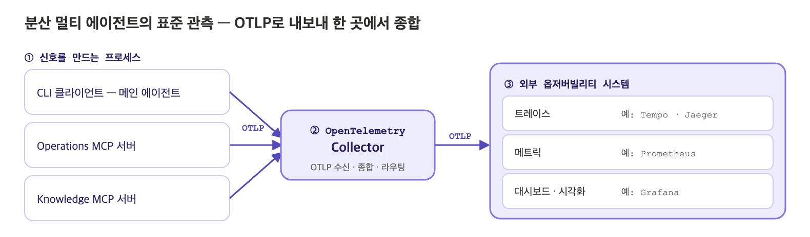

# Observability for AI Agents: Micrometer, OTel GenAI Semantic Conventions, and OTLP

<div class="post-meta" markdown>
<span class="tier-chip tx">Cross-cutting concerns</span> Book section 6.6.7 | Example [`chapter6`](https://github.com/JM-Lab/spring-ai-agent-book/tree/main/chapter6)
</div>

The agent CLI completed in the [previous article](../part6/20-enterprise-spring-ai-agent-cli-multi-agent-and-meta-tools.md) runs across several processes. A single user request goes through the client's agent loop and calls tools on the operations server and the knowledge server, and inside the knowledge server, vector search and model calls follow in turn. If you cannot see this flow, you cannot tell which segment is slow, which agent failed, or where a lot of tokens are being spent.

As the last step of Chapter 6, this article turns on observability. It looks at a setup that exports, over OTLP, the standard telemetry Spring AI produces automatically together with loop metrics added by hand, and finally looks back over the 4-tier architecture as a whole.

## Why observability goes into the design from the start

The book's design does not treat observability as a feature to add after the system is finished. This is because once agents are spread across several processes, you can operate the system only if you can trace slow calls, failed agents, and segments where costs have grown. So the design includes, from the start, a structure that produces standard signals and hands them to an external observability system.

In this design, the tool boundary is also the observability boundary. Each call the client makes to an MCP server becomes a trace span in its own right, so you can follow the execution flow from end to end even when it is split across processes. The application does not build observability tools of its own. Its responsibility ends at emitting standard signals. Adding the loop metrics advisor to the advisor chain in advance, when the core agent was built, was also part of this preparation. That is why the last step writes no new code for observability and adds only dependencies and configuration.

## How Spring AI observability works: Micrometer and the OTel GenAI semantic conventions

Spring AI runs on top of the Micrometer observation support used in the Spring ecosystem. `ChatClient`, advisors, `ChatModel`, `EmbeddingModel`, `ImageModel`, and `VectorStore` record metrics and traces on their own, so the execution flow is captured as spans and metrics with almost no changes to the code built so far. The following observations are especially useful when looking at agents.

- `spring.ai.chat.client`: one turn of the main agent. It records the call mode (call, stream), the list of applied advisors, the conversation ID, and tool names.
- `gen_ai.client.operation`: chat model and embedding model calls. It records the request model and the response model, along with input and output token counts.
- `spring.ai.tool`: tool execution. It records the tool definition name and the call ID.
- `spring.ai.advisor`: records the name and order value of each advisor.
- `db.vector.client.operation`: records query, add, and delete operations on the vector store.

Under the `spring.ai.chat.client` span that records a turn, the model calls made during that turn are attached as child spans. This lets you follow an agent turn and the model calls inside it within a single trace.

The naming scheme deserves even more attention. Attributes attached to model calls, such as `gen_ai.request.model` and `gen_ai.usage.input_tokens`, and the `gen_ai.client.token.usage` metric use names defined by the OpenTelemetry Semantic Conventions for Generative AI (OTel GenAI semantic conventions). Because they are not a format specific to one product, different observability systems can interpret them the same way.

Prompt and response content is not recorded by default. It can contain user input, retrieved documents, and internal business data as they are, and it can grow large quickly, so by default only metadata such as token counts, model names, and durations is recorded. If you turn on `spring.ai.chat.client.observations.log-prompt`, `spring.ai.chat.client.observations.log-completion`, and `spring.ai.tools.observations.include-content`, the content is also recorded. However, sensitive information then flows all the way to external systems, so when you turn these on in a real service, you need to decide on masking, access permissions, and data retention periods as well.

## Configuring OTLP export

To send observability signals out of the application, you need four dependencies.

```xml title="pom.xml"
--8<-- "chapter6/pom.xml:58:74"
```
<span class="code-link">[View full code](https://github.com/JM-Lab/spring-ai-agent-book/blob/main/chapter6/pom.xml)</span>

Actuator enables the observation infrastructure, and `micrometer-tracing-bridge-otel` connects Micrometer observations to OpenTelemetry tracing. Traces are exported over OTLP by `opentelemetry-exporter-otlp`, and metrics by `micrometer-registry-otlp`. Spring Boot Actuator automatically registers `TracingAwareMeterObservationHandler`, which links observations with tracing, so you do not need to write separate instrumentation code.

The configuration goes in `application.yml`.

```yaml title="application.yml"
--8<-- "chapter6/src/main/resources/application.yml:55:68"
```
<span class="code-link">[View full code](https://github.com/JM-Lab/spring-ai-agent-book/blob/main/chapter6/src/main/resources/application.yml)</span>

For learning purposes, the sampling probability is set to 1.0 so that every request is traced, and traces and metrics are each sent to an OTLP/HTTP endpoint (port 4318). All profiles share this configuration, so the client and both MCP servers send their signals to the same place. The metrics endpoint is exposed over HTTP only on the MCP servers, which start a web server, and not on the CLI client, which runs without one. The exercises run fine even without a collector.

You can use Actuator to check whether signals are actually accumulating. The book generates one RAG answer with the knowledge server and then queries `http://localhost:8086/actuator/metrics/gen_ai.client.token.usage`. The result shows that, without any observability code, token usage is aggregated as a standard metric, with the operation type (`chat`, `embedding`), the model name (`qwen3.5:4b`, `bge-m3`), and the token type (`input`, `output`, `total`) attached as tags. In the same way, you can check the number and duration of model calls in `gen_ai.client.operation`, and calls per agent turn in `spring.ai.chat.client`.

## Looking into the tool loop with custom metrics

Spring AI's automatic instrumentation captures behavior at the points the framework has defined. But how many times the loop went around in a request, which tools were called most, and how many tokens each iteration used cannot be read directly from the standard signals. These metrics are recorded by `ToolLoopMetricsAdvisor`, introduced in the [recursive advisor article](../part6/16-recursive-advisor-and-tool-loop-control.md).

```java title="ToolLoopMetricsAdvisor.java"
--8<-- "chapter6/src/main/java/kr/jmlab/spring/ai/agent/book/chapter6/orchestration/ToolLoopMetricsAdvisor.java:35:60"
```
<span class="code-link">[View full code](https://github.com/JM-Lab/spring-ai-agent-book/blob/main/chapter6/src/main/java/kr/jmlab/spring/ai/agent/book/chapter6/orchestration/ToolLoopMetricsAdvisor.java)</span>

Because it implements `BaseAdvisor`, it works with both `call` and `stream`, and its order value of +400, higher than that of `ToolCallingAdvisor` (+300), places it inside the tool loop. So `after()` runs each time the loop goes around and inspects the response of that iteration. It records three metrics. `agent.tool.loop.iterations` is a counter of iterations, `agent.tool.calls` is a counter that uses the `tool` tag to count calls per tool, and `agent.tool.loop.tokens` is a distribution summary that records the number of tokens per iteration.

With these metrics, you can break down the causes of a slow request. You can tell whether the model responded slowly, the loop ran too many times, or a particular tool was called too often. Custom metrics also gather in the same `MeterRegistry` as the standard signals and go out through the same OTLP exporter, so you can query the standard token metrics and the loop metrics together in an external observability system.

## The standard observability flow for distributed multi-agent systems

Because the client and both MCP servers send signals that follow the same conventions to one OTLP endpoint, everything a single request leaves behind, from the agent loop and model calls to MCP tool calls and searches by the subagent inside a server, ends up in one place.

<figure class="wide-figure" markdown>

<figcaption>Standard observability flow for distributed multi-agent systems</figcaption>
</figure>

The signals each process sends are received by the OpenTelemetry Collector and passed on to an external observability system. The Collector is a vendor-agnostic component that receives, processes, and exports telemetry. You build a pipeline by combining receivers, processors, and exporters, and the Collector can send the signals it receives to one or more backends. As in the figure, you can store traces in Tempo or Jaeger and metrics in Prometheus, and visualize them with Grafana.

Splitting things up this way makes the roles clear. The only thing the application needs to know is the OTLP endpoint address, and the Collector and the observability stack decide where to store the data and how to show it. Changing the observability backend barely changes the application's code and configuration, and processing such as retries, batching, encryption, and filtering of sensitive information can be left to a Collector placed next to the service. The example repository configures only as far as the OTLP endpoint, so set up the Collector and backends to suit your production environment.

## Where this fits in the 4-tier architecture

Observability does not belong to any particular tier. It is a cross-cutting concern that spans every tier, from Channel to Foundation. Orchestration actions such as asking questions, planning, delegating, and searching for tools are all observed, and so are the model calls of a subagent beyond the MCP boundary. With the same observability turned on for both the client and the servers in this article, the Chapter 6 system becomes ready to operate.

Looking back at Chapter 6 through the 4 tiers gives the following picture. The CLI in the Channel (T1) is separate from the agent core, so it can be replaced with another channel such as the web. In Orchestration (T2), `SpringAIAgent` runs the agent loop on top of `ChatClient` and the advisor chain, and recursive advisors control that loop. The system prompt, chat memory, skills, and dynamic tool discovery are implementations of context engineering, which decides what to show the model. The local tools, MCP servers, and subagents in Capability (T3) are bundled behind a single tool interface, and the models and vector store in the Foundation (T4) support them. Because T2 and T3 are separated by MCP, a standard interface, the orchestration code stays the same even as capabilities grow. The approval gate and observability cut across all of this.

So far, the exercises have used Ollama's local `qwen3.5:4b` model. In practice, there are times when you need to compare results with a commercial model, verify that answers match their sources, or connect an MCP server you built to another AI agent. The next article, [Appendix: Switching to OpenAI, AI Evaluation, and Connecting External AI Agents](../appendix/22-openai-evaluation-and-external-agents.md), covers how to do that.

## More in the book

!!! book "Book section 6.6.7"
    - The implementation of the integrated CLI and results from a run spanning several turns
    - A table of observation names and key attributes for each component Spring AI instruments automatically
    - The full `gen_ai.client.token.usage` query result and how to read its tags
    - How to pinpoint the cause of a slow request with the three custom metrics
    - A standard setup for an external observability stack with the OpenTelemetry Collector in front

    [About the book](../book.md){ .md-button } [Buy the book (Korean)](https://wikibook.co.kr/springai-agents/){ .md-button .md-button--primary }

## References

- [Spring Boot Reference: Tracing](https://docs.spring.io/spring-boot/reference/actuator/tracing.html): how to configure Micrometer Tracing in Spring Boot
- [Spring AI Reference: Observability](https://docs.spring.io/spring-ai/reference/observability/index.html): the list of observations and attributes that Spring AI instruments
- [OpenTelemetry Collector Architecture](https://opentelemetry.io/docs/collector/architecture/): the structure of Collector pipelines made up of receivers, processors, and exporters
